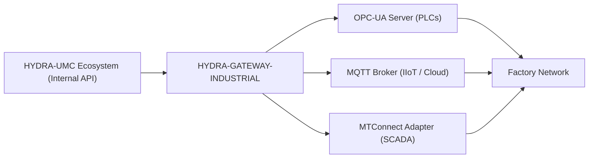

<p align="center">
  
</p>

# 🌐 HYDRA-UMC-GATEWAY-INDUSTRIAL

<p align="center">🇺🇸 <b>English</b> | <a href="README_spa.md">🇪🇸 Español</a> | <a href="README_fra.md">🇫🇷 Français</a> | <a href="README_ita.md">🇮🇹 Italiano</a> | <a href="README_deu.md">🇩🇪 Deutsch</a> | <a href="README_zho.md">🇨🇳 简体中文</a> | <a href="README_jpn.md">🇯🇵 日本語</a></p>

### 🏭 Industry 4.0 Interoperability Bridge for Factory Standards

<p align="left">
  
  
  
  
</p>

---

## 1. 🛠️ TECHNICAL OVERVIEW

**HYDRA-UMC-GATEWAY-INDUSTRIAL** is the secure communication bridge between the HYDRA-UMC ecosystem and external industrial standards. It allows the micro-factory to interact with third-party PLCs, SCADA systems, and cloud-based IIoT platforms.

It acts as a multi-protocol translator, exposing internal robotic states and tool telemetries as standardized nodes in OPC-UA, MQTT topics, or MTConnect XML streams, ensuring that the Hydra swarm is never an isolated island in the production plant.

### Key Features:
* 🌐 **Multi-Standard Support:** Integrated OPC-UA, MQTT, and MTConnect interfaces.
* 🛡️ **Industrial Security:** Mutual TLS (mTLS) and certificate-based authentication for all factory connections.
* 🔄 **State Mapping:** Real-time translation of Hydra's internal JSON state into standardized industrial address spaces.
* ⚡ **High Reliability:** Dedicated lightweight bridge optimized for 24/7 industrial uptime.
* 🚦 **Real v0 - Command Allowlist + Backpressure:** `POST /command` is gated by a default-deny allowlist per protocol, a bounded concurrency limit, and a real timeout - see "Honesty check" below for exactly what's enforced today.

**Honesty check - what actually runs today:** `POST /command { protocol, operation, target }` is real: the operation must be explicitly allowlisted for its protocol (`403` if not - v0 only allows read-like/publish operations, nothing that writes to a live PLC), no more than a bounded number of commands run at once (`429` beyond that), and a command that doesn't resolve in time is reported as timed out (`504`) rather than left hanging. The default execution path reuses this project's own real reachability probes - honest that it stops short of an actual OPC-UA/MQTT/MTConnect protocol-level write, since none of the three children expose a real command API yet either. See `CHANGELOG.md` for exactly what shipped.

---

## 2. 🔄 GATEWAY ARCHITECTURE



---

## 3. 🧱 ARCHITECTURE & DESIGN DECISIONS

* **Why this is the integration parent, not a peer, of its 3 children.** HYDRA-UMC-OPCUA-SERVER, HYDRA-UMC-MQTT-BROKER and HYDRA-UMC-MTCONNECT-ADAPTER all translate the SAME underlying HYDRA-UMC-SERVER state into 3 different industrial protocols - owning the shared routing/auth logic in one place avoids 3 independent, potentially-inconsistent translations of the same state.
* **Why 3 separate protocol adapters, not one do-everything gateway.** OPC-UA, MQTT and MTConnect are structurally different (address-space vs. pub/sub topics vs. XML device/agent streams) - one process per protocol means a slow/broken MQTT client never affects the OPC-UA one, and each can be enabled/disabled independently per deployment.
* **Why the entry point only prints identity/version, exits after a health-check listener comes up.** Andamiaje (scaffolding) stage: proving the process starts and stays up (not just runs-and-exits, unlike most of this ecosystem's other Node skeletons) precedes the real protocol-translation logic, since a real gateway is a long-running service by nature.
* **How this fits the rest of the ecosystem.** The integration parent of the Industrial Gateway family - exposes HYDRA-UMC-SERVER's own state to factory-floor systems (MES/SCADA/historians) that speak OPC-UA, MQTT or MTConnect instead of this ecosystem's own REST/WebSocket API.
* **`GET /status` makes a real, live check on every request.** `src/probes.ts` does a real TCP connect for OPC-UA/MQTT and a real HTTP `GET` for MTConnect against each child - `reachable`/`latencyMs`/`error` per child and an aggregated `allReachable` are computed at request time, not returned from a cached or static list. Verified end-to-end: all three real children were started, `/status` reported them all reachable, one was then actually killed, and the very next `/status` call correctly flipped only that child to unreachable with a real `ECONNREFUSED`. Host/port/URL per child are configurable via env vars, defaulting to the exact service names `docker-compose.yml` already uses.
* **Why `POST /command`'s allowlist is default-deny, not default-allow.** An industrial gateway that forwards any operation string it's handed is a liability the moment a child exposes a real write path - starting from "nothing is allowed unless explicitly listed" means adding a dangerous operation (an OPC-UA node write, an MQTT retained-config publish) is always a deliberate, reviewable decision later, never an accidental default today.
* **Why authorization is checked before backpressure in `CommandDispatcher.dispatch()`.** An unauthorized command must be rejected the same way regardless of how busy the gateway is right now - if capacity were checked first, a disallowed operation could occasionally slip through as "accepted" (a slot happened to be free) or occasionally read as "just busy" (a slot wasn't), leaking timing information about gateway load through what should be a purely authorization-based decision.
* **Why the default command executor reuses the reachability probes instead of a stub that always succeeds.** `src/probes.ts` already answers "is this child actually there" for real - reusing it means `POST /command` fails honestly (`502 downstream_unreachable`) against a child that's down, rather than reporting `accepted` for a command that could never have gone anywhere.

---

## 📂 DIRECTORY STRUCTURE

```text
HYDRA-UMC-GATEWAY-INDUSTRIAL/
├── src/
│   ├── probes.ts        # Real TCP/HTTP reachability checks against each child
│   ├── command.ts        # Real CommandDispatcher: allowlist + backpressure + timeout
│   ├── version.ts        # Real package version at runtime, read from package.json
│   └── server.ts         # Express app: GET /status, POST /command
├── tests/               # Real vitest suite (probes, server, command)
├── docs/               # Documentation and mapping reference
├── build/               # Compiled output (npm run build)
├── images/             # Media and diagrams
├── scripts/            # Utility scripts (bump-version.mjs)
├── tools/
│   ├── build_test.py    # Non-versioning build/compile check
│   └── ci_validate.py   # Manifest/CHANGELOG/docs validation used by CI
├── bump_manifest_version.py # Syncs hydra-umc.project.json's version to package.json's (--sync)
├── .env.example         # Environment variable template
├── build.sh/.bat        # Bumps version, then npm run build
├── build-test.sh/.bat   # Non-versioning build check (no CHANGELOG/version bump)
├── dev.sh/.bat           # Runs the server directly from source (tsx, no build step)
├── Dockerfile           # This service's own container image
├── docker-compose.yml   # Brings up this Gateway + its 3 children together
└── README.md
```

Pure network service, no dedicated hardware of its own - `hardware/`,
`firmware/` and `os/` are omitted under the repository structure policy.

---

## 🐳 INTEGRATING THE 3 CHILD BRIDGES

This is a real integration repo, not just documentation - `docker-compose.yml`
brings up this Gateway alongside its three children
(**HYDRA-UMC-OPCUA-SERVER**, **HYDRA-UMC-MQTT-BROKER**,
**HYDRA-UMC-MTCONNECT-ADAPTER**) as one Docker network, assuming the four
repos are checked out as sibling folders (the layout this ecosystem's
GitHub org already uses):

```bash
docker compose up --build
```

This starts all 4 services on the same ports each already binds to
standalone: this Gateway on `8000`, OPC-UA on `4840`, MQTT on `1883`,
MTConnect on `5000`. `GET http://localhost:8000/status` reports the
Gateway's own version and which children it expects to reach.

---

## 🛠️ DEVELOPMENT ENVIRONMENT

### Requirements
- [Node.js](https://nodejs.org/) (v18 or higher recommended)
- npm

### Installation
```bash
npm install
```

### Development Mode
Runs the aggregation server directly with `tsx` (no bundler):
- **Windows:** double-click `dev.bat` or run `npm run dev`
- **Linux/Mac:** run `./dev.sh` or `npm run dev`

### Production Build
Bundles the server into a single deployable file with esbuild:
- **Windows:** double-click `build.bat` or run `npm run build`
- **Linux/Mac:** run `./build.sh` or `npm run build`

Then start it with:
```bash
npm start
```

The server listens on `0.0.0.0:8000` - `GET /status` reports the
Gateway's own version plus the name/protocol/endpoint of each child
bridge it fronts.

Real example - an allowlisted command against a child that isn't running,
an unauthorized operation, and a malformed request:

```bash
curl -X POST http://localhost:8000/command -H "Content-Type: application/json" \
  -d '{"protocol":"OPC-UA","operation":"read","target":"ns=2;s=Line1.Status"}'
# 502 {"status":"downstream_unreachable","reason":"TCP connect to opcua-server:4840 timed out after 2000ms"}

curl -X POST http://localhost:8000/command -H "Content-Type: application/json" \
  -d '{"protocol":"OPC-UA","operation":"write","target":"ns=2;s=Line1.SetPoint"}'
# 403 {"status":"rejected_unauthorized","reason":"operation \"write\" is not allowlisted for OPC-UA"}

curl -X POST http://localhost:8000/command -H "Content-Type: application/json" -d '{"protocol":"OPC-UA"}'
# 400 {"error":"protocol, operation and target are required strings"}
```

### Versioning
Every real `npm run build` bumps `package.json`'s own `version`
automatically (`scripts/bump-version.mjs`, wired as the first step of the
`build` script) - a base-10 "odometer": patch +1 per build, rolling over
into minor (and minor into major) past 9 rather than ever reaching a
two-digit segment (`0.0.9` -> `0.1.0`, not `0.0.10`).

---

## 🚀 ROADMAP
* **Phase 1:** OPC-UA Pub/Sub implementation for high-speed data exchange and legacy protocol bridging.
* **Phase 2:** MQTT Broker cluster for massive IoT device management and high concurrency.
* **Phase 3:** MTConnect adapter support for multi-vendor CNC and PLC machinery integration.
* **Phase 4:** Industrial Gateway full ISO-27001 cybersecurity compliance and Profinet software adapter support.

---

## 🔗 Related Projects

This project is part of the HYDRA-UMC robotics ecosystem by the same author (JuanenRac / Electro Hobby 3D). Worth knowing about, since a request might actually be about one of these rather than this repository.

**Child Projects** — each one is a protocol adapter this gateway routes through
- **[HYDRA-UMC-OPCUA-SERVER](https://github.com/JuanenRac/HYDRA-UMC-OPCUA-SERVER)** — real OPC-UA address space, verified with a real binary-protocol client session.
- **[HYDRA-UMC-MQTT-BROKER](https://github.com/JuanenRac/HYDRA-UMC-MQTT-BROKER)** — real MQTT broker with optional per-client authentication and topic ACLs.
- **[HYDRA-UMC-MTCONNECT-ADAPTER](https://github.com/JuanenRac/HYDRA-UMC-MTCONNECT-ADAPTER)** — real MTConnect `/probe` and `/current` XML endpoints with degraded-mode output.

**Directly Related**
- **[HYDRA-UMC-SERVER](https://github.com/JuanenRac/HYDRA-UMC-SERVER)** — the real headless backend (REST/WebSocket) every control client actually talks to; the source of the state this gateway exposes.

**Also Part of the Ecosystem**

*Core Hardware & Platform*
- **[HYDRA-UMC](https://github.com/JuanenRac/HYDRA-UMC)** — the physical robot-arm motherboard: CM5 host + dual-core STM32H745, orchestrating up to 8 tool arms over CAN-OTA/SPI-OTA.
- **[HYDRA-UMC-OS](https://github.com/JuanenRac/HYDRA-UMC-OS)** — reproducible Raspberry Pi OS product layer for the CM5: read-only agent, validated config/profiles, WiFi first-contact provisioning.
- **[HYDRA-UMC-SDK](https://github.com/JuanenRac/HYDRA-UMC-SDK)** — the shared JSON-Schema contract and safety-gate boundary every bridge validates its commands against.

*Core Backend & Clients*
- **[HYDRA-UMC-STUDIO](https://github.com/JuanenRac/HYDRA-UMC-STUDIO)** — web control dashboard with real-time multi-robot 3D visualization.
- **[HYDRA-UMC-ANDROID-CONTROL](https://github.com/JuanenRac/HYDRA-UMC-ANDROID-CONTROL)** — native Android control app with biometric login and a paired Wear OS companion.
- **[HYDRA-UMC-IOS-CONTROL](https://github.com/JuanenRac/HYDRA-UMC-IOS-CONTROL)** — iOS/iPadOS control app (Flutter) with real-time WebSocket sync.
- **[HYDRA-UMC-DSI](https://github.com/JuanenRac/HYDRA-UMC-DSI)** — native touch UI for the onboard 7" DSI touchscreen, embedded on the CM5 itself.
- **[HYDRA-UMC-EDITOR-URDF](https://github.com/JuanenRac/HYDRA-UMC-EDITOR-URDF)** — desktop graphical URDF creator/editor that pushes finished models into STUDIO's own catalog.
- **[HYDRA-UMC-BRIDGE-AMR](https://github.com/JuanenRac/HYDRA-UMC-BRIDGE-AMR)** — coordination boundary for AGV/AMR fleets via a real VDA 5050 MQTT publisher.
- **[HYDRA-UMC-BRIDGE-CNC](https://github.com/JuanenRac/HYDRA-UMC-BRIDGE-CNC)** — high-level CNC-cell coordinator with real GRBL status/control-byte access.
- **[HYDRA-UMC-BRIDGE-DROIDS](https://github.com/JuanenRac/HYDRA-UMC-BRIDGE-DROIDS)** — coordination boundary for legged/humanoid droids, with a real Boston Dynamics Spot command sender.
- **[HYDRA-UMC-BRIDGE-LASER](https://github.com/JuanenRac/HYDRA-UMC-BRIDGE-LASER)** — laser-cell safety coordinator reading 3 real key/enclosure/interlock GPIO safeguards.
- **[HYDRA-UMC-BRIDGE-OPENPNP](https://github.com/JuanenRac/HYDRA-UMC-BRIDGE-OPENPNP)** — safe high-level board-flow coordinator for OpenPnP pick-and-place.
- **[HYDRA-UMC-BRIDGE-PRINTER3D](https://github.com/JuanenRac/HYDRA-UMC-BRIDGE-PRINTER3D)** — safe coordination boundary for Moonraker/Klipper 3D printers, with real gated job commands.
- **[HYDRA-UMC-BRIDGE-ROS2](https://github.com/JuanenRac/HYDRA-UMC-BRIDGE-ROS2)** — safety coordinator with a real, lazily-imported rclpy ROS 2 transport.
- **[HYDRA-UMC-BRIDGE-UAV](https://github.com/JuanenRac/HYDRA-UMC-BRIDGE-UAV)** — coordination boundary for camera-equipped UAVs, with a real MAVLink command sender.

*URTC Tool Platform*
- **[URTC](https://github.com/JuanenRac/URTC)** — firmware for the physical Universal Robot Tool Controller PCB, 25+ tool profiles over CAN bus.
- **[URTC-FLASHER](https://github.com/JuanenRac/URTC-FLASHER)** — desktop GUI flashing tool for URTC boards, CAN-OTA plus full-chip SWD/JTAG.
- **[URTC-TESTER](https://github.com/JuanenRac/URTC-TESTER)** — desktop live CAN-bus diagnostic tool for URTC boards, one panel per tool profile.
- **[URTC-WEB-STUDIO](https://github.com/JuanenRac/URTC-WEB-STUDIO)** — browser-based alternative to URTC-TESTER via the Web Serial API, no local install needed.

*Vision AI Node (Hailo-8)*
- **[HYDRA-UMC-VISION-NODE](https://github.com/JuanenRac/HYDRA-UMC-VISION-NODE)** — integration hub for the Hailo-8 vision pipeline, with a real per-stage hardware-readiness check.
- **[HYDRA-UMC-DETECTION-HEF](https://github.com/JuanenRac/HYDRA-UMC-DETECTION-HEF)** — real compiled-model registry with Hailo-architecture/checksum safe-load verification.
- **[HYDRA-UMC-VISION-STREAMER](https://github.com/JuanenRac/HYDRA-UMC-VISION-STREAMER)** — real GStreamer pipeline + MediaMTX config generator with a real HailoRT integration boundary.
- **[HYDRA-UMC-VISUAL-SERVOING-API](https://github.com/JuanenRac/HYDRA-UMC-VISUAL-SERVOING-API)** — real Position-Based Visual Servoing correction law, safety-gated on upstream zone state.
- **[HYDRA-UMC-SAFETY-ZONES](https://github.com/JuanenRac/HYDRA-UMC-SAFETY-ZONES)** — real zone-breach checking and E-STOP requesting, with calibration-freshness enforcement.

*Cognitive AI Node (Hailo-10)*
- **[HYDRA-UMC-COGNITIVE-NODE](https://github.com/JuanenRac/HYDRA-UMC-COGNITIVE-NODE)** — integration hub for the Hailo-10 cognitive pipeline (LLM/VLA/voice orchestration).
- **[HYDRA-UMC-VLA-ENGINE](https://github.com/JuanenRac/HYDRA-UMC-VLA-ENGINE)** — real action-token encoding/decoding and trajectory generation for a Vision-Language-Action model.
- **[HYDRA-UMC-VOICE-UI](https://github.com/JuanenRac/HYDRA-UMC-VOICE-UI)** — real voice front-end (VAD + intent parser) with a bounded, confirmation-gated Watch relay.
- **[HYDRA-UMC-SEMANTIC-PLANNER](https://github.com/JuanenRac/HYDRA-UMC-SEMANTIC-PLANNER)** — real rule-based task decomposition and semantic error recovery over MCU error codes.
- **[HYDRA-UMC-DOCS-QA](https://github.com/JuanenRac/HYDRA-UMC-DOCS-QA)** — real stdlib-only TF-IDF document search over this ecosystem's own Markdown docs.

*Orchestration & Swarm*
- **[HYDRA-UMC-ORCHESTRATOR](https://github.com/JuanenRac/HYDRA-UMC-ORCHESTRATOR)** — integration hub with a real gRPC/Protobuf health-report contract and mission state machine.
- **[HYDRA-UMC-JOB-DISPATCHER](https://github.com/JuanenRac/HYDRA-UMC-JOB-DISPATCHER)** — real priority-based job queue with deduplication, over a real HTTP API.
- **[HYDRA-UMC-NODE-HEALING](https://github.com/JuanenRac/HYDRA-UMC-NODE-HEALING)** — real gRPC-based fleet health watchdog with retry/backoff and identity-mismatch detection.
- **[HYDRA-UMC-PATH-PLANNER-3D](https://github.com/JuanenRac/HYDRA-UMC-PATH-PLANNER-3D)** — real RRT-based 3D path planner with real obstacle/workspace collision validation.
- **[HYDRA-UMC-SWARM-SYNC](https://github.com/JuanenRac/HYDRA-UMC-SWARM-SYNC)** — real CRDT LWW-Element-Map state sync, property-tested for multi-cell convergence.

*Digital Twin & Simulation*
- **[HYDRA-UMC-TWIN](https://github.com/JuanenRac/HYDRA-UMC-TWIN)** — integration hub for the digital-twin engine, with a real version-compatibility sync contract.
- **[HYDRA-UMC-HIL-BRIDGE](https://github.com/JuanenRac/HYDRA-UMC-HIL-BRIDGE)** — real hardware-in-the-loop safety interlock routing commands between simulation and real hardware.
- **[HYDRA-UMC-PHYSICS-REPLICA](https://github.com/JuanenRac/HYDRA-UMC-PHYSICS-REPLICA)** — real forward kinematics and joint-limit validation over a real URDF subset.
- **[HYDRA-UMC-SYNTHETIC-DATA-GEN](https://github.com/JuanenRac/HYDRA-UMC-SYNTHETIC-DATA-GEN)** — real procedural 2D scene generator with YOLO/COCO annotation export.

*Data & Analytics*
- **[HYDRA-UMC-DATALAKE](https://github.com/JuanenRac/HYDRA-UMC-DATALAKE)** — real sqlite3-backed time-series store with a real ingest/query HTTP API.
- **[HYDRA-UMC-ANOMALY-DETECTOR](https://github.com/JuanenRac/HYDRA-UMC-ANOMALY-DETECTOR)** — real FFT + statistical baseline anomaly detector with drift monitoring.
- **[HYDRA-UMC-PRODUCTION-REPORTS](https://github.com/JuanenRac/HYDRA-UMC-PRODUCTION-REPORTS)** — real OEE/availability calculation over DATALAKE history, with reproducible CSV export.
- **[HYDRA-UMC-TELEMETRY-COLLECTOR](https://github.com/JuanenRac/HYDRA-UMC-TELEMETRY-COLLECTOR)** — real CAN/WebSocket ingestion pipeline into DATALAKE, with sequence deduplication.

*Complementary Tools & Ecosystem Operations*
- **[HYDRA-UMC-DASHBOARD-AI](https://github.com/JuanenRac/HYDRA-UMC-DASHBOARD-AI)** — Smart Summaries and Anomaly Highlighting panels over DATALAKE/ANOMALY-DETECTOR, with an honest statistical fallback.
- **[HYDRA-UMC-TOOL-CLI](https://github.com/JuanenRac/HYDRA-UMC-TOOL-CLI)** — fleet CLI with a real, stable exit-code contract, a genuine live client of HYDRA-UMC-SERVER's own API.
- **[HYDRA-UMC-WATCH](https://github.com/JuanenRac/HYDRA-UMC-WATCH)** — WearOS companion app with real haptic alerts and a paired-phone voice relay.
- **[URTC-SMART-RACK](https://github.com/JuanenRac/URTC-SMART-RACK)** — firmware for a board-mounting rack with real tool-ID decoding and Smart Idle pre-heating logic.
- **[URTC-VISION-TOOL](https://github.com/JuanenRac/URTC-VISION-TOOL)** — firmware plus a real Python vision companion for a thermal/RGB inspection tool head.
- **[HYDRA-UMC-UPDATER](https://github.com/JuanenRac/HYDRA-UMC-UPDATER)** — administrative desktop tool that discovers, clones and updates every repo in this ecosystem.


---

## 📚 Documentation & Community

- **[docs/API.md](docs/API.md)** — the real HTTP API reference: every `GET /status` response field, the `POST /command` `403`/`429`/`504`/`502` boundary, and every configuration env var, documented straight from `src/server.ts`/`src/probes.ts`.
- **[CONTRIBUTING.md](CONTRIBUTING.md)** — tech stack and coding guidelines for a pull request.
- **[CODE_OF_CONDUCT.md](CODE_OF_CONDUCT.md)** — the standards of behavior expected in this community.
- **[SECURITY.md](SECURITY.md)** — how to report a vulnerability, and this project's own real security focus areas.
- **[SUPPORT.md](SUPPORT.md)** — where to ask questions and report bugs.
- **[LICENSE.md](LICENSE.md)** — this project's own license.

## 👤 AUTHOR
**JuanenRac** (Electro Hobby 3D)
📧 electrohobby3d@gmail.com
📺 [youtube.com/@electrohobby3d](https://youtube.com/@electrohobby3d)

## 📜 LICENSE
GPL-3.0 - See LICENSE for details.
