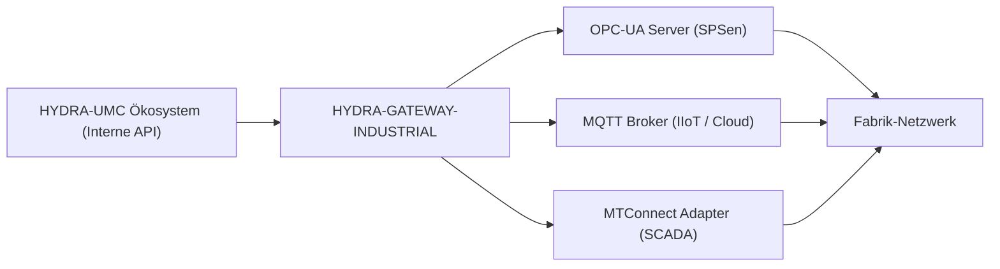

<p align="center">
  
</p>

# 🌐 HYDRA-UMC-GATEWAY-INDUSTRIAL

<p align="center"><a href="README.md">🇺🇸 English</a> | <a href="README_spa.md">🇪🇸 Español</a> | <a href="README_fra.md">🇫🇷 Français</a> | <a href="README_ita.md">🇮🇹 Italiano</a> | 🇩🇪 <b>Deutsch</b> | <a href="README_zho.md">🇨🇳 简体中文</a> | <a href="README_jpn.md">🇯🇵 日本語</a></p>

### 🏭 Industrie 4.0 Interoperabilitätsbrücke für Fabrikstandards

<p align="left">
  
  
  
  
</p>

---

## 1. 🛠️ TECHNISCHER ÜBERBLICK

**HYDRA-UMC-GATEWAY-INDUSTRIAL** ist die sichere Kommunikationsbrücke zwischen dem HYDRA-UMC-Ökosystem und externen Industriestandards. Es ermöglicht der Micro-Factory die Interaktion mit SPSen von Drittanbietern, SCADA-Systemen und cloudbasierten IIoT-Plattformen.

Es fungiert als Multi-Protokoll-Übersetzer, der interne Roboterzustände und Werkzeugtelemetrien als standardisierte Knoten in OPC-UA, MQTT-Topics oder MTConnect-XML-Streams exportiert. So wird sichergestellt, dass der Hydra-Schwarm niemals eine isolierte Insel in der Produktionsanlage ist.

### Hauptmerkmale:
* 🌐 **Multi-Standard-Unterstützung:** Integrierte OPC-UA-, MQTT- und MTConnect-Schnittstellen.
* 🛡️ **Industrielle Sicherheit:** Mutual TLS (mTLS) und zertifikatsbasierte Authentifizierung für alle Fabrikverbindungen.
* 🔄 **Zustands-Mapping:** Echtzeit-Übersetzung des internen JSON-Zustands von Hydra in standardisierte industrielle Adressräume.
* ⚡ **Hohe Zuverlässigkeit:** Dedizierte, leichtgewichtige Brücke, optimiert für den industriellen 24/7-Einsatz.

---

## 2. 🔄 GATEWAY-ARCHITEKTUR



---

## 3. 🧱 ARCHITEKTUR & DESIGNENTSCHEIDUNGEN

* **Warum es der Integrations-Elternteil, kein Gleichrangiger, seiner 3 Kinder ist.** HYDRA-UMC-OPCUA-SERVER, HYDRA-UMC-MQTT-BROKER und HYDRA-UMC-MTCONNECT-ADAPTER übersetzen alle denselben zugrunde liegenden Zustand von HYDRA-UMC-SERVER in 3 verschiedene Industrieprotokolle - das gemeinsame Routing/die Authentifizierung an einem Ort zu besitzen vermeidet 3 unabhängige, potenziell inkonsistente Übersetzungen desselben Zustands.
* **Warum 3 separate Protokolladapter statt eines Alles-Gateways.** OPC-UA, MQTT und MTConnect sind strukturell unterschiedlich (Address Space gegen Pub/Sub-Topics gegen XML-Device-/Agent-Streams) - ein Prozess pro Protokoll bedeutet, dass ein langsamer oder kaputter MQTT-Client nie den OPC-UA-Adapter beeinträchtigt, und jeder kann pro Deployment unabhängig aktiviert/deaktiviert werden.
* **Warum der Einstiegspunkt nur Identität/Version ausgibt und nach dem Start eines Health-Check-Listeners beendet wird.** Andamiaje-Stadium: der Nachweis, dass der Prozess startet und aktiv bleibt (nicht nur läuft und beendet, anders als die meisten anderen Node-Gerüste dieses Ökosystems), geht der echten Protokollübersetzungslogik voraus, da ein echtes Gateway von Natur aus ein langlaufender Dienst ist.
* **Wie sich das ins restliche Ökosystem einfügt.** Der Integrations-Elternteil der Industrial-Gateway-Familie - stellt den eigenen Zustand von HYDRA-UMC-SERVER Werkshallensystemen (MES/SCADA/Historians) zur Verfügung, die OPC-UA, MQTT oder MTConnect sprechen statt der eigenen REST/WebSocket-API dieses Ökosystems.
* **`GET /status` führt bei jeder Anfrage eine echte Live-Prüfung durch.** `src/probes.ts` stellt eine echte TCP-Verbindung für OPC-UA/MQTT her und sendet eine echte HTTP-`GET`-Anfrage für MTConnect an jedes Kind - `reachable`/`latencyMs`/`error` pro Kind sowie ein aggregiertes `allReachable` werden zum Zeitpunkt der Anfrage berechnet, nicht aus einer statischen oder zwischengespeicherten Liste zurückgegeben. End-to-End verifiziert: alle drei echten Kinder wurden gestartet, `/status` meldete sie alle erreichbar, eines wurde dann wirklich beendet, und der nächste `/status`-Aufruf markierte korrekt nur dieses Kind als nicht erreichbar mit einem echten `ECONNREFUSED`. Host/Port/URL jedes Kindes sind über Umgebungsvariablen konfigurierbar, standardmäßig mit denselben Servicenamen, die `docker-compose.yml` bereits verwendet.

---

## 📂 VERZEICHNISSTRUKTUR

```text
HYDRA-UMC-GATEWAY-INDUSTRIAL/
├── src/                # Quellcode (Node/TypeScript - Aggregationsoberfläche)
├── docs/               # Dokumentation und Mapping-Referenz
├── build/               # Kompilierte Ausgabe (npm run build)
├── images/             # Medien und Diagramme
├── scripts/            # Utility-Skripte (bump-version.mjs)
├── Dockerfile           # Eigenes Container-Image dieses Dienstes
├── docker-compose.yml   # Startet dieses Gateway + seine 3 Kinder zusammen
└── README.md
```

Reiner Netzwerkdienst ohne eigene Hardware - `hardware/`, `firmware/` und
`os/` wurden aus der ursprünglichen Projektvorlage entfernt (siehe die
Bereinigungsregel in `SONNET/5.PLAN_EJECUCION_32_PROYECTOS_NUEVOS.txt`,
interne Dokumentation des Ökosystems, angewendet auf dieses gesamte Paket).

---

## 🐳 INTEGRATION DER 3 KINDER-BRÜCKEN

Dies ist ein echtes Integrations-Repo, keine reine Dokumentation -
`docker-compose.yml` startet dieses Gateway zusammen mit seinen drei
Kindern (**HYDRA-UMC-OPCUA-SERVER**, **HYDRA-UMC-MQTT-BROKER**,
**HYDRA-UMC-MTCONNECT-ADAPTER**) als ein einziges Docker-Netzwerk, unter
der Annahme, dass die vier Repos als Geschwisterordner ausgecheckt sind
(das Layout, das die GitHub-Org dieses Ökosystems bereits verwendet):

```bash
docker compose up --build
```

Dies startet alle 4 Dienste auf denselben Ports, die jeder bereits
eigenständig verwendet: dieses Gateway auf `8000`, OPC-UA auf `4840`,
MQTT auf `1883`, MTConnect auf `5000`. `GET http://localhost:8000/status`
meldet die eigene Version des Gateways und welche Kinder es erreichen
können sollte.

---

## 🛠️ ENTWICKLUNGSUMGEBUNG

### Voraussetzungen
- [Node.js](https://nodejs.org/) (v18 oder höher empfohlen)
- npm

### Installation
```bash
npm install
```

### Entwicklungsmodus
Startet den Aggregationsserver direkt mit `tsx` (ohne Bundler):
- **Windows:** Doppelklick auf `dev.bat` oder `npm run dev` ausführen
- **Linux/Mac:** `./dev.sh` oder `npm run dev` ausführen

### Produktions-Build
Bündelt den Server mit esbuild in eine einzige einsetzbare Datei:
- **Windows:** Doppelklick auf `build.bat` oder `npm run build` ausführen
- **Linux/Mac:** `./build.sh` oder `npm run build` ausführen

Dann starten mit:
```bash
npm start
```

Der Server lauscht auf `0.0.0.0:8000` - `GET /status` meldet die eigene
Version des Gateways sowie Name/Protokoll/Endpoint jeder Kinder-Brücke,
für die es steht.

### Versionierung
Jeder echte `npm run build` erhöht automatisch die `version` in
`package.json` (`scripts/bump-version.mjs`, erster Schritt des
`build`-Skripts) - ein "Kilometerzähler" auf Basis 10: patch +1 pro Build,
mit Übertrag auf minor (und von minor auf major) über 9 hinaus, anstatt
je ein zweistelliges Segment zu erreichen (`0.0.9` -> `0.1.0`, nicht
`0.0.10`).

---

## 🚀 ROADMAP
* **Phase 1:** OPC-UA Pub/Sub-Implementierung für Hochgeschwindigkeitsdatenaustausch und Legacy-Protokoll-Bridging.
* **Phase 2:** MQTT-Broker-Cluster für massives IoT-Gerätemanagement und hohe Parallelität.
* **Phase 3:** MTConnect-Adapterunterstützung für die Integration von CNC- und SPS-Maschinen verschiedener Hersteller.
* **Phase 4:** Volle ISO-27001-Cybersicherheits-Compliance für das Industrial Gateway und Unterstützung für Profinet-Softwareadapter.

---

## 🔗 Verwandte Projekte

Dieses Projekt ist Teil eines größeren Robotik-Ökosystems desselben Autors (JuanenRac / Electro Hobby 3D), das Firmware, Steuerungssoftware, KI-Knoten und Flotten-Tools umfasst. Gut zu wissen, denn eine Anfrage könnte tatsächlich eines dieser Projekte betreffen statt dieses Repository.

### Familie

**Elternteil:** keiner — dieses Projekt ist selbst der Integrations-Elternteil der Industrial Gateway-Familie.

**Kinder:**
- **[HYDRA-UMC-OPCUA-SERVER](https://github.com/JuanenRac/HYDRA-UMC-OPCUA-SERVER)** — der OPC-UA-Protokolladapter, über den dieses Gateway routet.
- **[HYDRA-UMC-MQTT-BROKER](https://github.com/JuanenRac/HYDRA-UMC-MQTT-BROKER)** — der MQTT-Protokolladapter, über den dieses Gateway routet.
- **[HYDRA-UMC-MTCONNECT-ADAPTER](https://github.com/JuanenRac/HYDRA-UMC-MTCONNECT-ADAPTER)** — der MTConnect-Protokolladapter, über den dieses Gateway routet.

### Direkte Beziehung (außerhalb der Familie)

- **[HYDRA-UMC-SERVER](https://github.com/JuanenRac/HYDRA-UMC-SERVER)** — die Quelle des von diesem Gateway bereitgestellten Zustands.

### Restliches Ökosystem

**HYDRA-UMC-Plattform** — die Multi-Roboter-Mikrofabrikzelle
- **[HYDRA-UMC](https://github.com/JuanenRac/HYDRA-UMC)** — das CM5 + STM32H745-Motherboard, das bis zu 8 Roboterarme orchestriert.
- **[HYDRA-UMC-SERVER](https://github.com/JuanenRac/HYDRA-UMC-SERVER)** — das Express/WebSocket-Backend, mit dem jeder Steuerungsclient spricht.
- **[HYDRA-UMC-STUDIO](https://github.com/JuanenRac/HYDRA-UMC-STUDIO)** — webbasiertes Steuerungs-Dashboard, Multi-Roboter-3D-Visualisierung.
- **[HYDRA-UMC-ANDROID-CONTROL](https://github.com/JuanenRac/HYDRA-UMC-ANDROID-CONTROL)** — Android-Steuerungs-App über Wi-Fi/Bluetooth.
- **[HYDRA-UMC-IOS-CONTROL](https://github.com/JuanenRac/HYDRA-UMC-IOS-CONTROL)** — iOS/iPadOS-Steuerungs-App, gebaut in Flutter.
- **[HYDRA-UMC-SUITE](https://github.com/JuanenRac/HYDRA-UMC-SUITE)** — Desktop-Schwarm-Kommandozentrale (Python/PySide6).
- **[HYDRA-UMC-EDITOR-URDF](https://github.com/JuanenRac/HYDRA-UMC-EDITOR-URDF)** — Desktop-URDF-Modelleditor für den Roboterkatalog.
- **[HYDRA-UMC-DSI](https://github.com/JuanenRac/HYDRA-UMC-DSI)** — native Touch-UI für den eingebauten DSI-Touchscreen.

**URTC-Plattform** — der Werkzeugkopf-Controller, den jeder HYDRA-UMC-Roboterarm trägt
- **[URTC](https://github.com/JuanenRac/URTC)** — CAN-Bus-Werkzeugkopf-Controller, 25 Werkzeugprofile.
- **[URTC-FLASHER](https://github.com/JuanenRac/URTC-FLASHER)** — Desktop-Tool für CAN-OTA + SWD/JTAG-Flashing.
- **[URTC-TESTER](https://github.com/JuanenRac/URTC-TESTER)** — Desktop-Tool für Live-CAN-Bus-Diagnose.
- **[URTC-WEB-STUDIO](https://github.com/JuanenRac/URTC-WEB-STUDIO)** — browserbasierte Alternative über die Web-Serial-API.

**🎥 Vision AI Node (Hailo-8)**
- [HYDRA-UMC-VISION-NODE](https://github.com/JuanenRac/HYDRA-UMC-VISION-NODE)
- [HYDRA-UMC-VISION-STREAMER](https://github.com/JuanenRac/HYDRA-UMC-VISION-STREAMER)
- [HYDRA-UMC-DETECTION-HEF](https://github.com/JuanenRac/HYDRA-UMC-DETECTION-HEF)
- [HYDRA-UMC-SAFETY-ZONES](https://github.com/JuanenRac/HYDRA-UMC-SAFETY-ZONES)
- [HYDRA-UMC-VISUAL-SERVOING-API](https://github.com/JuanenRac/HYDRA-UMC-VISUAL-SERVOING-API)

**🧠 Cognitive AI Node (Hailo-10)**
- [HYDRA-UMC-COGNITIVE-NODE](https://github.com/JuanenRac/HYDRA-UMC-COGNITIVE-NODE)
- [HYDRA-UMC-VLA-ENGINE](https://github.com/JuanenRac/HYDRA-UMC-VLA-ENGINE)
- [HYDRA-UMC-VOICE-UI](https://github.com/JuanenRac/HYDRA-UMC-VOICE-UI)
- [HYDRA-UMC-SEMANTIC-PLANNER](https://github.com/JuanenRac/HYDRA-UMC-SEMANTIC-PLANNER)
- [HYDRA-UMC-DOCS-QA](https://github.com/JuanenRac/HYDRA-UMC-DOCS-QA)

**🐝 Orchestration & Swarm**
- [HYDRA-UMC-ORCHESTRATOR](https://github.com/JuanenRac/HYDRA-UMC-ORCHESTRATOR)
- [HYDRA-UMC-SWARM-SYNC](https://github.com/JuanenRac/HYDRA-UMC-SWARM-SYNC)
- [HYDRA-UMC-PATH-PLANNER-3D](https://github.com/JuanenRac/HYDRA-UMC-PATH-PLANNER-3D)
- [HYDRA-UMC-JOB-DISPATCHER](https://github.com/JuanenRac/HYDRA-UMC-JOB-DISPATCHER)
- [HYDRA-UMC-NODE-HEALING](https://github.com/JuanenRac/HYDRA-UMC-NODE-HEALING)

**🎮 Digital Twin & Simulation**
- [HYDRA-UMC-TWIN](https://github.com/JuanenRac/HYDRA-UMC-TWIN)
- [HYDRA-UMC-PHYSICS-REPLICA](https://github.com/JuanenRac/HYDRA-UMC-PHYSICS-REPLICA)
- [HYDRA-UMC-HIL-BRIDGE](https://github.com/JuanenRac/HYDRA-UMC-HIL-BRIDGE)
- [HYDRA-UMC-SYNTHETIC-DATA-GEN](https://github.com/JuanenRac/HYDRA-UMC-SYNTHETIC-DATA-GEN)

**📊 Data & Analytics**
- [HYDRA-UMC-DATALAKE](https://github.com/JuanenRac/HYDRA-UMC-DATALAKE)
- [HYDRA-UMC-TELEMETRY-COLLECTOR](https://github.com/JuanenRac/HYDRA-UMC-TELEMETRY-COLLECTOR)
- [HYDRA-UMC-ANOMALY-DETECTOR](https://github.com/JuanenRac/HYDRA-UMC-ANOMALY-DETECTOR)
- [HYDRA-UMC-PRODUCTION-REPORTS](https://github.com/JuanenRac/HYDRA-UMC-PRODUCTION-REPORTS)

**🛠️ Complementary Tools**
- [URTC-SMART-RACK](https://github.com/JuanenRac/URTC-SMART-RACK)
- [URTC-VISION-TOOL](https://github.com/JuanenRac/URTC-VISION-TOOL)
- [HYDRA-UMC-WATCH](https://github.com/JuanenRac/HYDRA-UMC-WATCH)
- [HYDRA-UMC-TOOL-CLI](https://github.com/JuanenRac/HYDRA-UMC-TOOL-CLI)
- [HYDRA-UMC-DASHBOARD-AI](https://github.com/JuanenRac/HYDRA-UMC-DASHBOARD-AI)


## 👤 AUTOR
**JuanenRac** (Electro Hobby 3D)
📧 electrohobby3d@gmail.com

## 📜 LIZENZ
GPL-3.0 - Siehe LICENSE für Details.

## Verwandte Projekte

> Canonical public ecosystem relationship map.

**Direct integrations:**
[HYDRA-UMC-OS](https://github.com/JuanenRac/HYDRA-UMC-OS) · [HYDRA-UMC-SDK](https://github.com/JuanenRac/HYDRA-UMC-SDK) · [HYDRA-UMC-SERVER](https://github.com/JuanenRac/HYDRA-UMC-SERVER) · [URTC](https://github.com/JuanenRac/URTC) · [HYDRA-UMC-OPCUA-SERVER](https://github.com/JuanenRac/HYDRA-UMC-OPCUA-SERVER) · [HYDRA-UMC-MQTT-BROKER](https://github.com/JuanenRac/HYDRA-UMC-MQTT-BROKER) · [HYDRA-UMC-MTCONNECT-ADAPTER](https://github.com/JuanenRac/HYDRA-UMC-MTCONNECT-ADAPTER)

**Platform and contracts:**
[HYDRA-UMC-OS](https://github.com/JuanenRac/HYDRA-UMC-OS) · [HYDRA-UMC-SDK](https://github.com/JuanenRac/HYDRA-UMC-SDK)

**Rest of the ecosystem:**
All remaining public repositories are grouped by the seven ecosystem layers in the [JuanenRac ecosystem dashboard](https://juanenrac.github.io/JuanenRac/).
