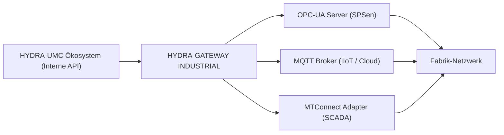

<p align="center">
  
</p>

# 🌐 HYDRA-UMC-GATEWAY-INDUSTRIAL

<p align="center"><a href="README.md">🇺🇸 English</a> | <a href="README_spa.md">🇪🇸 Español</a> | <a href="README_fra.md">🇫🇷 Français</a> | <a href="README_ita.md">🇮🇹 Italiano</a> | 🇩🇪 <b>Deutsch</b> | <a href="README_zho.md">🇨🇳 简体中文</a> | <a href="README_jpn.md">🇯🇵 日本語</a></p>

### 🏭 Industrie 4.0 Interoperabilitätsbrücke für Fabrikstandards

<p align="left">
  
  
  
  
</p>

---

## 1. 🛠️ TECHNISCHER ÜBERBLICK

**HYDRA-UMC-GATEWAY-INDUSTRIAL** ist die sichere Kommunikationsbrücke zwischen dem HYDRA-UMC-Ökosystem und externen Industriestandards. Es ermöglicht der Micro-Factory die Interaktion mit SPSen von Drittanbietern, SCADA-Systemen und cloudbasierten IIoT-Plattformen.

Es fungiert als Multi-Protokoll-Übersetzer, der interne Roboterzustände und Werkzeugtelemetrien als standardisierte Knoten in OPC-UA, MQTT-Topics oder MTConnect-XML-Streams exportiert. So wird sichergestellt, dass der Hydra-Schwarm niemals eine isolierte Insel in der Produktionsanlage ist.

### Hauptmerkmale:
* 🌐 **Multi-Standard-Unterstützung:** Integrierte OPC-UA-, MQTT- und MTConnect-Schnittstellen.
* 🛡️ **Industrielle Sicherheit:** Mutual TLS (mTLS) und zertifikatsbasierte Authentifizierung für alle Fabrikverbindungen.
* 🔄 **Zustands-Mapping:** Echtzeit-Übersetzung des internen JSON-Zustands von Hydra in standardisierte industrielle Adressräume.
* ⚡ **Hohe Zuverlässigkeit:** Dedizierte, leichtgewichtige Brücke, optimiert für den industriellen 24/7-Einsatz.
* 🚦 **Echtes v0 - Befehls-Allowlist + Backpressure:** `POST /command` wird durch eine standardmäßig verweigernde Allowlist pro Protokoll, ein begrenztes Nebenläufigkeitslimit und einen echten Timeout abgesichert - siehe „Ehrlichkeitscheck" unten für das, was heute genau durchgesetzt wird.

**Ehrlichkeitscheck - was heute wirklich läuft:** `POST /command { protocol, operation, target }` ist echt: die Operation muss für ihr Protokoll explizit auf der Allowlist stehen (`403`, wenn nicht - v0 erlaubt nur lese-/veröffentlichungsartige Operationen, nichts, was einen laufenden SPS-Zustand verändert), es laufen nie mehr als eine begrenzte Anzahl Befehle gleichzeitig (`429` darüber hinaus), und ein Befehl, der nicht rechtzeitig aufgelöst wird, wird als abgelaufen gemeldet (`504`), statt endlos zu hängen. Der Standard-Ausführungspfad nutzt die eigenen echten Erreichbarkeits-Sonden dieses Projekts wieder - ehrlich darüber, dass noch kein echtes protokollseitiges Schreiben (OPC-UA/MQTT/MTConnect) stattfindet, da auch keines der drei Kinder bislang eine echte Befehls-API bereitstellt. Siehe `CHANGELOG.md` für genau das, was geliefert wurde.

---

## 2. 🔄 GATEWAY-ARCHITEKTUR



---

## 3. 🧱 ARCHITEKTUR & DESIGNENTSCHEIDUNGEN

* **Warum es der Integrations-Elternteil, kein Gleichrangiger, seiner 3 Kinder ist.** HYDRA-UMC-OPCUA-SERVER, HYDRA-UMC-MQTT-BROKER und HYDRA-UMC-MTCONNECT-ADAPTER übersetzen alle denselben zugrunde liegenden Zustand von HYDRA-UMC-SERVER in 3 verschiedene Industrieprotokolle - das gemeinsame Routing/die Authentifizierung an einem Ort zu besitzen vermeidet 3 unabhängige, potenziell inkonsistente Übersetzungen desselben Zustands.
* **Warum 3 separate Protokolladapter statt eines Alles-Gateways.** OPC-UA, MQTT und MTConnect sind strukturell unterschiedlich (Address Space gegen Pub/Sub-Topics gegen XML-Device-/Agent-Streams) - ein Prozess pro Protokoll bedeutet, dass ein langsamer oder kaputter MQTT-Client nie den OPC-UA-Adapter beeinträchtigt, und jeder kann pro Deployment unabhängig aktiviert/deaktiviert werden.
* **Warum der Einstiegspunkt nur Identität/Version ausgibt und nach dem Start eines Health-Check-Listeners beendet wird.** Andamiaje-Stadium: der Nachweis, dass der Prozess startet und aktiv bleibt (nicht nur läuft und beendet, anders als die meisten anderen Node-Gerüste dieses Ökosystems), geht der echten Protokollübersetzungslogik voraus, da ein echtes Gateway von Natur aus ein langlaufender Dienst ist.
* **Wie sich das ins restliche Ökosystem einfügt.** Der Integrations-Elternteil der Industrial-Gateway-Familie - stellt den eigenen Zustand von HYDRA-UMC-SERVER Werkshallensystemen (MES/SCADA/Historians) zur Verfügung, die OPC-UA, MQTT oder MTConnect sprechen statt der eigenen REST/WebSocket-API dieses Ökosystems.
* **`GET /status` führt bei jeder Anfrage eine echte Live-Prüfung durch.** `src/probes.ts` stellt eine echte TCP-Verbindung für OPC-UA/MQTT her und sendet eine echte HTTP-`GET`-Anfrage für MTConnect an jedes Kind - `reachable`/`latencyMs`/`error` pro Kind sowie ein aggregiertes `allReachable` werden zum Zeitpunkt der Anfrage berechnet, nicht aus einer statischen oder zwischengespeicherten Liste zurückgegeben. End-to-End verifiziert: alle drei echten Kinder wurden gestartet, `/status` meldete sie alle erreichbar, eines wurde dann wirklich beendet, und der nächste `/status`-Aufruf markierte korrekt nur dieses Kind als nicht erreichbar mit einem echten `ECONNREFUSED`. Host/Port/URL jedes Kindes sind über Umgebungsvariablen konfigurierbar, standardmäßig mit denselben Servicenamen, die `docker-compose.yml` bereits verwendet.
* **Warum die Allowlist von `POST /command` standardmäßig verweigert, statt standardmäßig zu erlauben.** Ein industrielles Gateway, das jeden beliebigen Operations-String weiterleitet, ist ein Risiko, sobald ein Kind einen echten Schreibpfad bereitstellt - mit „nichts ist erlaubt, sofern nicht explizit gelistet" zu beginnen bedeutet, dass das Hinzufügen einer gefährlichen Operation (ein OPC-UA-Node-Schreibzugriff, eine MQTT-Retained-Config-Veröffentlichung) immer eine bewusste, später überprüfbare Entscheidung ist, nie ein zufälliger Standard von heute.
* **Warum die Autorisierung in `CommandDispatcher.dispatch()` vor dem Backpressure geprüft wird.** Ein nicht autorisierter Befehl muss unabhängig von der aktuellen Auslastung des Gateways immer gleich abgelehnt werden - würde die Kapazität zuerst geprüft, könnte eine nicht erlaubte Operation gelegentlich als „accepted" durchrutschen (ein Slot war gerade frei) oder gelegentlich als „nur beschäftigt" gelesen werden (er war es nicht), wodurch Timing-Informationen über die Gateway-Last durch eine Entscheidung durchsickern, die rein auf Autorisierung beruhen sollte.
* **Warum der Standard-Befehlsausführer die Erreichbarkeits-Sonden wiederverwendet statt eines Stubs, der immer erfolgreich ist.** `src/probes.ts` beantwortet bereits echt die Frage „ist dieses Kind tatsächlich da" - es wiederzuverwenden bedeutet, dass `POST /command` gegen ein abgeschaltetes Kind ehrlich fehlschlägt (`502 downstream_unreachable`), statt `accepted` für einen Befehl zu melden, der nirgendwohin hätte gelangen können.

---

## 📂 VERZEICHNISSTRUKTUR

```text
HYDRA-UMC-GATEWAY-INDUSTRIAL/
├── src/
│   ├── probes.ts        # Echte TCP/HTTP-Erreichbarkeitsprüfungen je Kind
│   ├── command.ts        # Echter CommandDispatcher: Allowlist + Backpressure + Timeout
│   ├── version.ts        # Echte Paketversion zur Laufzeit, gelesen aus package.json
│   └── server.ts         # Express-App: GET /status, POST /command
├── tests/               # Echte vitest-Suite (probes, server, command)
├── docs/               # Dokumentation und Mapping-Referenz
├── build/               # Kompilierte Ausgabe (npm run build)
├── images/             # Medien und Diagramme
├── scripts/            # Utility-Skripte (bump-version.mjs)
├── tools/
│   ├── build_test.py    # Nicht-versionierender Build-Check
│   └── ci_validate.py   # Manifest/CHANGELOG/Docs-Validierung, von CI genutzt
├── bump_manifest_version.py # Synchronisiert die Version von hydra-umc.project.json mit der von package.json (--sync)
├── .env.example         # Umgebungsvariablen-Vorlage
├── build.sh/.bat        # Erhöht die Version, dann npm run build
├── build-test.sh/.bat   # Nicht-versionierender Build-Check
├── dev.sh/.bat           # Führt den Server direkt aus dem Quellcode aus, ohne Build-Schritt
├── Dockerfile           # Eigenes Container-Image dieses Dienstes
├── docker-compose.yml   # Startet dieses Gateway + seine 3 Kinder zusammen
└── README.md
```

Reiner Netzwerkdienst ohne eigene Hardware - `hardware/`, `firmware/` und
`os/` werden gemäß der Repository-Strukturpolitik ausgelassen.

---

## 🐳 INTEGRATION DER 3 KINDER-BRÜCKEN

Dies ist ein echtes Integrations-Repo, keine reine Dokumentation -
`docker-compose.yml` startet dieses Gateway zusammen mit seinen drei
Kindern (**HYDRA-UMC-OPCUA-SERVER**, **HYDRA-UMC-MQTT-BROKER**,
**HYDRA-UMC-MTCONNECT-ADAPTER**) als ein einziges Docker-Netzwerk, unter
der Annahme, dass die vier Repos als Geschwisterordner ausgecheckt sind
(das Layout, das die GitHub-Org dieses Ökosystems bereits verwendet):

```bash
docker compose up --build
```

Dies startet alle 4 Dienste auf denselben Ports, die jeder bereits
eigenständig verwendet: dieses Gateway auf `8000`, OPC-UA auf `4840`,
MQTT auf `1883`, MTConnect auf `5000`. `GET http://localhost:8000/status`
meldet die eigene Version des Gateways und welche Kinder es erreichen
können sollte.

---

## 🛠️ ENTWICKLUNGSUMGEBUNG

### Voraussetzungen
- [Node.js](https://nodejs.org/) (v18 oder höher empfohlen)
- npm

### Installation
```bash
npm install
```

### Entwicklungsmodus
Startet den Aggregationsserver direkt mit `tsx` (ohne Bundler):
- **Windows:** Doppelklick auf `dev.bat` oder `npm run dev` ausführen
- **Linux/Mac:** `./dev.sh` oder `npm run dev` ausführen

### Produktions-Build
Bündelt den Server mit esbuild in eine einzige einsetzbare Datei:
- **Windows:** Doppelklick auf `build.bat` oder `npm run build` ausführen
- **Linux/Mac:** `./build.sh` oder `npm run build` ausführen

Dann starten mit:
```bash
npm start
```

Der Server lauscht auf `0.0.0.0:8000` - `GET /status` meldet die eigene
Version des Gateways sowie Name/Protokoll/Endpoint jeder Kinder-Brücke,
für die es steht.

Echtes Beispiel - ein erlaubter Befehl gegen ein nicht laufendes Kind,
eine nicht autorisierte Operation und eine fehlerhafte Anfrage:

```bash
curl -X POST http://localhost:8000/command -H "Content-Type: application/json" \
  -d '{"protocol":"OPC-UA","operation":"read","target":"ns=2;s=Line1.Status"}'
# 502 {"status":"downstream_unreachable","reason":"TCP connect to opcua-server:4840 timed out after 2000ms"}

curl -X POST http://localhost:8000/command -H "Content-Type: application/json" \
  -d '{"protocol":"OPC-UA","operation":"write","target":"ns=2;s=Line1.SetPoint"}'
# 403 {"status":"rejected_unauthorized","reason":"operation \"write\" is not allowlisted for OPC-UA"}

curl -X POST http://localhost:8000/command -H "Content-Type: application/json" -d '{"protocol":"OPC-UA"}'
# 400 {"error":"protocol, operation and target are required strings"}
```

### Versionierung
Jeder echte `npm run build` erhöht automatisch die `version` in
`package.json` (`scripts/bump-version.mjs`, erster Schritt des
`build`-Skripts) - ein "Kilometerzähler" auf Basis 10: patch +1 pro Build,
mit Übertrag auf minor (und von minor auf major) über 9 hinaus, anstatt
je ein zweistelliges Segment zu erreichen (`0.0.9` -> `0.1.0`, nicht
`0.0.10`).

---

## 🚀 FAHRPLAN
* **Phase 1:** OPC-UA Pub/Sub-Implementierung für Hochgeschwindigkeitsdatenaustausch und Legacy-Protokoll-Bridging.
* **Phase 2:** MQTT-Broker-Cluster für massives IoT-Gerätemanagement und hohe Parallelität.
* **Phase 3:** MTConnect-Adapterunterstützung für die Integration von CNC- und SPS-Maschinen verschiedener Hersteller.
* **Phase 4:** Volle ISO-27001-Cybersicherheits-Compliance für das Industrielles Gateway und Unterstützung für Profinet-Softwareadapter.

---

## 🔗 Verwandte Projekte

Dieses Projekt ist Teil des HYDRA-UMC-Robotik-Ökosystems desselben Autors (JuanenRac / Electro Hobby 3D). Gut zu wissen, da eine Anfrage eigentlich eines dieser Projekte betreffen könnte statt dieses Repositorys.

**Untergeordnete Projekte** — jedes davon ist ein Protokolladapter, über den dieses Gateway leitet
- **[HYDRA-UMC-OPCUA-SERVER](https://github.com/JuanenRac/HYDRA-UMC-OPCUA-SERVER)** — echter OPC-UA-Adressraum, verifiziert mit einer echten Binärprotokoll-Client-Session.
- **[HYDRA-UMC-MQTT-BROKER](https://github.com/JuanenRac/HYDRA-UMC-MQTT-BROKER)** — echter MQTT-Broker mit optionaler Pro-Client-Authentifizierung und Topic-ACLs.
- **[HYDRA-UMC-MTCONNECT-ADAPTER](https://github.com/JuanenRac/HYDRA-UMC-MTCONNECT-ADAPTER)** — echte MTConnect-`/probe`- und `/current`-XML-Endpunkte mit Degraded-Mode-Ausgabe.

**Direkt verwandt**
- **[HYDRA-UMC-SERVER](https://github.com/JuanenRac/HYDRA-UMC-SERVER)** — das reale Headless-Backend (REST/WebSocket), mit dem jeder Steuerungsclient tatsächlich spricht; die Quelle des Zustands, den dieses Gateway offenlegt.

**Ebenfalls Teil des Ökosystems**

*Kern-Hardware & Plattform*
- **[HYDRA-UMC](https://github.com/JuanenRac/HYDRA-UMC)** — das physische Motherboard des Roboterarms: CM5-Host + Dual-Core-STM32H745, koordiniert bis zu 8 Werkzeugarme über CAN-OTA/SPI-OTA.
- **[HYDRA-UMC-OS](https://github.com/JuanenRac/HYDRA-UMC-OS)** — reproduzierbare Raspberry-Pi-OS-Produktschicht für den CM5: schreibgeschützter Agent, validierte Konfiguration/Profile, WiFi-Ersteinrichtung.
- **[HYDRA-UMC-SDK](https://github.com/JuanenRac/HYDRA-UMC-SDK)** — der gemeinsame JSON-Schema-Vertrag und die Sicherheitsschranke, gegen die jede Bridge ihre Befehle validiert.

*Kern-Backend & Clients*
- **[HYDRA-UMC-STUDIO](https://github.com/JuanenRac/HYDRA-UMC-STUDIO)** — Web-Steuerungs-Dashboard mit Echtzeit-3D-Visualisierung mehrerer Roboter.
- **[HYDRA-UMC-ANDROID-CONTROL](https://github.com/JuanenRac/HYDRA-UMC-ANDROID-CONTROL)** — native Android-Steuerungs-App mit biometrischem Login und einer gekoppelten Wear-OS-Begleit-App.
- **[HYDRA-UMC-IOS-CONTROL](https://github.com/JuanenRac/HYDRA-UMC-IOS-CONTROL)** — iOS/iPadOS-Steuerungs-App (Flutter) mit Echtzeit-WebSocket-Synchronisierung.
- **[HYDRA-UMC-DSI](https://github.com/JuanenRac/HYDRA-UMC-DSI)** — native Touch-UI für das eingebaute 7"-DSI-Touchscreen, direkt auf dem CM5 eingebettet.
- **[HYDRA-UMC-EDITOR-URDF](https://github.com/JuanenRac/HYDRA-UMC-EDITOR-URDF)** — grafischer Desktop-URDF-Ersteller/-Editor, der fertige Modelle in STUDIOs eigenen Katalog überträgt.
- **[HYDRA-UMC-BRIDGE-AMR](https://github.com/JuanenRac/HYDRA-UMC-BRIDGE-AMR)** — Koordinationsschranke für AGV-/AMR-Flotten über einen echten VDA-5050-MQTT-Publisher.
- **[HYDRA-UMC-BRIDGE-CNC](https://github.com/JuanenRac/HYDRA-UMC-BRIDGE-CNC)** — High-Level-Koordinator für CNC-Zellen mit echtem GRBL-Status-/Steuerbyte-Zugriff.
- **[HYDRA-UMC-BRIDGE-DROIDS](https://github.com/JuanenRac/HYDRA-UMC-BRIDGE-DROIDS)** — Koordinationsschranke für laufende/humanoide Droiden, mit einem echten Boston-Dynamics-Spot-Befehlssender.
- **[HYDRA-UMC-BRIDGE-LASER](https://github.com/JuanenRac/HYDRA-UMC-BRIDGE-LASER)** — Sicherheitskoordinator für Laserzellen, liest 3 echte Schlüssel-/Gehäuse-/Verriegelungs-GPIO-Sicherungen.
- **[HYDRA-UMC-BRIDGE-OPENPNP](https://github.com/JuanenRac/HYDRA-UMC-BRIDGE-OPENPNP)** — sicherer High-Level-Koordinator für den Leiterplattenfluss von OpenPnP Pick-and-Place.
- **[HYDRA-UMC-BRIDGE-PRINTER3D](https://github.com/JuanenRac/HYDRA-UMC-BRIDGE-PRINTER3D)** — sichere Koordinationsschranke für Moonraker/Klipper-3D-Drucker, mit echten gesicherten Job-Befehlen.
- **[HYDRA-UMC-BRIDGE-ROS2](https://github.com/JuanenRac/HYDRA-UMC-BRIDGE-ROS2)** — Sicherheitskoordinator mit einem echten, träge importierten rclpy-ROS-2-Transport.
- **[HYDRA-UMC-BRIDGE-UAV](https://github.com/JuanenRac/HYDRA-UMC-BRIDGE-UAV)** — Koordinationsschranke für kameraausgestattete UAVs, mit einem echten MAVLink-Befehlssender.

*URTC-Werkzeugplattform*
- **[URTC](https://github.com/JuanenRac/URTC)** — Firmware für die physische Universal-Robot-Tool-Controller-Platine, 25+ Werkzeugprofile über CAN-Bus.
- **[URTC-FLASHER](https://github.com/JuanenRac/URTC-FLASHER)** — Desktop-GUI-Flash-Tool für URTC-Platinen, CAN-OTA plus Full-Chip-SWD/JTAG.
- **[URTC-TESTER](https://github.com/JuanenRac/URTC-TESTER)** — Desktop-Live-CAN-Bus-Diagnosetool für URTC-Platinen, ein Panel pro Werkzeugprofil.
- **[URTC-WEB-STUDIO](https://github.com/JuanenRac/URTC-WEB-STUDIO)** — browserbasierte Alternative zu URTC-TESTER über die Web-Serial-API, ohne lokale Installation.

*Vision-KI-Knoten (Hailo-8)*
- **[HYDRA-UMC-VISION-NODE](https://github.com/JuanenRac/HYDRA-UMC-VISION-NODE)** — Integrationsknoten für die Hailo-8-Vision-Pipeline, mit einer echten stufenweisen Hardware-Bereitschaftsprüfung.
- **[HYDRA-UMC-DETECTION-HEF](https://github.com/JuanenRac/HYDRA-UMC-DETECTION-HEF)** — echte Registry für kompilierte Modelle mit Hailo-Architektur-/Prüfsummen-Safe-Load-Verifizierung.
- **[HYDRA-UMC-VISION-STREAMER](https://github.com/JuanenRac/HYDRA-UMC-VISION-STREAMER)** — echter GStreamer-Pipeline- + MediaMTX-Konfigurationsgenerator mit einer echten HailoRT-Integrationsschranke.
- **[HYDRA-UMC-VISUAL-SERVOING-API](https://github.com/JuanenRac/HYDRA-UMC-VISUAL-SERVOING-API)** — echtes Position-Based-Visual-Servoing-Korrekturgesetz, sicherheitsgesteuert nach vorgelagertem Zonenstatus.
- **[HYDRA-UMC-SAFETY-ZONES](https://github.com/JuanenRac/HYDRA-UMC-SAFETY-ZONES)** — echte Zonenverletzungsprüfung und E-STOP-Anforderung, mit erzwungener Kalibrierungsaktualität.

*Kognitiver KI-Knoten (Hailo-10)*
- **[HYDRA-UMC-COGNITIVE-NODE](https://github.com/JuanenRac/HYDRA-UMC-COGNITIVE-NODE)** — Integrationsknoten für die Hailo-10-Cognitive-Pipeline (LLM-/VLA-/Sprach-Orchestrierung).
- **[HYDRA-UMC-VLA-ENGINE](https://github.com/JuanenRac/HYDRA-UMC-VLA-ENGINE)** — echte Aktions-Token-Kodierung/-Dekodierung und Trajektoriengenerierung für ein Vision-Language-Action-Modell.
- **[HYDRA-UMC-VOICE-UI](https://github.com/JuanenRac/HYDRA-UMC-VOICE-UI)** — echtes Sprach-Frontend (VAD + Intent-Parser) mit einem begrenzten, bestätigungsgesicherten Watch-Relay.
- **[HYDRA-UMC-SEMANTIC-PLANNER](https://github.com/JuanenRac/HYDRA-UMC-SEMANTIC-PLANNER)** — echte regelbasierte Aufgabenzerlegung und semantische Fehlerbehebung über MCU-Fehlercodes.
- **[HYDRA-UMC-DOCS-QA](https://github.com/JuanenRac/HYDRA-UMC-DOCS-QA)** — echte, nur auf der Standardbibliothek basierende TF-IDF-Dokumentensuche über die eigenen Markdown-Dokumente dieses Ökosystems.

*Orchestrierung & Schwarm*
- **[HYDRA-UMC-ORCHESTRATOR](https://github.com/JuanenRac/HYDRA-UMC-ORCHESTRATOR)** — Integrationsknoten mit einem echten gRPC/Protobuf-Health-Report-Vertrag und einer Missions-Zustandsmaschine.
- **[HYDRA-UMC-JOB-DISPATCHER](https://github.com/JuanenRac/HYDRA-UMC-JOB-DISPATCHER)** — echte prioritätsbasierte Job-Queue mit Deduplizierung, über eine echte HTTP-API.
- **[HYDRA-UMC-NODE-HEALING](https://github.com/JuanenRac/HYDRA-UMC-NODE-HEALING)** — echter gRPC-basierter Flotten-Health-Watchdog mit Retry/Backoff und Identitäts-Mismatch-Erkennung.
- **[HYDRA-UMC-PATH-PLANNER-3D](https://github.com/JuanenRac/HYDRA-UMC-PATH-PLANNER-3D)** — echter RRT-basierter 3D-Pfadplaner mit echter Hindernis-/Arbeitsraum-Kollisionsvalidierung.
- **[HYDRA-UMC-SWARM-SYNC](https://github.com/JuanenRac/HYDRA-UMC-SWARM-SYNC)** — echte CRDT-LWW-Element-Map-Zustandssynchronisation, eigenschaftsgetestet auf Multi-Zellen-Konvergenz.

*Digitaler Zwilling & Simulation*
- **[HYDRA-UMC-TWIN](https://github.com/JuanenRac/HYDRA-UMC-TWIN)** — Integrationsknoten für die Digital-Twin-Engine, mit einem echten Versionskompatibilitäts-Sync-Vertrag.
- **[HYDRA-UMC-HIL-BRIDGE](https://github.com/JuanenRac/HYDRA-UMC-HIL-BRIDGE)** — echte Hardware-in-the-Loop-Sicherheitsverriegelung, die Befehle zwischen Simulation und echter Hardware routet.
- **[HYDRA-UMC-PHYSICS-REPLICA](https://github.com/JuanenRac/HYDRA-UMC-PHYSICS-REPLICA)** — echte Vorwärtskinematik und Gelenkgrenzenvalidierung über eine echte URDF-Teilmenge.
- **[HYDRA-UMC-SYNTHETIC-DATA-GEN](https://github.com/JuanenRac/HYDRA-UMC-SYNTHETIC-DATA-GEN)** — echter prozeduraler 2D-Szenengenerator mit YOLO/COCO-Annotationsexport.

*Daten & Analytik*
- **[HYDRA-UMC-DATALAKE](https://github.com/JuanenRac/HYDRA-UMC-DATALAKE)** — echter sqlite3-gestützter Zeitreihenspeicher mit einer echten Ingest-/Abfrage-HTTP-API.
- **[HYDRA-UMC-ANOMALY-DETECTOR](https://github.com/JuanenRac/HYDRA-UMC-ANOMALY-DETECTOR)** — echter FFT- + statistischer Basislinien-Anomaliedetektor mit Drift-Überwachung.
- **[HYDRA-UMC-PRODUCTION-REPORTS](https://github.com/JuanenRac/HYDRA-UMC-PRODUCTION-REPORTS)** — echte OEE-/Verfügbarkeitsberechnung über den DATALAKE-Verlauf, mit reproduzierbarem CSV-Export.
- **[HYDRA-UMC-TELEMETRY-COLLECTOR](https://github.com/JuanenRac/HYDRA-UMC-TELEMETRY-COLLECTOR)** — echte CAN/WebSocket-Ingestion-Pipeline in DATALAKE, mit Sequenz-Deduplizierung.

*Ergänzende Tools & Ökosystembetrieb*
- **[HYDRA-UMC-DASHBOARD-AI](https://github.com/JuanenRac/HYDRA-UMC-DASHBOARD-AI)** — Smart-Summaries- und Anomaly-Highlighting-Panels über DATALAKE/ANOMALY-DETECTOR, mit einem ehrlichen statistischen Fallback.
- **[HYDRA-UMC-TOOL-CLI](https://github.com/JuanenRac/HYDRA-UMC-TOOL-CLI)** — Flotten-CLI mit einem echten, stabilen Exit-Code-Vertrag, ein echter Live-Client der eigenen API von HYDRA-UMC-SERVER.
- **[HYDRA-UMC-WATCH](https://github.com/JuanenRac/HYDRA-UMC-WATCH)** — WearOS-Begleit-App mit echten haptischen Alarmen und einem Sprach-Relay zum gekoppelten Telefon.
- **[URTC-SMART-RACK](https://github.com/JuanenRac/URTC-SMART-RACK)** — Firmware für ein Platinenmontagegestell mit echter Werkzeug-ID-Dekodierung und Smart-Idle-Vorheizlogik.
- **[URTC-VISION-TOOL](https://github.com/JuanenRac/URTC-VISION-TOOL)** — Firmware plus ein echter Python-Vision-Begleiter für einen Thermal-/RGB-Inspektionswerkzeugkopf.
- **[HYDRA-UMC-UPDATER](https://github.com/JuanenRac/HYDRA-UMC-UPDATER)** — administratives Desktop-Tool, das jedes Repository in diesem Ökosystem entdeckt, klont und aktualisiert.


---

## 📚 Dokumentation & Community

- **[docs/API.md](docs/API.md)** — die echte HTTP-API-Referenz: jedes Feld der `GET /status`-Antwort, die `403`/`429`/`504`/`502`-Grenzen von `POST /command`, und jede Konfigurations-Umgebungsvariable, direkt aus `src/server.ts`/`src/probes.ts` dokumentiert.
- **[CONTRIBUTING.md](CONTRIBUTING.md)** — Technologie-Stack und Coding-Richtlinien für einen Pull Request.
- **[CODE_OF_CONDUCT.md](CODE_OF_CONDUCT.md)** — die in dieser Community erwarteten Verhaltensstandards.
- **[SECURITY.md](SECURITY.md)** — wie man eine Schwachstelle meldet, und die echten Sicherheitsschwerpunkte dieses Projekts.
- **[SUPPORT.md](SUPPORT.md)** — wo man Fragen stellt und Fehler meldet.
- **[LICENSE.md](LICENSE.md)** — die eigene Lizenz dieses Projekts.

## 👤 AUTOR
**JuanenRac** (Electro Hobby 3D)
📧 electrohobby3d@gmail.com
📺 [youtube.com/@electrohobby3d](https://youtube.com/@electrohobby3d)

## 📜 LIZENZ
GPL-3.0 - Siehe LICENSE für Details.
