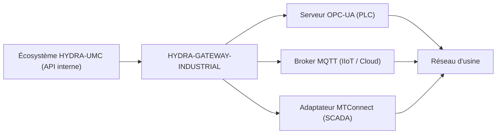

<p align="center">
  
</p>

# 🌐 HYDRA-UMC-GATEWAY-INDUSTRIAL

<p align="center"><a href="README.md">🇺🇸 English</a> | <a href="README_spa.md">🇪🇸 Español</a> | 🇫🇷 <b>Français</b> | <a href="README_ita.md">🇮🇹 Italiano</a> | <a href="README_deu.md">🇩🇪 Deutsch</a> | <a href="README_zho.md">🇨🇳 简体中文</a> | <a href="README_jpn.md">🇯🇵 日本語</a></p>

### 🏭 Pont d'interopérabilité Industrie 4.0 pour les standards d'usine

<p align="left">
  
  
  
  
</p>

---

## 1. 🛠️ APERÇU TECHNIQUE

**HYDRA-UMC-GATEWAY-INDUSTRIAL** est le pont de communication sécurisé entre l'écosystème HYDRA-UMC et les normes industrielles externes. Il permet à la micro-usine d'interagir avec des automates tiers (PLC), des systèmes SCADA et des plateformes IIoT basées sur le cloud.

Il agit comme un traducteur multiprotocole, exposant les états robotiques internes et les télémétries d'outils sous forme de nœuds standardisés dans OPC-UA, de sujets MQTT ou de flux XML MTConnect, garantissant que l'essaim Hydra n'est jamais une île isolée dans l'usine de production.

### Caractéristiques principales :
* 🌐 **Prise en charge multi-standard :** Interfaces OPC-UA, MQTT et MTConnect intégrées.
* 🛡️ **Sécurité industrielle :** Mutual TLS (mTLS) et authentification par certificat pour toutes les connexions d'usine.
* 🔄 **Mappage d'état :** Traduction en temps réel de l'état JSON interne de Hydra en espaces d'adressage industriels standardisés.
* ⚡ **Haute fiabilité :** Pont léger dédié optimisé pour une disponibilité industrielle 24h/24 et 7j/7.
* 🚦 **Réel v0 - Liste d'autorisation de commandes + Backpressure :** `POST /command` est protégé par une liste d'autorisation par défaut-refus par protocole, une limite de concurrence bornée et un vrai timeout - voir « Vérification d'honnêteté » ci-dessous pour ce qui est appliqué exactement aujourd'hui.

**Vérification d'honnêteté - ce qui fonctionne réellement aujourd'hui :** `POST /command { protocol, operation, target }` est réel : l'opération doit être explicitement listée pour son protocole (`403` sinon - v0 n'autorise que les opérations de type lecture/publication, rien qui écrive sur un PLC en direct), pas plus qu'un nombre borné de commandes ne s'exécutent à la fois (`429` au-delà), et une commande qui ne se résout pas à temps est signalée comme expirée (`504`) plutôt que laissée en attente indéfiniment. Le chemin d'exécution par défaut réutilise les propres sondes d'accessibilité réelles de ce projet - honnête sur le fait qu'il n'effectue pas encore une vraie écriture au niveau protocole OPC-UA/MQTT/MTConnect, puisqu'aucun des trois enfants n'expose encore de vraie API de commande non plus. Voir `CHANGELOG.md` pour ce qui a été livré exactement.

---

## 2. 🔄 ARCHITECTURE DE LA PASSERELLE



---

## 3. 🧱 ARCHITECTURE & DÉCISIONS DE CONCEPTION

* **Pourquoi c'est le parent d'intégration, pas un pair, de ses 3 enfants.** HYDRA-UMC-OPCUA-SERVER, HYDRA-UMC-MQTT-BROKER et HYDRA-UMC-MTCONNECT-ADAPTER traduisent tous le MÊME état sous-jacent de HYDRA-UMC-SERVER vers 3 protocoles industriels différents - posséder le routage/l'authentification partagés à un seul endroit évite 3 traductions indépendantes et potentiellement incohérentes du même état.
* **Pourquoi 3 adaptateurs de protocole séparés, pas une passerelle qui fait tout.** OPC-UA, MQTT et MTConnect sont structurellement différents (espace d'adressage contre sujets pub/sub contre flux XML device/agent) - un processus par protocole signifie qu'un client MQTT lent ou cassé n'affecte jamais celui d'OPC-UA, et chacun peut être activé/désactivé indépendamment selon le déploiement.
* **Pourquoi le point d'entrée n'imprime qu'identité/version, et se termine après la mise en place d'un listener de health-check.** Étape d'andamiaje : prouver que le processus démarre et reste actif (pas seulement s'exécute et se termine, contrairement à la plupart des autres squelettes Node de cet écosystème) précède la vraie logique de traduction de protocole, une vraie passerelle étant par nature un service de longue durée.
* **Comment cela s'intègre dans le reste de l'écosystème.** Le parent d'intégration de la famille Industrial Gateway - expose le propre état de HYDRA-UMC-SERVER aux systèmes d'atelier (MES/SCADA/historiens) qui parlent OPC-UA, MQTT ou MTConnect plutôt que la propre API REST/WebSocket de cet écosystème.
* **`GET /status` effectue une vérification réelle et en direct à chaque requête.** `src/probes.ts` réalise une vraie connexion TCP pour OPC-UA/MQTT et une vraie requête HTTP `GET` pour MTConnect vers chaque enfant - `reachable`/`latencyMs`/`error` par enfant et un `allReachable` agrégé sont calculés au moment de la requête, et non renvoyés depuis une liste statique ou en cache. Vérifié de bout en bout : les 3 enfants réels ont été démarrés, `/status` les a tous signalés comme accessibles, l'un d'eux a ensuite été réellement arrêté, et l'appel suivant à `/status` a correctement basculé uniquement cet enfant en inaccessible avec un vrai `ECONNREFUSED`. L'hôte/port/URL de chaque enfant est configurable via des variables d'environnement, avec pour valeur par défaut le nom de service que `docker-compose.yml` utilise déjà.
* **Pourquoi la liste d'autorisation de `POST /command` est par défaut-refus, pas par défaut-autorisation.** Une passerelle industrielle qui relaie n'importe quelle chaîne d'opération qu'on lui donne est un risque dès l'instant où un enfant expose un vrai chemin d'écriture - partir de « rien n'est autorisé sauf mention explicite » signifie qu'ajouter une opération dangereuse (une écriture de nœud OPC-UA, une publication de config retenue MQTT) est toujours une décision délibérée et révisable plus tard, jamais un défaut accidentel aujourd'hui.
* **Pourquoi l'autorisation est vérifiée avant le backpressure dans `CommandDispatcher.dispatch()`.** Une commande non autorisée doit être rejetée de la même façon quelle que soit l'occupation actuelle de la passerelle - si la capacité était vérifiée en premier, une opération interdite pourrait parfois se faufiler comme « acceptée » (un créneau était libre) ou parfois se lire comme « juste occupée » (il ne l'était pas), fuitant des informations de timing sur la charge de la passerelle à travers ce qui devrait être une décision purement d'autorisation.
* **Pourquoi l'exécuteur de commande par défaut réutilise les sondes d'accessibilité plutôt qu'un bouchon qui réussit toujours.** `src/probes.ts` répond déjà réellement à « cet enfant est-il vraiment là » - le réutiliser signifie que `POST /command` échoue honnêtement (`502 downstream_unreachable`) contre un enfant à l'arrêt, plutôt que de rapporter `accepted` pour une commande qui n'aurait jamais pu aller nulle part.

---

## 📂 STRUCTURE DES RÉPERTOIRES

```text
HYDRA-UMC-GATEWAY-INDUSTRIAL/
├── src/
│   ├── probes.ts        # Vraies vérifications d'accessibilité TCP/HTTP par enfant
│   ├── command.ts        # Vrai CommandDispatcher : liste d'autorisation + backpressure + timeout
│   └── server.ts         # App Express : GET /status, POST /command
├── tests/               # Vraie suite vitest (probes, server, command)
├── docs/               # Documentation et référence de mappage
├── build/               # Sortie compilée (npm run build)
├── images/             # Médias et diagrammes
├── scripts/            # Scripts utilitaires (bump-version.mjs)
├── tools/
│   ├── build_test.py    # Vérification de build sans versionnage
│   └── ci_validate.py   # Validation manifeste/CHANGELOG/docs utilisée par CI
├── build-test.sh/.bat   # Vérification de build sans versionnage
├── Dockerfile           # Image de conteneur propre à ce service
├── docker-compose.yml   # Démarre ce Gateway + ses 3 enfants ensemble
└── README.md
```

Service réseau pur, sans matériel propre - `hardware/`, `firmware/` et
`os/` sont omis conformément à la politique de structure du dépôt.

---

## 🐳 INTÉGRATION DES 3 PASSERELLES ENFANTS

C'est un vrai dépôt d'intégration, pas seulement de la documentation -
`docker-compose.yml` démarre ce Gateway avec ses trois enfants
(**HYDRA-UMC-OPCUA-SERVER**, **HYDRA-UMC-MQTT-BROKER**,
**HYDRA-UMC-MTCONNECT-ADAPTER**) en un seul réseau Docker, en supposant
que les quatre dépôts sont clonés en tant que dossiers frères (la
disposition déjà utilisée par l'org GitHub de cet écosystème) :

```bash
docker compose up --build
```

Cela démarre les 4 services sur les mêmes ports que chacun utilise déjà
seul : ce Gateway sur `8000`, OPC-UA sur `4840`, MQTT sur `1883`,
MTConnect sur `5000`. `GET http://localhost:8000/status` rapporte la
version propre du Gateway et les enfants qu'il s'attend à pouvoir
joindre.

---

## 🛠️ ENVIRONNEMENT DE DÉVELOPPEMENT

### Prérequis
- [Node.js](https://nodejs.org/) (v18 ou supérieur recommandé)
- npm

### Installation
```bash
npm install
```

### Mode Développement
Exécute le serveur d'agrégation directement avec `tsx` (sans bundler) :
- **Windows :** double-cliquer sur `dev.bat` ou exécuter `npm run dev`
- **Linux/Mac :** exécuter `./dev.sh` ou `npm run dev`

### Build de Production
Regroupe le serveur en un seul fichier déployable avec esbuild :
- **Windows :** double-cliquer sur `build.bat` ou exécuter `npm run build`
- **Linux/Mac :** exécuter `./build.sh` ou `npm run build`

Puis démarrez-le avec :
```bash
npm start
```

Le serveur écoute sur `0.0.0.0:8000` - `GET /status` rapporte la version
propre du Gateway ainsi que le nom/protocole/endpoint de chaque passerelle
enfant qu'il représente.

Exemple réel - une commande autorisée contre un enfant qui ne tourne pas,
une opération non autorisée, et une requête malformée :

```bash
curl -X POST http://localhost:8000/command -H "Content-Type: application/json" \
  -d '{"protocol":"OPC-UA","operation":"read","target":"ns=2;s=Line1.Status"}'
# 502 {"status":"downstream_unreachable","reason":"TCP connect to opcua-server:4840 timed out after 2000ms"}

curl -X POST http://localhost:8000/command -H "Content-Type: application/json" \
  -d '{"protocol":"OPC-UA","operation":"write","target":"ns=2;s=Line1.SetPoint"}'
# 403 {"status":"rejected_unauthorized","reason":"operation \"write\" is not allowlisted for OPC-UA"}

curl -X POST http://localhost:8000/command -H "Content-Type: application/json" -d '{"protocol":"OPC-UA"}'
# 400 {"error":"protocol, operation and target are required strings"}
```

### Gestion des versions
Chaque `npm run build` réel incrémente automatiquement le `version` de
`package.json` (`scripts/bump-version.mjs`, première étape du script
`build`) - un « compteur kilométrique » en base 10 : patch +1 par build,
avec report vers minor (et de minor vers major) au-delà de 9 plutôt que
d'atteindre un segment à deux chiffres (`0.0.9` -> `0.1.0`, pas `0.0.10`).

---

## 🚀 ROADMAP
* **Phase 1 :** Implémentation d'OPC-UA Pub/Sub pour l'échange de données à haute vitesse et le pontage des protocoles hérités.
* **Phase 2 :** Cluster de brokers MQTT pour la gestion massive des appareils IoT et une haute simultanéité.
* **Phase 3 :** Prise en charge de l'adaptateur MTConnect pour l'intégration de machines CNC et d'automates multi-fournisseurs.
* **Phase 4 :** Conformité totale à la cybersécurité ISO-27001 pour l'Industrial Gateway et prise en charge de l'adaptateur logiciel Profinet.

---

## 🔗 Projets Liés

Ce projet fait partie d'un écosystème robotique plus large du même auteur (JuanenRac / Electro Hobby 3D), couvrant firmware, logiciel de contrôle, nœuds IA et outillage de flotte. Bon à savoir, car une demande pourrait en réalité concerner l'un de ces projets plutôt que ce dépôt.

### Famille

**Parent :** aucun — ce projet est lui-même le parent d'intégration de la famille Industrial Gateway.

**Enfants :**
- **[HYDRA-UMC-OPCUA-SERVER](https://github.com/JuanenRac/HYDRA-UMC-OPCUA-SERVER)** — l'adaptateur de protocole OPC-UA par lequel route cette passerelle.
- **[HYDRA-UMC-MQTT-BROKER](https://github.com/JuanenRac/HYDRA-UMC-MQTT-BROKER)** — l'adaptateur de protocole MQTT par lequel route cette passerelle.
- **[HYDRA-UMC-MTCONNECT-ADAPTER](https://github.com/JuanenRac/HYDRA-UMC-MTCONNECT-ADAPTER)** — l'adaptateur de protocole MTConnect par lequel route cette passerelle.

### Relation Directe (hors de la famille)

- **[HYDRA-UMC-SERVER](https://github.com/JuanenRac/HYDRA-UMC-SERVER)** — la source de l'état exposé par cette passerelle.

### Reste de l'Écosystème

**Plateforme HYDRA-UMC** — la cellule de micro-usine multi-robot
- **[HYDRA-UMC](https://github.com/JuanenRac/HYDRA-UMC)** — la carte mère CM5 + STM32H745 orchestrant jusqu'à 8 bras robotiques.
- **[HYDRA-UMC-SERVER](https://github.com/JuanenRac/HYDRA-UMC-SERVER)** — le backend Express/WebSocket auquel parle chaque client de contrôle.
- **[HYDRA-UMC-STUDIO](https://github.com/JuanenRac/HYDRA-UMC-STUDIO)** — tableau de bord de contrôle web, visualisation 3D multi-robot.
- **[HYDRA-UMC-ANDROID-CONTROL](https://github.com/JuanenRac/HYDRA-UMC-ANDROID-CONTROL)** — application de contrôle Android via Wi-Fi/Bluetooth.
- **[HYDRA-UMC-IOS-CONTROL](https://github.com/JuanenRac/HYDRA-UMC-IOS-CONTROL)** — application de contrôle iOS/iPadOS construite en Flutter.
- **[HYDRA-UMC-SUITE](https://github.com/JuanenRac/HYDRA-UMC-SUITE)** — centre de commande d'essaim de bureau (Python/PySide6).
- **[HYDRA-UMC-EDITOR-URDF](https://github.com/JuanenRac/HYDRA-UMC-EDITOR-URDF)** — éditeur de modèles URDF de bureau pour le catalogue de robots.
- **[HYDRA-UMC-DSI](https://github.com/JuanenRac/HYDRA-UMC-DSI)** — interface tactile native pour l'écran DSI embarqué.

**Plateforme URTC** — le contrôleur de tête d'outil que porte chaque bras HYDRA-UMC
- **[URTC](https://github.com/JuanenRac/URTC)** — contrôleur de tête d'outil sur bus CAN, 25 profils d'outil.
- **[URTC-FLASHER](https://github.com/JuanenRac/URTC-FLASHER)** — outil de bureau de flashage CAN-OTA + SWD/JTAG.
- **[URTC-TESTER](https://github.com/JuanenRac/URTC-TESTER)** — outil de bureau de diagnostic CAN en direct.
- **[URTC-WEB-STUDIO](https://github.com/JuanenRac/URTC-WEB-STUDIO)** — alternative basée navigateur via l'API Web Serial.

**🎥 Vision AI Node (Hailo-8)**
- [HYDRA-UMC-VISION-NODE](https://github.com/JuanenRac/HYDRA-UMC-VISION-NODE)
- [HYDRA-UMC-VISION-STREAMER](https://github.com/JuanenRac/HYDRA-UMC-VISION-STREAMER)
- [HYDRA-UMC-DETECTION-HEF](https://github.com/JuanenRac/HYDRA-UMC-DETECTION-HEF)
- [HYDRA-UMC-SAFETY-ZONES](https://github.com/JuanenRac/HYDRA-UMC-SAFETY-ZONES)
- [HYDRA-UMC-VISUAL-SERVOING-API](https://github.com/JuanenRac/HYDRA-UMC-VISUAL-SERVOING-API)

**🧠 Cognitive AI Node (Hailo-10)**
- [HYDRA-UMC-COGNITIVE-NODE](https://github.com/JuanenRac/HYDRA-UMC-COGNITIVE-NODE)
- [HYDRA-UMC-VLA-ENGINE](https://github.com/JuanenRac/HYDRA-UMC-VLA-ENGINE)
- [HYDRA-UMC-VOICE-UI](https://github.com/JuanenRac/HYDRA-UMC-VOICE-UI)
- [HYDRA-UMC-SEMANTIC-PLANNER](https://github.com/JuanenRac/HYDRA-UMC-SEMANTIC-PLANNER)
- [HYDRA-UMC-DOCS-QA](https://github.com/JuanenRac/HYDRA-UMC-DOCS-QA)

**🐝 Orchestration & Swarm**
- [HYDRA-UMC-ORCHESTRATOR](https://github.com/JuanenRac/HYDRA-UMC-ORCHESTRATOR)
- [HYDRA-UMC-SWARM-SYNC](https://github.com/JuanenRac/HYDRA-UMC-SWARM-SYNC)
- [HYDRA-UMC-PATH-PLANNER-3D](https://github.com/JuanenRac/HYDRA-UMC-PATH-PLANNER-3D)
- [HYDRA-UMC-JOB-DISPATCHER](https://github.com/JuanenRac/HYDRA-UMC-JOB-DISPATCHER)
- [HYDRA-UMC-NODE-HEALING](https://github.com/JuanenRac/HYDRA-UMC-NODE-HEALING)

**🎮 Digital Twin & Simulation**
- [HYDRA-UMC-TWIN](https://github.com/JuanenRac/HYDRA-UMC-TWIN)
- [HYDRA-UMC-PHYSICS-REPLICA](https://github.com/JuanenRac/HYDRA-UMC-PHYSICS-REPLICA)
- [HYDRA-UMC-HIL-BRIDGE](https://github.com/JuanenRac/HYDRA-UMC-HIL-BRIDGE)
- [HYDRA-UMC-SYNTHETIC-DATA-GEN](https://github.com/JuanenRac/HYDRA-UMC-SYNTHETIC-DATA-GEN)

**📊 Data & Analytics**
- [HYDRA-UMC-DATALAKE](https://github.com/JuanenRac/HYDRA-UMC-DATALAKE)
- [HYDRA-UMC-TELEMETRY-COLLECTOR](https://github.com/JuanenRac/HYDRA-UMC-TELEMETRY-COLLECTOR)
- [HYDRA-UMC-ANOMALY-DETECTOR](https://github.com/JuanenRac/HYDRA-UMC-ANOMALY-DETECTOR)
- [HYDRA-UMC-PRODUCTION-REPORTS](https://github.com/JuanenRac/HYDRA-UMC-PRODUCTION-REPORTS)

**🛠️ Complementary Tools**
- [URTC-SMART-RACK](https://github.com/JuanenRac/URTC-SMART-RACK)
- [URTC-VISION-TOOL](https://github.com/JuanenRac/URTC-VISION-TOOL)
- [HYDRA-UMC-WATCH](https://github.com/JuanenRac/HYDRA-UMC-WATCH)
- [HYDRA-UMC-TOOL-CLI](https://github.com/JuanenRac/HYDRA-UMC-TOOL-CLI)
- [HYDRA-UMC-DASHBOARD-AI](https://github.com/JuanenRac/HYDRA-UMC-DASHBOARD-AI)


## 👤 AUTEUR
**JuanenRac** (Electro Hobby 3D)
📧 electrohobby3d@gmail.com

## 📜 LICENCE
GPL-3.0 - Voir le fichier LICENSE pour plus de détails.
