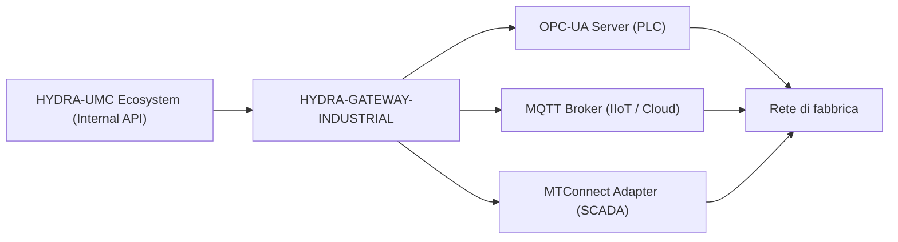

<p align="center">
  
</p>

# 🌐 HYDRA-UMC-GATEWAY-INDUSTRIAL

<p align="center"><a href="README.md">🇺🇸 English</a> | <a href="README_spa.md">🇪🇸 Español</a> | <a href="README_fra.md">🇫🇷 Français</a> | 🇮🇹 <b>Italiano</b> | <a href="README_deu.md">🇩🇪 Deutsch</a> | <a href="README_zho.md">🇨🇳 简体中文</a> | <a href="README_jpn.md">🇯🇵 日本語</a></p>

### 🏭 Bridge di interoperabilità Industry 4.0 per standard di fabbrica

<p align="left">
  
  
  
  
</p>

---

## 1. 🛠️ PANORAMICA TECNICA

**HYDRA-UMC-GATEWAY-INDUSTRIAL** è il ponte di comunicazione sicuro tra l'ecosistema HYDRA-UMC e gli standard industriali esterni. Consente alla micro-fabbrica di interagire con PLC di terze parti, sistemi SCADA e piattaforme IIoT basate su cloud.

Funge da traduttore multi-protocollo, esponendo gli stati robotici interni e le telemetrie degli strumenti come nodi standardizzati in OPC-UA, topic MQTT o stream XML MTConnect, assicurando che lo sciame Hydra non sia mai un'isola isolata nell'impianto di produzione.

### Caratteristiche principali:
* 🌐 **Supporto multi-standard:** Interfacce OPC-UA, MQTT e MTConnect integrate.
* 🛡️ **Sicurezza industriale:** Mutual TLS (mTLS) e autenticazione basata su certificati per tutte le connessioni di fabbrica.
* 🔄 **Mappatura dello stato:** Traduzione in tempo reale dello stato JSON interno di Hydra in spazi di indirizzamento industriali standardizzati.
* ⚡ **Alta affidabilità:** Bridge leggero dedicato ottimizzato per un tempo di attività industriale 24/7.
* 🚦 **Reale v0 - Allowlist dei comandi + Backpressure:** `POST /command` è protetto da una allowlist per-protocollo a rifiuto predefinito, un limite di concorrenza limitato e un vero timeout - vedi "Verifica di onestà" sotto per cosa viene applicato esattamente oggi.

**Verifica di onestà - cosa funziona davvero oggi:** `POST /command { protocol, operation, target }` è reale: l'operazione deve essere esplicitamente in allowlist per il suo protocollo (`403` altrimenti - v0 permette solo operazioni di tipo lettura/pubblicazione, nulla che scriva su un PLC in funzione), non vengono eseguiti più di un numero limitato di comandi alla volta (`429` oltre quel limite), e un comando che non si risolve in tempo viene segnalato come scaduto (`504`) invece di restare in sospeso. Il percorso di esecuzione predefinito riutilizza le sonde di raggiungibilità reali di questo progetto - onesto sul fatto che non esegue ancora una vera scrittura a livello di protocollo OPC-UA/MQTT/MTConnect, dato che nessuno dei tre figli espone ancora una vera API di comando. Vedi `CHANGELOG.md` per ciò che è stato consegnato esattamente.

---

## 2. 🔄 ARCHITETTURA DEL GATEWAY



---

## 3. 🧱 ARCHITETTURA E DECISIONI DI PROGETTAZIONE

* **Perché è il genitore di integrazione, non un pari, dei suoi 3 figli.** HYDRA-UMC-OPCUA-SERVER, HYDRA-UMC-MQTT-BROKER e HYDRA-UMC-MTCONNECT-ADAPTER traducono tutti lo STESSO stato sottostante di HYDRA-UMC-SERVER in 3 protocolli industriali diversi - possedere il routing/l'autenticazione condivisi in un unico posto evita 3 traduzioni indipendenti e potenzialmente incoerenti dello stesso stato.
* **Perché 3 adattatori di protocollo separati, non un gateway che fa tutto.** OPC-UA, MQTT e MTConnect sono strutturalmente diversi (address space contro topic pub/sub contro flussi XML device/agent) - un processo per protocollo significa che un client MQTT lento o rotto non influenza mai quello OPC-UA, e ciascuno può essere abilitato/disabilitato indipendentemente per deployment.
* **Perché il punto di ingresso stampa solo identità/versione, e termina dopo che un listener di health-check si avvia.** Fase di andamiaje: dimostrare che il processo si avvia e resta attivo (non solo gira ed esce, a differenza della maggior parte degli altri scheletri Node di questo ecosistema) precede la vera logica di traduzione di protocollo, dato che un vero gateway è per natura un servizio di lunga durata.
* **Come si inserisce nel resto dell'ecosistema.** Il genitore di integrazione della famiglia Industrial Gateway - espone lo stato proprio di HYDRA-UMC-SERVER a sistemi di stabilimento (MES/SCADA/storici) che parlano OPC-UA, MQTT o MTConnect invece dell'API REST/WebSocket propria di questo ecosistema.
* **`GET /status` esegue un controllo reale e in tempo reale ad ogni richiesta.** `src/probes.ts` effettua una connessione TCP reale per OPC-UA/MQTT e una richiesta HTTP `GET` reale per MTConnect verso ciascun figlio - `reachable`/`latencyMs`/`error` per figlio e un `allReachable` aggregato vengono calcolati al momento della richiesta, non restituiti da un elenco statico o in cache. Verificato end-to-end: i 3 figli reali sono stati avviati, `/status` li ha segnalati tutti raggiungibili, uno di essi è stato poi realmente terminato, e la chiamata successiva a `/status` ha correttamente contrassegnato solo quel figlio come non raggiungibile con un vero `ECONNREFUSED`. Host/porta/URL di ciascun figlio sono configurabili tramite variabili d'ambiente, con lo stesso nome di servizio gia usato da `docker-compose.yml` come predefinito.
* **Perché la allowlist di `POST /command` è a rifiuto predefinito, non a permesso predefinito.** Un gateway industriale che inoltra qualsiasi stringa di operazione ricevuta è un rischio nel momento in cui un figlio espone un vero percorso di scrittura - partire da "niente è permesso a meno che non sia esplicitamente elencato" significa che aggiungere un'operazione pericolosa (una scrittura di nodo OPC-UA, una pubblicazione di configurazione retained MQTT) è sempre una decisione deliberata e rivedibile in futuro, mai un predefinito accidentale oggi.
* **Perché l'autorizzazione viene controllata prima del backpressure in `CommandDispatcher.dispatch()`.** Un comando non autorizzato deve essere rifiutato sempre allo stesso modo indipendentemente da quanto sia occupato il gateway in quel momento - se la capacità fosse controllata per prima, un'operazione non permessa potrebbe a volte passare come "accepted" (uno slot era libero) o a volte apparire come "solo occupato" (non lo era), facendo trapelare informazioni sul carico del gateway attraverso quella che dovrebbe essere una decisione puramente di autorizzazione.
* **Perché l'esecutore di comandi predefinito riutilizza le sonde di raggiungibilità invece di uno stub che ha sempre successo.** `src/probes.ts` risponde già davvero a "questo figlio è davvero lì" - riutilizzarlo significa che `POST /command` fallisce onestamente (`502 downstream_unreachable`) contro un figlio spento, invece di riportare `accepted` per un comando che non sarebbe mai potuto arrivare da nessuna parte.

---

## 📂 STRUTTURA DELLE CARTELLE

```text
HYDRA-UMC-GATEWAY-INDUSTRIAL/
├── src/
│   ├── probes.ts        # Vere verifiche di raggiungibilità TCP/HTTP per figlio
│   ├── command.ts        # Vero CommandDispatcher: allowlist + backpressure + timeout
│   └── server.ts         # App Express: GET /status, POST /command
├── tests/               # Vera suite vitest (probes, server, command)
├── docs/               # Documentazione e riferimento mappatura
├── build/               # Output compilato (npm run build)
├── images/             # Media e diagrammi
├── scripts/            # Script di utilità (bump-version.mjs)
├── tools/
│   ├── build_test.py    # Controllo build senza versionamento
│   └── ci_validate.py   # Validazione manifest/CHANGELOG/docs usata dalla CI
├── build-test.sh/.bat   # Controllo build senza versionamento
├── Dockerfile           # Immagine container propria di questo servizio
├── docker-compose.yml   # Avvia questo Gateway + i suoi 3 figli insieme
└── README.md
```

Servizio di rete puro, senza hardware proprio - `hardware/`, `firmware/`
e `os/` sono omesse secondo la politica della struttura del repository.

---

## 🐳 INTEGRAZIONE DEI 3 BRIDGE FIGLI

Questo è un vero repo di integrazione, non solo documentazione -
`docker-compose.yml` avvia questo Gateway insieme ai suoi tre figli
(**HYDRA-UMC-OPCUA-SERVER**, **HYDRA-UMC-MQTT-BROKER**,
**HYDRA-UMC-MTCONNECT-ADAPTER**) come un'unica rete Docker, assumendo che
i quattro repo siano clonati come cartelle sorelle (la disposizione già
usata dall'org GitHub di questo ecosistema):

```bash
docker compose up --build
```

Questo avvia i 4 servizi sulle stesse porte che ciascuno usa già in modo
indipendente: questo Gateway su `8000`, OPC-UA su `4840`, MQTT su `1883`,
MTConnect su `5000`. `GET http://localhost:8000/status` riporta la
versione propria del Gateway e quali figli si aspetta di poter
raggiungere.

---

## 🛠️ AMBIENTE DI SVILUPPO

### Requisiti
- [Node.js](https://nodejs.org/) (v18 o superiore consigliato)
- npm

### Installazione
```bash
npm install
```

### Modalità Sviluppo
Esegue il server di aggregazione direttamente con `tsx` (senza bundler):
- **Windows:** doppio clic su `dev.bat` oppure eseguire `npm run dev`
- **Linux/Mac:** eseguire `./dev.sh` oppure `npm run dev`

### Build di Produzione
Impacchetta il server in un unico file distribuibile con esbuild:
- **Windows:** doppio clic su `build.bat` oppure eseguire `npm run build`
- **Linux/Mac:** eseguire `./build.sh` oppure `npm run build`

Poi avvialo con:
```bash
npm start
```

Il server resta in ascolto su `0.0.0.0:8000` - `GET /status` riporta la
versione propria del Gateway più nome/protocollo/endpoint di ciascun
bridge figlio a cui fa da facciata.

Esempio reale - un comando in allowlist contro un figlio che non è in
esecuzione, un'operazione non autorizzata e una richiesta malformata:

```bash
curl -X POST http://localhost:8000/command -H "Content-Type: application/json" \
  -d '{"protocol":"OPC-UA","operation":"read","target":"ns=2;s=Line1.Status"}'
# 502 {"status":"downstream_unreachable","reason":"TCP connect to opcua-server:4840 timed out after 2000ms"}

curl -X POST http://localhost:8000/command -H "Content-Type: application/json" \
  -d '{"protocol":"OPC-UA","operation":"write","target":"ns=2;s=Line1.SetPoint"}'
# 403 {"status":"rejected_unauthorized","reason":"operation \"write\" is not allowlisted for OPC-UA"}

curl -X POST http://localhost:8000/command -H "Content-Type: application/json" -d '{"protocol":"OPC-UA"}'
# 400 {"error":"protocol, operation and target are required strings"}
```

### Versionamento
Ogni `npm run build` reale incrementa automaticamente il `version` di
`package.json` (`scripts/bump-version.mjs`, primo passo dello script
`build`) - un "contachilometri" in base 10: patch +1 per build, con
riporto a minor (e da minor a major) oltre il 9 invece di raggiungere mai
un segmento a due cifre (`0.0.9` -> `0.1.0`, non `0.0.10`).

---

## 🚀 ROADMAP
* **Fase 1:** Implementazione di OPC-UA Pub/Sub per lo scambio di dati ad alta velocità e bridging di protocolli legacy.
* **Fase 2:** Cluster MQTT Broker per la gestione massiva di dispositivi IoT e alta concorrenza.
* **Fase 3:** Supporto per l'adattatore MTConnect per l'integrazione di macchinari CNC e PLC multi-vendor.
* **Fase 4:** Conformità completa alla cybersicurezza ISO-27001 per Industrial Gateway e supporto per l'adattatore software Profinet.

---

## 🔗 Progetti Correlati

Questo progetto fa parte di un ecosistema robotico più ampio dello stesso autore (JuanenRac / Electro Hobby 3D), che copre firmware, software di controllo, nodi IA e strumenti di flotta. Utile saperlo, perché una richiesta potrebbe in realtà riguardare uno di questi progetti anziché questo repository.

### Famiglia

**Genitore:** nessuno — questo progetto è esso stesso il genitore di integrazione della famiglia Industrial Gateway.

**Figli:**
- **[HYDRA-UMC-OPCUA-SERVER](https://github.com/JuanenRac/HYDRA-UMC-OPCUA-SERVER)** — l'adattatore di protocollo OPC-UA attraverso cui instrada questo gateway.
- **[HYDRA-UMC-MQTT-BROKER](https://github.com/JuanenRac/HYDRA-UMC-MQTT-BROKER)** — l'adattatore di protocollo MQTT attraverso cui instrada questo gateway.
- **[HYDRA-UMC-MTCONNECT-ADAPTER](https://github.com/JuanenRac/HYDRA-UMC-MTCONNECT-ADAPTER)** — l'adattatore di protocollo MTConnect attraverso cui instrada questo gateway.

### Relazione Diretta (fuori dalla famiglia)

- **[HYDRA-UMC-SERVER](https://github.com/JuanenRac/HYDRA-UMC-SERVER)** — la fonte dello stato esposto da questo gateway.

### Resto dell'Ecosistema

**Piattaforma HYDRA-UMC** — la cella di micro-fabbrica multi-robot
- **[HYDRA-UMC](https://github.com/JuanenRac/HYDRA-UMC)** — la scheda madre CM5 + STM32H745 che orchestra fino a 8 bracci robotici.
- **[HYDRA-UMC-SERVER](https://github.com/JuanenRac/HYDRA-UMC-SERVER)** — il backend Express/WebSocket con cui parla ogni client di controllo.
- **[HYDRA-UMC-STUDIO](https://github.com/JuanenRac/HYDRA-UMC-STUDIO)** — dashboard di controllo web, visualizzazione 3D multi-robot.
- **[HYDRA-UMC-ANDROID-CONTROL](https://github.com/JuanenRac/HYDRA-UMC-ANDROID-CONTROL)** — app di controllo Android via Wi-Fi/Bluetooth.
- **[HYDRA-UMC-IOS-CONTROL](https://github.com/JuanenRac/HYDRA-UMC-IOS-CONTROL)** — app di controllo iOS/iPadOS costruita in Flutter.
- **[HYDRA-UMC-SUITE](https://github.com/JuanenRac/HYDRA-UMC-SUITE)** — centro di comando sciame desktop (Python/PySide6).
- **[HYDRA-UMC-EDITOR-URDF](https://github.com/JuanenRac/HYDRA-UMC-EDITOR-URDF)** — editor desktop di modelli URDF per il catalogo robot.
- **[HYDRA-UMC-DSI](https://github.com/JuanenRac/HYDRA-UMC-DSI)** — interfaccia touch nativa per lo schermo DSI a bordo.

**Piattaforma URTC** — il controller della testa utensile che ogni braccio HYDRA-UMC porta con sé
- **[URTC](https://github.com/JuanenRac/URTC)** — controller testa utensile su bus CAN, 25 profili utensile.
- **[URTC-FLASHER](https://github.com/JuanenRac/URTC-FLASHER)** — strumento desktop di flashing CAN-OTA + SWD/JTAG.
- **[URTC-TESTER](https://github.com/JuanenRac/URTC-TESTER)** — strumento desktop di diagnostica CAN live.
- **[URTC-WEB-STUDIO](https://github.com/JuanenRac/URTC-WEB-STUDIO)** — alternativa basata su browser via Web Serial API.

**🎥 Vision AI Node (Hailo-8)**
- [HYDRA-UMC-VISION-NODE](https://github.com/JuanenRac/HYDRA-UMC-VISION-NODE)
- [HYDRA-UMC-VISION-STREAMER](https://github.com/JuanenRac/HYDRA-UMC-VISION-STREAMER)
- [HYDRA-UMC-DETECTION-HEF](https://github.com/JuanenRac/HYDRA-UMC-DETECTION-HEF)
- [HYDRA-UMC-SAFETY-ZONES](https://github.com/JuanenRac/HYDRA-UMC-SAFETY-ZONES)
- [HYDRA-UMC-VISUAL-SERVOING-API](https://github.com/JuanenRac/HYDRA-UMC-VISUAL-SERVOING-API)

**🧠 Cognitive AI Node (Hailo-10)**
- [HYDRA-UMC-COGNITIVE-NODE](https://github.com/JuanenRac/HYDRA-UMC-COGNITIVE-NODE)
- [HYDRA-UMC-VLA-ENGINE](https://github.com/JuanenRac/HYDRA-UMC-VLA-ENGINE)
- [HYDRA-UMC-VOICE-UI](https://github.com/JuanenRac/HYDRA-UMC-VOICE-UI)
- [HYDRA-UMC-SEMANTIC-PLANNER](https://github.com/JuanenRac/HYDRA-UMC-SEMANTIC-PLANNER)
- [HYDRA-UMC-DOCS-QA](https://github.com/JuanenRac/HYDRA-UMC-DOCS-QA)

**🐝 Orchestration & Swarm**
- [HYDRA-UMC-ORCHESTRATOR](https://github.com/JuanenRac/HYDRA-UMC-ORCHESTRATOR)
- [HYDRA-UMC-SWARM-SYNC](https://github.com/JuanenRac/HYDRA-UMC-SWARM-SYNC)
- [HYDRA-UMC-PATH-PLANNER-3D](https://github.com/JuanenRac/HYDRA-UMC-PATH-PLANNER-3D)
- [HYDRA-UMC-JOB-DISPATCHER](https://github.com/JuanenRac/HYDRA-UMC-JOB-DISPATCHER)
- [HYDRA-UMC-NODE-HEALING](https://github.com/JuanenRac/HYDRA-UMC-NODE-HEALING)

**🎮 Digital Twin & Simulation**
- [HYDRA-UMC-TWIN](https://github.com/JuanenRac/HYDRA-UMC-TWIN)
- [HYDRA-UMC-PHYSICS-REPLICA](https://github.com/JuanenRac/HYDRA-UMC-PHYSICS-REPLICA)
- [HYDRA-UMC-HIL-BRIDGE](https://github.com/JuanenRac/HYDRA-UMC-HIL-BRIDGE)
- [HYDRA-UMC-SYNTHETIC-DATA-GEN](https://github.com/JuanenRac/HYDRA-UMC-SYNTHETIC-DATA-GEN)

**📊 Data & Analytics**
- [HYDRA-UMC-DATALAKE](https://github.com/JuanenRac/HYDRA-UMC-DATALAKE)
- [HYDRA-UMC-TELEMETRY-COLLECTOR](https://github.com/JuanenRac/HYDRA-UMC-TELEMETRY-COLLECTOR)
- [HYDRA-UMC-ANOMALY-DETECTOR](https://github.com/JuanenRac/HYDRA-UMC-ANOMALY-DETECTOR)
- [HYDRA-UMC-PRODUCTION-REPORTS](https://github.com/JuanenRac/HYDRA-UMC-PRODUCTION-REPORTS)

**🛠️ Complementary Tools**
- [URTC-SMART-RACK](https://github.com/JuanenRac/URTC-SMART-RACK)
- [URTC-VISION-TOOL](https://github.com/JuanenRac/URTC-VISION-TOOL)
- [HYDRA-UMC-WATCH](https://github.com/JuanenRac/HYDRA-UMC-WATCH)
- [HYDRA-UMC-TOOL-CLI](https://github.com/JuanenRac/HYDRA-UMC-TOOL-CLI)
- [HYDRA-UMC-DASHBOARD-AI](https://github.com/JuanenRac/HYDRA-UMC-DASHBOARD-AI)


## 👤 AUTORE
**JuanenRac** (Electro Hobby 3D)
📧 electrohobby3d@gmail.com

## 📜 LICENZA
GPL-3.0 - Vedere LICENSE per i dettagli.

## 🛠️ BUILD & RUN

Usa il controllo di compilazione senza versionamento prima di una compilazione di rilascio:

| Azione | Windows | Linux / macOS |
|---|---|---|
| Controllo di compilazione (senza modificare versione o CHANGELOG) | `build-test.bat` | `./build-test.sh` |
| Esecuzione / sviluppo (se disponibile) | `run*.bat` o `dev*.bat` | `./run*.sh` o `./dev*.sh` |

`build-test.bat` e `build-test.sh` compilano o convalidano lo stack del progetto senza incrementare `hydra-umc.project.json` né modificare `CHANGELOG.md`. Possono creare solo i normali output del compilatore. Gli script esistenti `build*.bat`, `build*.sh`, `run*` e `dev*` mantengono il comportamento specifico di versione o esecuzione; usali quando tale comportamento è necessario.