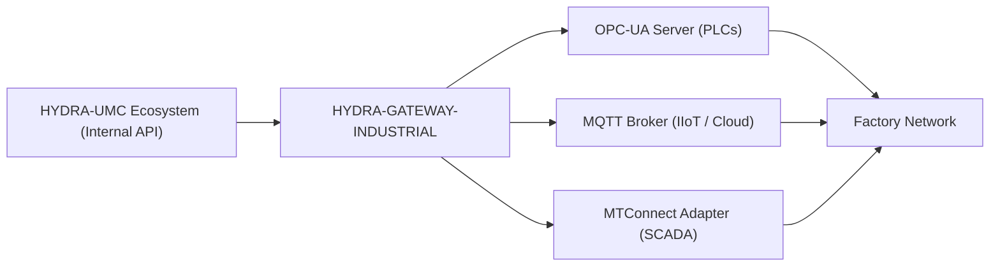

<p align="center">
  
</p>

# 🌐 HYDRA-UMC-GATEWAY-INDUSTRIAL

<p align="center"><a href="README.md">🇺🇸 English</a> | <a href="README_spa.md">🇪🇸 Español</a> | <a href="README_fra.md">🇫🇷 Français</a> | <a href="README_ita.md">🇮🇹 Italiano</a> | <a href="README_deu.md">🇩🇪 Deutsch</a> | <a href="README_zho.md">🇨🇳 简体中文</a> | 🇯🇵 <b>日本語</b></p>

### 🏭 工場標準向けのインダストリー 4.0 相互運用性ブリッジ

<p align="left">
  
  
  
  
</p>

---

## 1. 🛠️ 技術概要

**HYDRA-UMC-GATEWAY-INDUSTRIAL** は、HYDRA-UMC エコシステムと外部の
産業標準との間の安全な通信ブリッジです。マイクロファクトリーがサード
パーティの PLC、SCADA システム、クラウドベースの IIoT プラットフォーム
と相互作用することを可能にします。

マルチプロトコルトランスレーターとして機能し、内部のロボット状態と
工具のテレメトリを、OPC-UA の標準化されたノード、MQTT トピック、または
MTConnect の XML ストリームとして公開し、Hydra スウォームが生産工場に
おいて孤立した島になることを防ぎます。

### 主な機能：
* 🌐 **マルチスタンダード対応：** 統合された OPC-UA、MQTT、MTConnect インターフェース。
* 🛡️ **産業用セキュリティ：** すべての工場接続に対する相互 TLS（mTLS）と証明書ベースの認証。
* 🔄 **状態マッピング：** Hydra 内部の JSON 状態を標準化された産業用アドレス空間へリアルタイムに変換。
* ⚡ **高信頼性：** 24 時間 365 日の産業用稼働に最適化された専用の軽量ブリッジ。
* 🚦 **実装済み v0 —— コマンドアローリスト + バックプレッシャー：** `POST /command` は、プロトコルごとのデフォルト拒否アローリスト、上限付きの同時実行制限、実際のタイムアウトによって保護されています——今日実際に強制されている内容の詳細は下記「正直な現状確認」を参照してください。

**正直な現状確認 —— 今日実際に動くもの：** `POST /command { protocol, operation, target }` は実際に動作します——操作はそのプロトコルのアローリストに明示的に登録されている必要があり（そうでなければ `403`——v0 では読み取り/publish 系の操作のみを許可し、稼働中の PLC の状態を変更しうる操作は許可されていません）、上限を超える数のコマンドが同時に実行されることはなく（超えると `429`）、時間内に完了しなかったコマンドは無期限に保留されるのではなくタイムアウトとして報告されます（`504`）。デフォルトの実行経路は本プロジェクト自身の実際の到達可能性プローブを再利用しています——3 つの子サービスのいずれもまだ実際のコマンド API を公開していないため、実際のプロトコルレベルの書き込みにはまだ至っていないことを正直に示しています。実際に出荷済みの内容は `CHANGELOG.md` を参照してください。

---

## 2. 🔄 ゲートウェイアーキテクチャ



---

## 3. 🧱 アーキテクチャと設計上の決定

* **本プロジェクトが 3 つの子プロジェクトの統合親プロジェクトであり、対等な関係ではない理由。** HYDRA-UMC-OPCUA-SERVER、HYDRA-UMC-MQTT-BROKER、HYDRA-UMC-MTCONNECT-ADAPTER はすべて*同一*の基盤となる HYDRA-UMC-SERVER の状態を 3 つの異なる産業用プロトコルに変換します——共有されるルーティング/認証ロジックの所有権を一か所に集約することで、同一状態に対する 3 つの独立した、互いに一貫しない変換を避けられます。
* **すべてを行う単一のゲートウェイではなく、3 つの独立したプロトコルアダプターである理由。** OPC-UA、MQTT、MTConnect は構造的に異なります（アドレス空間 対 パブリッシュ/サブスクライブトピック 対 XML デバイス/エージェントストリーム）——プロトコルごとに 1 つのプロセスを持つことで、遅延している/壊れている MQTT クライアントが OPC-UA クライアントに影響を与えることは決してなく、それぞれをデプロイごとに独立して有効/無効にできます。
* **エントリポイントが今日は身元/バージョンのみを表示し、ヘルスチェックリスナーが起動した後で終了しない理由。** 足場（アンダミアヘ、スキャフォールディング）段階にあります：このプロセスが起動し稼働し続けることを証明すること（このエコシステムの他の多くの Node スケルトンとは異なり、単に実行して終了するだけではないこと）が、実際のプロトコル変換ロジックに先立ちます。実際のゲートウェイは、その性質上、長時間稼働するサービスだからです。
* **エコシステムの他の部分との関係。** 産業用ゲートウェイ ファミリーの統合親プロジェクトです——HYDRA-UMC-SERVER 自身の状態を、このエコシステム自身の REST/WebSocket API ではなく OPC-UA、MQTT、MTConnect を話す工場フロアのシステム（MES/SCADA/ヒストリアン）に公開します。
* **`GET /health` は独立した高速な生存確認エンドポイントです——`GET /status` はもうこの用途には使われません。** `/status` は本物の詳細診断であり、到達不能な子サービス 1 つにつき正当に ~2 秒かかることがあります。これに直接向けると、HYDRA-UMC-SERVER 自身のエコシステム全体ステータススキャナー（`/api/ecosystem/status`、1 回のプローブに ~800ms しか予算を割かない）は、ゲートウェイ自体のプロセスは健全であっても、子サービスが到達不能なだけでこのゲートウェイを DOWN と報告していました。`/health` は子サービスへのプローブを一切行わず `{ gateway, version, status: "ok" }` を返し、`hydra-umc.project.json` 自身の `service.health_path` も `/status` ではなくここを指しています。
* **`GET /status` はリクエストごとに実際のライブチェックを行います。** `src/probes.ts` は各子サービスに対して OPC-UA/MQTT には実際の TCP 接続を、MTConnect には実際の HTTP `GET` リクエストを行います——各子サービスの `reachable`/`latencyMs`/`error`、および集計された `allReachable` はリクエスト時点で計算され、静的またはキャッシュされたリストから返されるものではありません。エンドツーエンドで検証済み: 3 つの実際の子サービスをすべて起動したところ `/status` は全て到達可能と報告し、その後 1 つを実際に停止させたところ、次の `/status` 呼び出しはその子サービスのみを正しく到達不能と判定し、実際の `ECONNREFUSED` エラーを返しました。各子サービスのホスト/ポート/URL は環境変数で設定可能で、デフォルトは `docker-compose.yml` が既に使用しているサービス名と同じです。
* **`POST /command` のアローリストがデフォルト許可ではなくデフォルト拒否である理由。** 受け取った任意の操作文字列を転送する産業用ゲートウェイは、子サービスが実際の書き込みパスを公開した瞬間にリスクとなります——「明示的にリストされていない限り何も許可しない」から始めることで、危険な操作（OPC-UA ノードの書き込み、MQTT の retained 設定の publish）を追加することは、常に後で意図的にレビュー可能な決定となり、今日の偶発的なデフォルトには決してなりません。
* **`CommandDispatcher.dispatch()` において、認可がバックプレッシャーより先にチェックされる理由。** 認可されていないコマンドは、ゲートウェイが現在どれだけ忙しいかに関わらず、常に同じ方法で拒否されなければなりません——もし容量を先にチェックしていたら、許可されていない操作が、たまたま枠が空いていたために「accepted」としてすり抜けたり、たまたま空いていなかったために「単に忙しいだけ」として読み取られたりすることがあり、本来純粋に認可のみに基づくべき判断を通じてゲートウェイの負荷に関するタイミング情報が漏れてしまいます。
* **デフォルトのコマンド実行器が、常に成功するスタブではなく到達可能性プローブを再利用する理由。** `src/probes.ts` はすでに「この子サービスは実際にそこにあるか」という問いに実際に答えています——それを再利用することで、`POST /command` は停止している子サービスに対して正直に失敗し（`502 downstream_unreachable`）、決して到達しえなかったコマンドに対して `accepted` を報告することがなくなります。

---

## 📂 リポジトリ構成

```text
HYDRA-UMC-GATEWAY-INDUSTRIAL/
├── src/
│   ├── probes.ts        # 各子サービスに対する実際の TCP/HTTP 到達可能性チェック
│   ├── command.ts        # 実際の CommandDispatcher：アローリスト + バックプレッシャー + タイムアウト
│   ├── version.ts        # package.json から読み取る実際のパッケージバージョン(実行時)
│   └── server.ts         # Express アプリ：GET /status、POST /command
├── tests/               # 実際の vitest スイート（probes、server、command）
├── docs/               # ドキュメントとマッピングリファレンス
├── build/               # コンパイル出力（npm run build）
├── images/             # メディアと図表
├── scripts/            # ユーティリティスクリプト（bump-version.mjs）
├── tools/
│   ├── build_test.py    # バージョンを増やさないビルドチェック
│   └── ci_validate.py   # CI が使用するマニフェスト/CHANGELOG/ドキュメント検証
├── bump_manifest_version.py # hydra-umc.project.json のバージョンを package.json と同期(--sync)
├── .env.example         # 環境変数テンプレート
├── build.sh/.bat        # バージョンを増加させ、その後 npm run build を実行
├── build-test.sh/.bat   # バージョンを増やさないビルドチェック
├── dev.sh/.bat           # ビルドステップなしでソースから直接サーバーを実行
├── Dockerfile           # 本サービス自身のコンテナイメージ
├── docker-compose.yml   # 本ゲートウェイとその 3 つの子プロジェクトを一緒に起動
└── README.md
```

純粋なネットワークサービスであり、独自の専用ハードウェアを持ちません
——`hardware/`、`firmware/`、`os/` は元のプロジェクトテンプレートから
省略されており、リポジトリ構造ポリシーに従っています。

---

## 🐳 3 つの子ブリッジの統合

これは単なるドキュメントではなく、実際の統合リポジトリです——
`docker-compose.yml` は、4 つのリポジトリが兄弟フォルダとしてチェック
アウトされていること（このエコシステムの GitHub 組織が既に使用している
レイアウト）を前提として、本ゲートウェイをその 3 つの子プロジェクト
（**HYDRA-UMC-OPCUA-SERVER**、**HYDRA-UMC-MQTT-BROKER**、
**HYDRA-UMC-MTCONNECT-ADAPTER**）とともに 1 つの Docker ネットワーク
として起動します：

```bash
docker compose up --build
```

これにより、各サービスが単独でそれぞれ既にバインドしているのと同じ
ポートで、4 つのサービスすべてが起動します：本ゲートウェイは `8000`、
OPC-UA は `4840`、MQTT は `1883`、MTConnect は `5000` です。
`GET http://localhost:8000/status` は、本ゲートウェイ自身のバージョン
と、それが到達を期待している子プロジェクトを報告します。

---

## 🛠️ 開発環境

### 必要条件
- [Node.js](https://nodejs.org/)（v18 以上を推奨）
- npm

### インストール
```bash
npm install
```

### 開発モード
`tsx` を使用して集約サーバーを直接実行します（バンドラーなし）：
- **Windows：** `dev.bat` をダブルクリックするか、`npm run dev` を実行
- **Linux/Mac：** `./dev.sh` または `npm run dev` を実行

### プロダクションビルド
esbuild を使用してサーバーを単一のデプロイ可能なファイルにバンドル
します：
- **Windows：** `build.bat` をダブルクリックするか、`npm run build` を実行
- **Linux/Mac：** `./build.sh` または `npm run build` を実行

その後、次のコマンドで起動します：
```bash
npm start
```

サーバーは `0.0.0.0:8000` でリッスンします——`GET /health` は子サービスへ
のプローブを行わない高速な生存確認です（`hydra-umc.project.json` 自身の
`service.health_path` はここを指します）。一方 `GET /status` は本物の詳細
診断で、本ゲートウェイ自身のバージョンと、それがフロントに立っている各子
ブリッジの名前/プロトコル/エンドポイント/到達可能性を報告します。

実際の例 —— 稼働していない子サービスに対するアローリスト内のコマンド、
認可されていない操作、および不正な形式のリクエスト：

```bash
curl -X POST http://localhost:8000/command -H "Content-Type: application/json" \
  -d '{"protocol":"OPC-UA","operation":"read","target":"ns=2;s=Line1.Status"}'
# 502 {"status":"downstream_unreachable","reason":"TCP connect to opcua-server:4840 timed out after 2000ms"}

curl -X POST http://localhost:8000/command -H "Content-Type: application/json" \
  -d '{"protocol":"OPC-UA","operation":"write","target":"ns=2;s=Line1.SetPoint"}'
# 403 {"status":"rejected_unauthorized","reason":"operation \"write\" is not allowlisted for OPC-UA"}

curl -X POST http://localhost:8000/command -H "Content-Type: application/json" -d '{"protocol":"OPC-UA"}'
# 400 {"error":"protocol, operation and target are required strings"}
```

### バージョン管理
実際の `npm run build` のたびに、`package.json` 自身の `version` が
自動的に増加します（`scripts/bump-version.mjs`、`build` スクリプトの
最初のステップとして接続）——10 進法の「オドメーター」方式：ビルド
ごとに patch を +1 し、9 を超えると minor に繰り上がり（minor が 9 を
超えると major に繰り上がる）、2 桁のセグメントに到達することはあり
ません（`0.0.9` -> `0.1.0`、`0.0.10` にはなりません）。

---

## 🚀 ロードマップ
* **フェーズ 1：** 高速データ交換とレガシープロトコルブリッジングのための OPC-UA パブリッシュ/サブスクライブ実装。
* **フェーズ 2：** 大量の IoT デバイス管理と高い並行性のための MQTT Broker クラスター。
* **フェーズ 3：** マルチベンダーの CNC および PLC 機械統合のための MTConnect アダプターサポート。
* **フェーズ 4：** 産業用ゲートウェイ の完全な ISO-27001 サイバーセキュリティ準拠と Profinet ソフトウェアアダプターサポート。

---

## 🔗 関連プロジェクト

本プロジェクトは、同じ作者(JuanenRac / Electro Hobby 3D)による HYDRA-UMC ロボティクスエコシステムの一部です。リクエストが実はこの中のどれかについてのものである可能性があるため、知っておく価値があります。

**子プロジェクト** —— いずれも、本ゲートウェイが中継する先のプロトコルアダプターです
- **[HYDRA-UMC-OPCUA-SERVER](https://github.com/JuanenRac/HYDRA-UMC-OPCUA-SERVER)** — 実際のバイナリプロトコルクライアントセッションで検証された、実際の OPC-UA アドレス空間。
- **[HYDRA-UMC-MQTT-BROKER](https://github.com/JuanenRac/HYDRA-UMC-MQTT-BROKER)** — クライアント単位のオプション認証とトピック ACL を備えた、実際の MQTT ブローカー。
- **[HYDRA-UMC-MTCONNECT-ADAPTER](https://github.com/JuanenRac/HYDRA-UMC-MTCONNECT-ADAPTER)** — 縮退モード出力を備えた、実際の MTConnect `/probe` および `/current` XML エンドポイント。

**直接関連**
- **[HYDRA-UMC-SERVER](https://github.com/JuanenRac/HYDRA-UMC-SERVER)** — すべての制御クライアントが実際に通信する、本物のヘッドレスバックエンド(REST/WebSocket)。本ゲートウェイが公開する状態の出所。

**エコシステムの他のプロジェクト**

*コアハードウェア&プラットフォーム*
- **[HYDRA-UMC](https://github.com/JuanenRac/HYDRA-UMC)** — 実際のロボットアームのマザーボード——CM5 ホスト + デュアルコア STM32H745、CAN-OTA/SPI-OTA 経由で最大 8 本のツールアームを統括。
- **[HYDRA-UMC-OS](https://github.com/JuanenRac/HYDRA-UMC-OS)** — CM5 向けの再現可能な Raspberry Pi OS プロダクト層——読み取り専用エージェント、検証済み設定/プロファイル、WiFi 初回接続プロビジョニング。
- **[HYDRA-UMC-SDK](https://github.com/JuanenRac/HYDRA-UMC-SDK)** — すべてのブリッジが自身のコマンドを検証する共有 JSON-Schema 契約と安全ゲートの境界。

*コアバックエンド&クライアント*
- **[HYDRA-UMC-STUDIO](https://github.com/JuanenRac/HYDRA-UMC-STUDIO)** — リアルタイムのマルチロボット 3D 可視化を備えたウェブ制御ダッシュボード。
- **[HYDRA-UMC-ANDROID-CONTROL](https://github.com/JuanenRac/HYDRA-UMC-ANDROID-CONTROL)** — 生体認証ログインとペアリングされた Wear OS コンパニオンを備えたネイティブ Android 制御アプリ。
- **[HYDRA-UMC-IOS-CONTROL](https://github.com/JuanenRac/HYDRA-UMC-IOS-CONTROL)** — リアルタイム WebSocket 同期を備えた iOS/iPadOS 制御アプリ(Flutter)。
- **[HYDRA-UMC-DSI](https://github.com/JuanenRac/HYDRA-UMC-DSI)** — 本体搭載の 7 インチ DSI タッチスクリーン向けネイティブタッチ UI、CM5 自体に組み込み。
- **[HYDRA-UMC-EDITOR-URDF](https://github.com/JuanenRac/HYDRA-UMC-EDITOR-URDF)** — 完成したモデルを STUDIO 自身のカタログへ送信するデスクトップ用グラフィカル URDF 作成/編集ツール。
- **[HYDRA-UMC-BRIDGE-AMR](https://github.com/JuanenRac/HYDRA-UMC-BRIDGE-AMR)** — 実際の VDA 5050 MQTT パブリッシャーによる AGV/AMR フリートの調整境界。
- **[HYDRA-UMC-BRIDGE-CNC](https://github.com/JuanenRac/HYDRA-UMC-BRIDGE-CNC)** — 実際の GRBL ステータス/制御バイトへのアクセスを持つ、CNC セルの高レベルコーディネーター。
- **[HYDRA-UMC-BRIDGE-DROIDS](https://github.com/JuanenRac/HYDRA-UMC-BRIDGE-DROIDS)** — 実際の Boston Dynamics Spot コマンド送信機能を持つ、脚型/ヒューマノイドドロイドの調整境界。
- **[HYDRA-UMC-BRIDGE-LASER](https://github.com/JuanenRac/HYDRA-UMC-BRIDGE-LASER)** — 実際のキー/筐体/インターロック GPIO セーフガード 3 系統を読み取る、レーザーセルの安全コーディネーター。
- **[HYDRA-UMC-BRIDGE-OPENPNP](https://github.com/JuanenRac/HYDRA-UMC-BRIDGE-OPENPNP)** — OpenPnP ピックアンドプレースの基板フローを安全に統括する高レベルコーディネーター。
- **[HYDRA-UMC-BRIDGE-PRINTER3D](https://github.com/JuanenRac/HYDRA-UMC-BRIDGE-PRINTER3D)** — 実際にゲート制御されたジョブコマンドを持つ、Moonraker/Klipper 3D プリンター向けの安全な調整境界。
- **[HYDRA-UMC-BRIDGE-ROS2](https://github.com/JuanenRac/HYDRA-UMC-BRIDGE-ROS2)** — 実際の遅延インポート rclpy ROS 2 トランスポートを持つ安全コーディネーター。
- **[HYDRA-UMC-BRIDGE-UAV](https://github.com/JuanenRac/HYDRA-UMC-BRIDGE-UAV)** — 実際の MAVLink コマンド送信機能を持つ、カメラ搭載 UAV の調整境界。

*URTC ツールプラットフォーム*
- **[URTC](https://github.com/JuanenRac/URTC)** — 物理的な Universal Robot Tool Controller 基板向けファームウェア、CAN バス経由の 25 以上のツールプロファイル。
- **[URTC-FLASHER](https://github.com/JuanenRac/URTC-FLASHER)** — URTC 基板用のデスクトップ GUI 書き込みツール、CAN-OTA およびフルチップ SWD/JTAG。
- **[URTC-TESTER](https://github.com/JuanenRac/URTC-TESTER)** — URTC 基板向けのデスクトップ CAN バスライブ診断ツール、ツールプロファイルごとに 1 パネル。
- **[URTC-WEB-STUDIO](https://github.com/JuanenRac/URTC-WEB-STUDIO)** — Web Serial API を使ったブラウザベースの URTC-TESTER の代替、ローカルインストール不要。

*ビジョン AI ノード(Hailo-8)*
- **[HYDRA-UMC-VISION-NODE](https://github.com/JuanenRac/HYDRA-UMC-VISION-NODE)** — Hailo-8 ビジョンパイプラインの統合ハブ、段階ごとの実際のハードウェア準備状況チェック付き。
- **[HYDRA-UMC-DETECTION-HEF](https://github.com/JuanenRac/HYDRA-UMC-DETECTION-HEF)** — Hailo アーキテクチャ/チェックサムによる安全読み込み検証を備えた、実際のコンパイル済みモデルレジストリ。
- **[HYDRA-UMC-VISION-STREAMER](https://github.com/JuanenRac/HYDRA-UMC-VISION-STREAMER)** — 実際の HailoRT 統合境界を持つ、実際の GStreamer パイプライン + MediaMTX 設定生成器。
- **[HYDRA-UMC-VISUAL-SERVOING-API](https://github.com/JuanenRac/HYDRA-UMC-VISUAL-SERVOING-API)** — 上流のゾーン状態に応じて安全ゲート制御される、実際の Position-Based Visual Servoing 補正則。
- **[HYDRA-UMC-SAFETY-ZONES](https://github.com/JuanenRac/HYDRA-UMC-SAFETY-ZONES)** — キャリブレーションの鮮度を強制する、実際のゾーン侵入チェックと E-STOP 要求。

*コグニティブ AI ノード(Hailo-10)*
- **[HYDRA-UMC-COGNITIVE-NODE](https://github.com/JuanenRac/HYDRA-UMC-COGNITIVE-NODE)** — Hailo-10 コグニティブパイプライン(LLM/VLA/音声オーケストレーション)の統合ハブ。
- **[HYDRA-UMC-VLA-ENGINE](https://github.com/JuanenRac/HYDRA-UMC-VLA-ENGINE)** — Vision-Language-Action モデル向けの、実際のアクショントークンのエンコード/デコードと軌道生成。
- **[HYDRA-UMC-VOICE-UI](https://github.com/JuanenRac/HYDRA-UMC-VOICE-UI)** — 確認ゲート付きの限定的な Watch リレーを備えた、実際の音声フロントエンド(VAD + 意図解析)。
- **[HYDRA-UMC-SEMANTIC-PLANNER](https://github.com/JuanenRac/HYDRA-UMC-SEMANTIC-PLANNER)** — MCU エラーコードに対する、実際のルールベースのタスク分解と意味的エラー復旧。
- **[HYDRA-UMC-DOCS-QA](https://github.com/JuanenRac/HYDRA-UMC-DOCS-QA)** — このエコシステム自身の Markdown ドキュメントに対する、標準ライブラリのみの実際の TF-IDF 文書検索。

*オーケストレーション&スウォーム*
- **[HYDRA-UMC-ORCHESTRATOR](https://github.com/JuanenRac/HYDRA-UMC-ORCHESTRATOR)** — 実際の gRPC/Protobuf ヘルスレポート契約とミッションステートマシンを持つ統合ハブ。
- **[HYDRA-UMC-JOB-DISPATCHER](https://github.com/JuanenRac/HYDRA-UMC-JOB-DISPATCHER)** — 実際の HTTP API 上に構築された、優先度ベースの実際のジョブキュー(重複排除付き)。
- **[HYDRA-UMC-NODE-HEALING](https://github.com/JuanenRac/HYDRA-UMC-NODE-HEALING)** — リトライ/バックオフとアイデンティティ不一致検出を備えた、実際の gRPC ベースのフリートヘルスウォッチドッグ。
- **[HYDRA-UMC-PATH-PLANNER-3D](https://github.com/JuanenRac/HYDRA-UMC-PATH-PLANNER-3D)** — 実際の障害物/ワークスペース衝突検証を備えた、実際の RRT ベースの 3D 経路プランナー。
- **[HYDRA-UMC-SWARM-SYNC](https://github.com/JuanenRac/HYDRA-UMC-SWARM-SYNC)** — 複数セルの収束についてプロパティテストされた、実際の CRDT LWW-Element-Map 状態同期。

*デジタルツイン&シミュレーション*
- **[HYDRA-UMC-TWIN](https://github.com/JuanenRac/HYDRA-UMC-TWIN)** — 実際のバージョン互換性同期契約を持つ、デジタルツインエンジンの統合ハブ。
- **[HYDRA-UMC-HIL-BRIDGE](https://github.com/JuanenRac/HYDRA-UMC-HIL-BRIDGE)** — シミュレーションと実際のハードウェアの間でコマンドをルーティングする、実際のハードウェア・イン・ザ・ループ安全インターロック。
- **[HYDRA-UMC-PHYSICS-REPLICA](https://github.com/JuanenRac/HYDRA-UMC-PHYSICS-REPLICA)** — 実際の URDF サブセットに対する、実際の順運動学と関節限界検証。
- **[HYDRA-UMC-SYNTHETIC-DATA-GEN](https://github.com/JuanenRac/HYDRA-UMC-SYNTHETIC-DATA-GEN)** — YOLO/COCO アノテーションのエクスポート機能を持つ、実際のプロシージャル 2D シーンジェネレーター。

*データ&分析*
- **[HYDRA-UMC-DATALAKE](https://github.com/JuanenRac/HYDRA-UMC-DATALAKE)** — 実際の取り込み/クエリ HTTP API を備えた、実際の sqlite3 ベースの時系列ストア。
- **[HYDRA-UMC-ANOMALY-DETECTOR](https://github.com/JuanenRac/HYDRA-UMC-ANOMALY-DETECTOR)** — ドリフト監視を備えた、実際の FFT + 統計ベースラインによる異常検知器。
- **[HYDRA-UMC-PRODUCTION-REPORTS](https://github.com/JuanenRac/HYDRA-UMC-PRODUCTION-REPORTS)** — DATALAKE の履歴に対する実際の OEE/稼働率計算、再現可能な CSV エクスポート付き。
- **[HYDRA-UMC-TELEMETRY-COLLECTOR](https://github.com/JuanenRac/HYDRA-UMC-TELEMETRY-COLLECTOR)** — シーケンス重複排除機能を備えた、DATALAKE への実際の CAN/WebSocket 取り込みパイプライン。

*補完ツール&エコシステム運用*
- **[HYDRA-UMC-DASHBOARD-AI](https://github.com/JuanenRac/HYDRA-UMC-DASHBOARD-AI)** — 誠実な統計フォールバックを備えた、DATALAKE/ANOMALY-DETECTOR 上のスマートサマリーと異常ハイライトパネル。
- **[HYDRA-UMC-TOOL-CLI](https://github.com/JuanenRac/HYDRA-UMC-TOOL-CLI)** — 実際の安定した終了コード契約を持つフリート CLI、HYDRA-UMC-SERVER 自身の API の本物のライブクライアント。
- **[HYDRA-UMC-WATCH](https://github.com/JuanenRac/HYDRA-UMC-WATCH)** — 実際の触覚アラートとペアリングされたスマートフォンへの音声リレーを備えた WearOS コンパニオンアプリ。
- **[URTC-SMART-RACK](https://github.com/JuanenRac/URTC-SMART-RACK)** — 実際の工具 ID デコードと Smart Idle 予熱ロジックを備えた、基板搭載ラック用ファームウェア。
- **[URTC-VISION-TOOL](https://github.com/JuanenRac/URTC-VISION-TOOL)** — サーマル/RGB 検査ツールヘッド向けの、ファームウェアと実際の Python ビジョンコンパニオン。
- **[HYDRA-UMC-UPDATER](https://github.com/JuanenRac/HYDRA-UMC-UPDATER)** — このエコシステム内のすべてのリポジトリを検出・クローン・更新する、管理用デスクトップツール。


---

## 📚 ドキュメント & コミュニティ

- **[docs/API.md](docs/API.md)** —— 実際の HTTP API リファレンス: 高速な生存確認 `GET /health`、`GET /status` レスポンスの各フィールド、`POST /command` の `403`/`429`/`504`/`502` の境界、および各設定用環境変数を、`src/server.ts`/`src/probes.ts` から直接まとめたもの。
- **[CONTRIBUTING.md](CONTRIBUTING.md)** —— プルリクエストのための技術スタックとコーディング指針。
- **[CODE_OF_CONDUCT.md](CODE_OF_CONDUCT.md)** —— このコミュニティで期待される行動規範。
- **[SECURITY.md](SECURITY.md)** —— 脆弱性の報告方法と、このプロジェクトの実際のセキュリティ重点領域。
- **[SUPPORT.md](SUPPORT.md)** —— 質問の投稿先とバグの報告先。
- **[LICENSE.md](LICENSE.md)** —— このプロジェクト自身のライセンス。

## 👤 作者
**JuanenRac** (Electro Hobby 3D)
📧 electrohobby3d@gmail.com
📺 [youtube.com/@electrohobby3d](https://youtube.com/@electrohobby3d)

## 📜 ライセンス
GPL-3.0 —— 詳細は LICENSE を参照してください。
