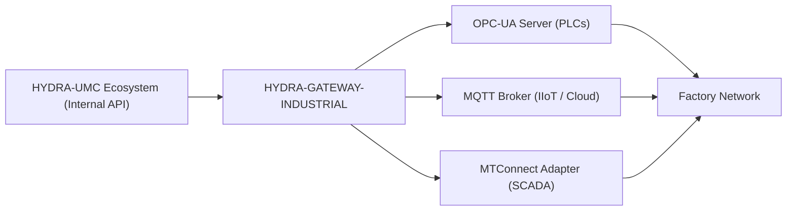

<p align="center">
  
</p>

# 🌐 HYDRA-UMC-GATEWAY-INDUSTRIAL

<p align="center"><a href="README.md">🇺🇸 English</a> | <a href="README_spa.md">🇪🇸 Español</a> | <a href="README_fra.md">🇫🇷 Français</a> | <a href="README_ita.md">🇮🇹 Italiano</a> | <a href="README_deu.md">🇩🇪 Deutsch</a> | <a href="README_zho.md">🇨🇳 简体中文</a> | 🇯🇵 <b>日本語</b></p>

### 🏭 工場標準向けのインダストリー 4.0 相互運用性ブリッジ

<p align="left">
  
  
  
  
</p>

---

## 1. 🛠️ 技術概要

**HYDRA-UMC-GATEWAY-INDUSTRIAL** は、HYDRA-UMC エコシステムと外部の
産業標準との間の安全な通信ブリッジです。マイクロファクトリーがサード
パーティの PLC、SCADA システム、クラウドベースの IIoT プラットフォーム
と相互作用することを可能にします。

マルチプロトコルトランスレーターとして機能し、内部のロボット状態と
工具のテレメトリを、OPC-UA の標準化されたノード、MQTT トピック、または
MTConnect の XML ストリームとして公開し、Hydra スウォームが生産工場に
おいて孤立した島になることを防ぎます。

### 主な機能：
* 🌐 **マルチスタンダード対応：** 統合された OPC-UA、MQTT、MTConnect インターフェース。
* 🛡️ **産業用セキュリティ：** すべての工場接続に対する相互 TLS（mTLS）と証明書ベースの認証。
* 🔄 **状態マッピング：** Hydra 内部の JSON 状態を標準化された産業用アドレス空間へリアルタイムに変換。
* ⚡ **高信頼性：** 24 時間 365 日の産業用稼働に最適化された専用の軽量ブリッジ。

---

## 2. 🔄 ゲートウェイアーキテクチャ



---

## 3. 🧱 アーキテクチャと設計上の決定

* **本プロジェクトが 3 つの子プロジェクトの統合親プロジェクトであり、対等な関係ではない理由。** HYDRA-UMC-OPCUA-SERVER、HYDRA-UMC-MQTT-BROKER、HYDRA-UMC-MTCONNECT-ADAPTER はすべて*同一*の基盤となる HYDRA-UMC-SERVER の状態を 3 つの異なる産業用プロトコルに変換します——共有されるルーティング/認証ロジックの所有権を一か所に集約することで、同一状態に対する 3 つの独立した、互いに一貫しない変換を避けられます。
* **すべてを行う単一のゲートウェイではなく、3 つの独立したプロトコルアダプターである理由。** OPC-UA、MQTT、MTConnect は構造的に異なります（アドレス空間 対 パブリッシュ/サブスクライブトピック 対 XML デバイス/エージェントストリーム）——プロトコルごとに 1 つのプロセスを持つことで、遅延している/壊れている MQTT クライアントが OPC-UA クライアントに影響を与えることは決してなく、それぞれをデプロイごとに独立して有効/無効にできます。
* **エントリポイントが今日は身元/バージョンのみを表示し、ヘルスチェックリスナーが起動した後で終了しない理由。** 足場（アンダミアヘ、スキャフォールディング）段階にあります：このプロセスが起動し稼働し続けることを証明すること（このエコシステムの他の多くの Node スケルトンとは異なり、単に実行して終了するだけではないこと）が、実際のプロトコル変換ロジックに先立ちます。実際のゲートウェイは、その性質上、長時間稼働するサービスだからです。
* **エコシステムの他の部分との関係。** Industrial Gateway ファミリーの統合親プロジェクトです——HYDRA-UMC-SERVER 自身の状態を、このエコシステム自身の REST/WebSocket API ではなく OPC-UA、MQTT、MTConnect を話す工場フロアのシステム（MES/SCADA/ヒストリアン）に公開します。
* **`GET /status` はリクエストごとに実際のライブチェックを行います。** `src/probes.ts` は各子サービスに対して OPC-UA/MQTT には実際の TCP 接続を、MTConnect には実際の HTTP `GET` リクエストを行います——各子サービスの `reachable`/`latencyMs`/`error`、および集計された `allReachable` はリクエスト時点で計算され、静的またはキャッシュされたリストから返されるものではありません。エンドツーエンドで検証済み: 3 つの実際の子サービスをすべて起動したところ `/status` は全て到達可能と報告し、その後 1 つを実際に停止させたところ、次の `/status` 呼び出しはその子サービスのみを正しく到達不能と判定し、実際の `ECONNREFUSED` エラーを返しました。各子サービスのホスト/ポート/URL は環境変数で設定可能で、デフォルトは `docker-compose.yml` が既に使用しているサービス名と同じです。

---

## 📂 リポジトリ構成

```text
HYDRA-UMC-GATEWAY-INDUSTRIAL/
├── src/                # ソースコード（Node/TypeScript —— 集約インターフェース）
├── docs/               # ドキュメントとマッピングリファレンス
├── build/               # コンパイル出力（npm run build）
├── images/             # メディアと図表
├── scripts/            # ユーティリティスクリプト（bump-version.mjs）
├── Dockerfile           # 本サービス自身のコンテナイメージ
├── docker-compose.yml   # 本ゲートウェイとその 3 つの子プロジェクトを一緒に起動
└── README.md
```

純粋なネットワークサービスであり、独自の専用ハードウェアを持ちません
——`hardware/`、`firmware/`、`os/` は元のプロジェクトテンプレートから
省略されています（このバッチに適用された省略ルールについては、
エコシステム自身の計画文書 `SONNET/5.PLAN_EJECUCION_32_PROYECTOS_NUEVOS.txt` を参照してください）。

---

## 🐳 3 つの子ブリッジの統合

これは単なるドキュメントではなく、実際の統合リポジトリです——
`docker-compose.yml` は、4 つのリポジトリが兄弟フォルダとしてチェック
アウトされていること（このエコシステムの GitHub 組織が既に使用している
レイアウト）を前提として、本ゲートウェイをその 3 つの子プロジェクト
（**HYDRA-UMC-OPCUA-SERVER**、**HYDRA-UMC-MQTT-BROKER**、
**HYDRA-UMC-MTCONNECT-ADAPTER**）とともに 1 つの Docker ネットワーク
として起動します：

```bash
docker compose up --build
```

これにより、各サービスが単独でそれぞれ既にバインドしているのと同じ
ポートで、4 つのサービスすべてが起動します：本ゲートウェイは `8000`、
OPC-UA は `4840`、MQTT は `1883`、MTConnect は `5000` です。
`GET http://localhost:8000/status` は、本ゲートウェイ自身のバージョン
と、それが到達を期待している子プロジェクトを報告します。

---

## 🛠️ 開発環境

### 必要条件
- [Node.js](https://nodejs.org/)（v18 以上を推奨）
- npm

### インストール
```bash
npm install
```

### 開発モード
`tsx` を使用して集約サーバーを直接実行します（バンドラーなし）：
- **Windows：** `dev.bat` をダブルクリックするか、`npm run dev` を実行
- **Linux/Mac：** `./dev.sh` または `npm run dev` を実行

### プロダクションビルド
esbuild を使用してサーバーを単一のデプロイ可能なファイルにバンドル
します：
- **Windows：** `build.bat` をダブルクリックするか、`npm run build` を実行
- **Linux/Mac：** `./build.sh` または `npm run build` を実行

その後、次のコマンドで起動します：
```bash
npm start
```

サーバーは `0.0.0.0:8000` でリッスンします——`GET /status` は、本ゲート
ウェイ自身のバージョンと、それがフロントに立っている各子ブリッジの
名前/プロトコル/エンドポイントを報告します。

### バージョン管理
実際の `npm run build` のたびに、`package.json` 自身の `version` が
自動的に増加します（`scripts/bump-version.mjs`、`build` スクリプトの
最初のステップとして接続）——10 進法の「オドメーター」方式：ビルド
ごとに patch を +1 し、9 を超えると minor に繰り上がり（minor が 9 を
超えると major に繰り上がる）、2 桁のセグメントに到達することはあり
ません（`0.0.9` -> `0.1.0`、`0.0.10` にはなりません）。

---

## 🚀 ロードマップ
* **フェーズ 1：** 高速データ交換とレガシープロトコルブリッジングのための OPC-UA パブリッシュ/サブスクライブ実装。
* **フェーズ 2：** 大量の IoT デバイス管理と高い並行性のための MQTT Broker クラスター。
* **フェーズ 3：** マルチベンダーの CNC および PLC 機械統合のための MTConnect アダプターサポート。
* **フェーズ 4：** Industrial Gateway の完全な ISO-27001 サイバーセキュリティ準拠と Profinet ソフトウェアアダプターサポート。

---

## 🔗 関連プロジェクト

本プロジェクトは、同一著者（JuanenRac / Electro Hobby 3D）による、
ファームウェア、制御ソフトウェア、AI ノード、フリート管理ツールにまたがる、
より大きなロボティクスエコシステムの一部です。ご要望が実際にはこれらの
プロジェクトのいずれかに関するものであり、本リポジトリのものではない
可能性もあるため、知っておく価値があります。

### プロジェクトファミリー

**親プロジェクト：** なし —— 本プロジェクト自体が Industrial Gateway ファミリーの統合親プロジェクトです。

**子プロジェクト：**
- **[HYDRA-UMC-OPCUA-SERVER](https://github.com/JuanenRac/HYDRA-UMC-OPCUA-SERVER)** —— 本ゲートウェイがルーティングを経由する OPC-UA プロトコルアダプター。
- **[HYDRA-UMC-MQTT-BROKER](https://github.com/JuanenRac/HYDRA-UMC-MQTT-BROKER)** —— 本ゲートウェイがルーティングを経由する MQTT プロトコルアダプター。
- **[HYDRA-UMC-MTCONNECT-ADAPTER](https://github.com/JuanenRac/HYDRA-UMC-MTCONNECT-ADAPTER)** —— 本ゲートウェイがルーティングを経由する MTConnect プロトコルアダプター。

### 直接関連（ファミリー外）

- **[HYDRA-UMC-SERVER](https://github.com/JuanenRac/HYDRA-UMC-SERVER)** —— 本ゲートウェイが公開する状態の発生源。

### エコシステムのその他のプロジェクト

**HYDRA-UMC プラットフォーム** — マルチロボット・マイクロファクトリーセル
- **[HYDRA-UMC](https://github.com/JuanenRac/HYDRA-UMC)** — 最大 8 台のロボットアームを統括する CM5 + STM32H745 マザーボード。
- **[HYDRA-UMC-SERVER](https://github.com/JuanenRac/HYDRA-UMC-SERVER)** — すべての制御クライアントが接続する Express/WebSocket バックエンド。
- **[HYDRA-UMC-STUDIO](https://github.com/JuanenRac/HYDRA-UMC-STUDIO)** — Web ベースの制御ダッシュボード、マルチロボット 3D 可視化。
- **[HYDRA-UMC-ANDROID-CONTROL](https://github.com/JuanenRac/HYDRA-UMC-ANDROID-CONTROL)** — Wi-Fi/Bluetooth 経由の Android 制御アプリ。
- **[HYDRA-UMC-IOS-CONTROL](https://github.com/JuanenRac/HYDRA-UMC-IOS-CONTROL)** — Flutter で構築された iOS/iPadOS 制御アプリ。
- **[HYDRA-UMC-SUITE](https://github.com/JuanenRac/HYDRA-UMC-SUITE)** — デスクトップ版群制御コマンドセンター（Python/PySide6）。
- **[HYDRA-UMC-EDITOR-URDF](https://github.com/JuanenRac/HYDRA-UMC-EDITOR-URDF)** — ロボットカタログ向けのデスクトップ版 URDF モデルエディター。
- **[HYDRA-UMC-DSI](https://github.com/JuanenRac/HYDRA-UMC-DSI)** — 機載 DSI タッチスクリーン用のネイティブタッチ UI。

**URTC プラットフォーム** — すべての HYDRA-UMC ロボットアームが搭載するツールヘッドコントローラー
- **[URTC](https://github.com/JuanenRac/URTC)** — CAN バスツールヘッドコントローラー、25 種類のツールプロファイル。
- **[URTC-FLASHER](https://github.com/JuanenRac/URTC-FLASHER)** — デスクトップ版 CAN-OTA + SWD/JTAG フラッシュツール。
- **[URTC-TESTER](https://github.com/JuanenRac/URTC-TESTER)** — デスクトップ版ライブ CAN バス診断ツール。
- **[URTC-WEB-STUDIO](https://github.com/JuanenRac/URTC-WEB-STUDIO)** — Web Serial API によるブラウザベースの代替版。

**🎥 ビジョン AI ノード（Hailo-8）**
- [HYDRA-UMC-VISION-NODE](https://github.com/JuanenRac/HYDRA-UMC-VISION-NODE)
- [HYDRA-UMC-VISION-STREAMER](https://github.com/JuanenRac/HYDRA-UMC-VISION-STREAMER)
- [HYDRA-UMC-DETECTION-HEF](https://github.com/JuanenRac/HYDRA-UMC-DETECTION-HEF)
- [HYDRA-UMC-SAFETY-ZONES](https://github.com/JuanenRac/HYDRA-UMC-SAFETY-ZONES)
- [HYDRA-UMC-VISUAL-SERVOING-API](https://github.com/JuanenRac/HYDRA-UMC-VISUAL-SERVOING-API)

**🧠 認知 AI ノード（Hailo-10）**
- [HYDRA-UMC-COGNITIVE-NODE](https://github.com/JuanenRac/HYDRA-UMC-COGNITIVE-NODE)
- [HYDRA-UMC-VLA-ENGINE](https://github.com/JuanenRac/HYDRA-UMC-VLA-ENGINE)
- [HYDRA-UMC-VOICE-UI](https://github.com/JuanenRac/HYDRA-UMC-VOICE-UI)
- [HYDRA-UMC-SEMANTIC-PLANNER](https://github.com/JuanenRac/HYDRA-UMC-SEMANTIC-PLANNER)
- [HYDRA-UMC-DOCS-QA](https://github.com/JuanenRac/HYDRA-UMC-DOCS-QA)

**🐝 オーケストレーションと群制御**
- [HYDRA-UMC-ORCHESTRATOR](https://github.com/JuanenRac/HYDRA-UMC-ORCHESTRATOR)
- [HYDRA-UMC-SWARM-SYNC](https://github.com/JuanenRac/HYDRA-UMC-SWARM-SYNC)
- [HYDRA-UMC-PATH-PLANNER-3D](https://github.com/JuanenRac/HYDRA-UMC-PATH-PLANNER-3D)
- [HYDRA-UMC-JOB-DISPATCHER](https://github.com/JuanenRac/HYDRA-UMC-JOB-DISPATCHER)
- [HYDRA-UMC-NODE-HEALING](https://github.com/JuanenRac/HYDRA-UMC-NODE-HEALING)

**🎮 デジタルツインとシミュレーション**
- [HYDRA-UMC-TWIN](https://github.com/JuanenRac/HYDRA-UMC-TWIN)
- [HYDRA-UMC-PHYSICS-REPLICA](https://github.com/JuanenRac/HYDRA-UMC-PHYSICS-REPLICA)
- [HYDRA-UMC-HIL-BRIDGE](https://github.com/JuanenRac/HYDRA-UMC-HIL-BRIDGE)
- [HYDRA-UMC-SYNTHETIC-DATA-GEN](https://github.com/JuanenRac/HYDRA-UMC-SYNTHETIC-DATA-GEN)

**📊 データと分析**
- [HYDRA-UMC-DATALAKE](https://github.com/JuanenRac/HYDRA-UMC-DATALAKE)
- [HYDRA-UMC-TELEMETRY-COLLECTOR](https://github.com/JuanenRac/HYDRA-UMC-TELEMETRY-COLLECTOR)
- [HYDRA-UMC-ANOMALY-DETECTOR](https://github.com/JuanenRac/HYDRA-UMC-ANOMALY-DETECTOR)
- [HYDRA-UMC-PRODUCTION-REPORTS](https://github.com/JuanenRac/HYDRA-UMC-PRODUCTION-REPORTS)

**🛠️ 補完ツール**
- [URTC-SMART-RACK](https://github.com/JuanenRac/URTC-SMART-RACK)
- [URTC-VISION-TOOL](https://github.com/JuanenRac/URTC-VISION-TOOL)
- [HYDRA-UMC-WATCH](https://github.com/JuanenRac/HYDRA-UMC-WATCH)
- [HYDRA-UMC-TOOL-CLI](https://github.com/JuanenRac/HYDRA-UMC-TOOL-CLI)
- [HYDRA-UMC-DASHBOARD-AI](https://github.com/JuanenRac/HYDRA-UMC-DASHBOARD-AI)


## 👤 作者
**JuanenRac**（Electro Hobby 3D）
📧 electrohobby3d@gmail.com

## 📜 ライセンス
GPL-3.0 —— 詳細は LICENSE を参照してください。
