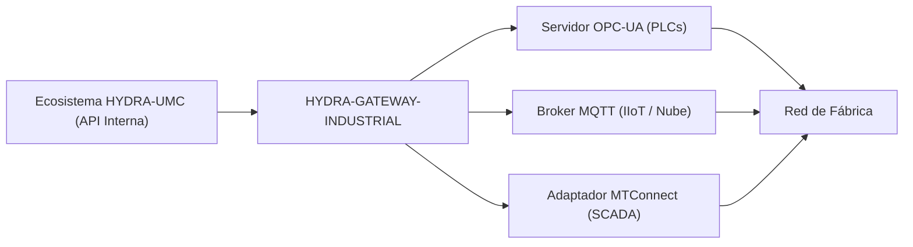

<p align="center">
  
</p>

# 🌐 HYDRA-UMC-GATEWAY-INDUSTRIAL

<p align="center"><a href="README.md">🇺🇸 English</a> | 🇪🇸 <b>Español</b> | <a href="README_fra.md">🇫🇷 Français</a> | <a href="README_ita.md">🇮🇹 Italiano</a> | <a href="README_deu.md">🇩🇪 Deutsch</a> | <a href="README_zho.md">🇨🇳 简体中文</a> | <a href="README_jpn.md">🇯🇵 日本語</a></p>

### 🏭 Puente de Interoperabilidad Industria 4.0 para Estándares de Fábrica

<p align="left">
  
  
  
  
</p>

---

## 1. 🛠️ VISIÓN GENERAL TÉCNICA

**HYDRA-UMC-GATEWAY-INDUSTRIAL** es el puente de comunicación seguro entre el ecosistema HYDRA-UMC y los estándares industriales externos. Permite que la micro-fábrica interactúe con PLCs de terceros, sistemas SCADA y plataformas IIoT basadas en la nube.

Actúa como un traductor multi-protocolo, exponiendo los estados robóticos internos y las telemetrías de herramientas como nodos estandarizados en OPC-UA, tópicos MQTT o flujos XML MTConnect, asegurando que el enjambre Hydra nunca sea una isla aislada en la planta de producción.

### Características Clave:
* 🌐 **Soporte Multi-Estándar:** Interfaces integradas de OPC-UA, MQTT y MTConnect.
* 🛡️ **Seguridad Industrial:** TLS mutuo (mTLS) y autenticación basada en certificados para todas las conexiones de fábrica.
* 🔄 **Mapeo de Estado:** Traducción en tiempo real del estado JSON interno de Hydra en espacios de direcciones industriales estandarizados.
* ⚡ **Alta Fiabilidad:** Puente ligero dedicado optimizado para un tiempo de actividad industrial 24/7.
* 🚦 **Real v0 - Allowlist de Comandos + Backpressure:** `POST /command` está protegido por una allowlist por defecto-denegado por protocolo, un límite de concurrencia acotado y un timeout real - ver "Comprobación de honestidad" abajo para lo que se aplica exactamente hoy.

**Comprobación de honestidad - qué funciona hoy de verdad:** `POST /command { protocol, operation, target }` es real: la operación debe estar explícitamente en la allowlist de su protocolo (`403` si no lo está - v0 solo permite operaciones de lectura/publicación, nada que escriba en un PLC en vivo), no se ejecuta más de un número acotado de comandos a la vez (`429` por encima de eso), y un comando que no se resuelve a tiempo se reporta como agotado (`504`) en vez de dejarse colgado. La ruta de ejecución por defecto reutiliza las sondas de alcanzabilidad reales de este proyecto - honesto en que se queda corto de una escritura real a nivel de protocolo OPC-UA/MQTT/MTConnect, ya que ninguno de los tres hijos expone todavía una API de comandos real tampoco. Ver `CHANGELOG.md` para lo entregado exactamente.

---

## 2. 🔄 ARQUITECTURA DEL GATEWAY



---

## 3. 🧱 ARQUITECTURA Y DECISIONES DE DISEÑO

* **Por qué es el padre de integración, no un par, de sus 3 hijos.** HYDRA-UMC-OPCUA-SERVER, HYDRA-UMC-MQTT-BROKER y HYDRA-UMC-MTCONNECT-ADAPTER traducen todos el MISMO estado subyacente de HYDRA-UMC-SERVER a 3 protocolos industriales distintos - poseer el enrutamiento/autenticación compartidos en un solo sitio evita 3 traducciones independientes y potencialmente inconsistentes del mismo estado.
* **Por qué 3 adaptadores de protocolo separados, no una pasarela que lo haga todo.** OPC-UA, MQTT y MTConnect son estructuralmente distintos (espacio de direcciones frente a temas pub/sub frente a flujos XML de dispositivo/agente) - un proceso por protocolo significa que un cliente MQTT lento o roto nunca afecta al de OPC-UA, y cada uno puede activarse/desactivarse de forma independiente según el despliegue.
* **Por qué el punto de entrada solo imprime identidad/versión, y termina tras levantar un listener de health-check.** Etapa de andamiaje: probar que el proceso arranca y se mantiene en pie (no solo se ejecuta y termina, a diferencia de la mayoría de los otros esqueletos Node de este ecosistema) precede a la lógica real de traducción de protocolo, ya que una pasarela real es por naturaleza un servicio de larga duración.
* **Cómo encaja en el resto del ecosistema.** El padre de integración de la familia Pasarela Industrial - expone el propio estado de HYDRA-UMC-SERVER a sistemas de planta (MES/SCADA/históricos) que hablan OPC-UA, MQTT o MTConnect en vez de la API REST/WebSocket propia de este ecosistema.
* **`GET /health` es una comprobación de vida rápida y separada - `GET /status` ya no se usa para eso.** `/status` es un diagnóstico profundo real que puede tardar legítimamente ~2s por cada hijo inalcanzable; apuntado directamente ahí, el propio escáner de estado del ecosistema de HYDRA-UMC-SERVER (`/api/ecosystem/status`, que solo da ~800ms por sondeo) reportaba este gateway como caído cada vez que sus hijos eran inalcanzables, aunque el propio proceso del gateway estuviera sano. `/health` responde `{ gateway, version, status: "ok" }` sin ningún sondeo a los hijos, y el propio `service.health_path` de `hydra-umc.project.json` apunta ahí en vez de a `/status`.
* **`GET /status` hace una comprobación real y en vivo en cada petición.** `src/probes.ts` realiza una conexión TCP real para OPC-UA/MQTT y una petición HTTP `GET` real para MTConnect contra cada hijo - `reachable`/`latencyMs`/`error` por hijo y un `allReachable` agregado se calculan en el momento de la petición, no se devuelven de una lista estática o en caché. Verificado de extremo a extremo: se arrancaron los 3 hijos reales, `/status` los reportó a todos alcanzables, se mató de verdad uno de ellos, y la siguiente llamada a `/status` marcó correctamente solo a ese hijo como no alcanzable con un `ECONNREFUSED` real. El host/puerto/URL de cada hijo es configurable por variables de entorno, con el mismo nombre de servicio que ya usa `docker-compose.yml` como valor por defecto.
* **Por qué la allowlist de `POST /command` es por defecto-denegado, no por defecto-permitido.** Una pasarela industrial que reenvía cualquier string de operación que reciba es un riesgo en el momento en que un hijo exponga una ruta de escritura real - empezar desde "nada está permitido a menos que se liste explícitamente" significa que añadir una operación peligrosa (una escritura de nodo OPC-UA, una publicación de configuración retenida en MQTT) siempre es una decisión deliberada y revisable más adelante, nunca un valor por defecto accidental hoy.
* **Por qué la autorización se comprueba antes que el backpressure en `CommandDispatcher.dispatch()`.** Un comando no autorizado debe rechazarse siempre de la misma forma sin importar cuán ocupada esté la pasarela en ese momento - si la capacidad se comprobara primero, una operación no permitida podría a veces colarse como "aceptada" (un hueco estaba libre) o a veces leerse como "solo ocupado" (no lo estaba), filtrando información de temporización sobre la carga de la pasarela a través de lo que debería ser una decisión puramente de autorización.
* **Por qué el ejecutor de comandos por defecto reutiliza las sondas de alcanzabilidad en vez de un stub que siempre tiene éxito.** `src/probes.ts` ya responde de verdad a "¿este hijo está de verdad ahí?" - reutilizarlo significa que `POST /command` falla honestamente (`502 downstream_unreachable`) contra un hijo caído, en vez de reportar `accepted` para un comando que nunca podría haber llegado a ningún sitio.

---

## 📂 ESTRUCTURA DE DIRECTORIOS

```text
HYDRA-UMC-GATEWAY-INDUSTRIAL/
├── src/
│   ├── probes.ts        # Comprobaciones reales de alcanzabilidad TCP/HTTP por hijo
│   ├── command.ts        # CommandDispatcher real: allowlist + backpressure + timeout
│   ├── version.ts        # Versión real del paquete en tiempo de ejecución, leída de package.json
│   └── server.ts         # App Express: GET /status, POST /command
├── tests/               # Suite vitest real (probes, server, command)
├── docs/               # Documentación y referencia de mapeo
├── build/               # Salida compilada (npm run build)
├── images/             # Medios y diagramas
├── scripts/            # Scripts de utilidad (bump-version.mjs)
├── tools/
│   ├── build_test.py    # Comprobación de compilación sin versionado
│   └── ci_validate.py   # Validación de manifiesto/CHANGELOG/docs usada por CI
├── bump_manifest_version.py # Sincroniza la versión de hydra-umc.project.json con la de package.json (--sync)
├── .env.example         # Plantilla de variables de entorno
├── build.sh/.bat        # Sube la versión y luego ejecuta npm run build
├── build-test.sh/.bat   # Comprobación de compilación sin versionado
├── dev.sh/.bat           # Ejecuta el servidor directamente desde el código fuente, sin build
├── Dockerfile           # Imagen de contenedor propia de este servicio
├── docker-compose.yml   # Levanta este Gateway + sus 3 hijos juntos
└── README.md
```

Servicio de red puro, sin hardware propio - `hardware/`, `firmware/` y
`os/` se omiten según la política de estructura del repositorio.

---

## 🐳 INTEGRACIÓN DE LOS 3 PUENTES HIJOS

Este es un repo de integración real, no solo documentación -
`docker-compose.yml` levanta este Gateway junto a sus tres hijos
(**HYDRA-UMC-OPCUA-SERVER**, **HYDRA-UMC-MQTT-BROKER**,
**HYDRA-UMC-MTCONNECT-ADAPTER**) como una única red Docker, asumiendo que
los cuatro repos están clonados como carpetas hermanas (la disposición
que ya usa el GitHub org de este ecosistema):

```bash
docker compose up --build
```

Esto arranca los 4 servicios en los mismos puertos que cada uno ya usa de
forma independiente: este Gateway en `8000`, OPC-UA en `4840`, MQTT en
`1883`, MTConnect en `5000`. `GET http://localhost:8000/status` reporta
la versión propia del Gateway y qué hijos espera poder alcanzar.

---

## 🛠️ ENTORNO DE DESARROLLO

### Requisitos
- [Node.js](https://nodejs.org/) (v18 o superior recomendado)
- npm

### Instalación
```bash
npm install
```

### Modo Desarrollo
Ejecuta el servidor de agregación directamente con `tsx` (sin bundler):
- **Windows:** doble clic en `dev.bat` o ejecutar `npm run dev`
- **Linux/Mac:** ejecutar `./dev.sh` o `npm run dev`

### Build de Producción
Empaqueta el servidor en un único archivo desplegable con esbuild:
- **Windows:** doble clic en `build.bat` o ejecutar `npm run build`
- **Linux/Mac:** ejecutar `./build.sh` o `npm run build`

Luego arráncalo con:
```bash
npm start
```

El servidor escucha en `0.0.0.0:8000` - `GET /health` es una comprobación
de vida rápida sin sondeo a los hijos (a donde apunta el propio
`service.health_path` de `hydra-umc.project.json`), mientras que
`GET /status` es el diagnóstico profundo real que reporta la versión
propia del Gateway más el nombre/protocolo/endpoint/alcanzabilidad de
cada puente hijo al que da la cara.

Ejemplo real - un comando permitido contra un hijo que no está corriendo,
una operación no autorizada y una petición malformada:

```bash
curl -X POST http://localhost:8000/command -H "Content-Type: application/json" \
  -d '{"protocol":"OPC-UA","operation":"read","target":"ns=2;s=Line1.Status"}'
# 502 {"status":"downstream_unreachable","reason":"TCP connect to opcua-server:4840 timed out after 2000ms"}

curl -X POST http://localhost:8000/command -H "Content-Type: application/json" \
  -d '{"protocol":"OPC-UA","operation":"write","target":"ns=2;s=Line1.SetPoint"}'
# 403 {"status":"rejected_unauthorized","reason":"operation \"write\" is not allowlisted for OPC-UA"}

curl -X POST http://localhost:8000/command -H "Content-Type: application/json" -d '{"protocol":"OPC-UA"}'
# 400 {"error":"protocol, operation and target are required strings"}
```

### Versionado
Cada `npm run build` real incrementa automáticamente el `version` de
`package.json` (`scripts/bump-version.mjs`, primer paso del script
`build`) - un "cuentakilómetros" en base 10: patch +1 por build, con
acarreo a minor (y de minor a major) al pasar de 9 en vez de llegar nunca
a un segmento de dos dígitos (`0.0.9` -> `0.1.0`, no `0.0.10`).

---

## 🚀 HOJA DE RUTA
* **Fase 1:** Implementación de OPC-UA Pub/Sub para intercambio de datos de alta velocidad y puente de protocolos heredados.
* **Fase 2:** Clúster de Broker MQTT para gestión masiva de dispositivos IoT y alta concurrencia.
* **Fase 3:** Soporte del adaptador MTConnect para integración de maquinaria CNC y PLC multi-vendedor.
* **Fase 4:** Cumplimiento total de ciberseguridad ISO-27001 para el Pasarela Industrial y soporte de adaptador de software Profinet.

---

## 🔗 Proyectos Relacionados

Este proyecto es parte del ecosistema de robótica HYDRA-UMC del mismo autor (JuanenRac / Electro Hobby 3D). Vale la pena conocerlo, ya que una petición podría en realidad ser sobre alguno de estos en vez de sobre este repositorio.

**Proyectos Hijos** — cada uno es un adaptador de protocolo por el que esta pasarela enruta
- **[HYDRA-UMC-OPCUA-SERVER](https://github.com/JuanenRac/HYDRA-UMC-OPCUA-SERVER)** — espacio de direcciones OPC-UA real, verificado con una sesión de cliente real del protocolo binario.
- **[HYDRA-UMC-MQTT-BROKER](https://github.com/JuanenRac/HYDRA-UMC-MQTT-BROKER)** — broker MQTT real con autenticación por cliente opcional y ACL de tópicos.
- **[HYDRA-UMC-MTCONNECT-ADAPTER](https://github.com/JuanenRac/HYDRA-UMC-MTCONNECT-ADAPTER)** — endpoints XML reales `/probe` y `/current` de MTConnect, con salida en modo degradado.

**Directamente Relacionados**
- **[HYDRA-UMC-SERVER](https://github.com/JuanenRac/HYDRA-UMC-SERVER)** — el backend headless real (REST/WebSocket) con el que habla de verdad cada cliente de control; la fuente del estado que expone esta pasarela.

**También Forma Parte del Ecosistema**

*Hardware y Plataforma Base*
- **[HYDRA-UMC](https://github.com/JuanenRac/HYDRA-UMC)** — la placa madre física del brazo robótico: host CM5 + coprocesador STM32H745 de doble núcleo, coordinando hasta 8 brazos herramienta por CAN-OTA/SPI-OTA.
- **[HYDRA-UMC-OS](https://github.com/JuanenRac/HYDRA-UMC-OS)** — capa de producto reproducible sobre Raspberry Pi OS para el CM5: agente de solo lectura, config/perfiles validados, aprovisionamiento WiFi de primer contacto.
- **[HYDRA-UMC-SDK](https://github.com/JuanenRac/HYDRA-UMC-SDK)** — el contrato JSON-Schema compartido y la barrera de seguridad contra la que cada bridge valida sus comandos.

*Backend Central y Clientes*
- **[HYDRA-UMC-STUDIO](https://github.com/JuanenRac/HYDRA-UMC-STUDIO)** — panel de control web con visualización 3D multi-robot en tiempo real.
- **[HYDRA-UMC-ANDROID-CONTROL](https://github.com/JuanenRac/HYDRA-UMC-ANDROID-CONTROL)** — app nativa de control para Android con inicio de sesión biométrico y un compañero Wear OS emparejado.
- **[HYDRA-UMC-IOS-CONTROL](https://github.com/JuanenRac/HYDRA-UMC-IOS-CONTROL)** — app de control para iOS/iPadOS (Flutter) con sincronización en tiempo real por WebSocket.
- **[HYDRA-UMC-DSI](https://github.com/JuanenRac/HYDRA-UMC-DSI)** — interfaz táctil nativa para la pantalla táctil DSI de 7" a bordo, embebida en el propio CM5.
- **[HYDRA-UMC-EDITOR-URDF](https://github.com/JuanenRac/HYDRA-UMC-EDITOR-URDF)** — creador/editor gráfico de URDF de escritorio que envía los modelos terminados al propio catálogo de STUDIO.
- **[HYDRA-UMC-BRIDGE-AMR](https://github.com/JuanenRac/HYDRA-UMC-BRIDGE-AMR)** — barrera de coordinación para flotas AGV/AMR mediante un publicador MQTT VDA 5050 real.
- **[HYDRA-UMC-BRIDGE-CNC](https://github.com/JuanenRac/HYDRA-UMC-BRIDGE-CNC)** — coordinador de alto nivel para celdas CNC con acceso real a estado/bytes de control GRBL.
- **[HYDRA-UMC-BRIDGE-DROIDS](https://github.com/JuanenRac/HYDRA-UMC-BRIDGE-DROIDS)** — barrera de coordinación para droides con patas/humanoides, con un emisor de comandos real para Boston Dynamics Spot.
- **[HYDRA-UMC-BRIDGE-LASER](https://github.com/JuanenRac/HYDRA-UMC-BRIDGE-LASER)** — coordinador de seguridad para celdas láser que lee 3 salvaguardas GPIO reales de llave/carcasa/enclavamiento.
- **[HYDRA-UMC-BRIDGE-OPENPNP](https://github.com/JuanenRac/HYDRA-UMC-BRIDGE-OPENPNP)** — coordinador de alto nivel seguro para el flujo de placas de pick-and-place OpenPnP.
- **[HYDRA-UMC-BRIDGE-PRINTER3D](https://github.com/JuanenRac/HYDRA-UMC-BRIDGE-PRINTER3D)** — barrera de coordinación segura para impresoras 3D Moonraker/Klipper, con comandos de trabajo reales y controlados.
- **[HYDRA-UMC-BRIDGE-ROS2](https://github.com/JuanenRac/HYDRA-UMC-BRIDGE-ROS2)** — coordinador de seguridad con un transporte ROS 2 rclpy real, importado de forma perezosa.
- **[HYDRA-UMC-BRIDGE-UAV](https://github.com/JuanenRac/HYDRA-UMC-BRIDGE-UAV)** — barrera de coordinación para UAV equipados con cámara, con un emisor de comandos MAVLink real.

*Plataforma de Herramientas URTC*
- **[URTC](https://github.com/JuanenRac/URTC)** — firmware para la placa física del Universal Robot Tool Controller, más de 25 perfiles de herramienta por bus CAN.
- **[URTC-FLASHER](https://github.com/JuanenRac/URTC-FLASHER)** — herramienta de escritorio con GUI para flashear placas URTC, CAN-OTA más SWD/JTAG de chip completo.
- **[URTC-TESTER](https://github.com/JuanenRac/URTC-TESTER)** — herramienta de escritorio de diagnóstico CAN-bus en vivo para placas URTC, un panel por perfil de herramienta.
- **[URTC-WEB-STUDIO](https://github.com/JuanenRac/URTC-WEB-STUDIO)** — alternativa basada en navegador a URTC-TESTER mediante la Web Serial API, sin instalación local.

*Nodo IA de Visión (Hailo-8)*
- **[HYDRA-UMC-VISION-NODE](https://github.com/JuanenRac/HYDRA-UMC-VISION-NODE)** — nodo de integración para el pipeline de visión Hailo-8, con una comprobación real de disponibilidad de hardware por etapa.
- **[HYDRA-UMC-DETECTION-HEF](https://github.com/JuanenRac/HYDRA-UMC-DETECTION-HEF)** — registro real de modelos compilados con verificación de carga segura por arquitectura Hailo/checksum.
- **[HYDRA-UMC-VISION-STREAMER](https://github.com/JuanenRac/HYDRA-UMC-VISION-STREAMER)** — generador real de pipeline GStreamer + config MediaMTX, con una frontera de integración HailoRT real.
- **[HYDRA-UMC-VISUAL-SERVOING-API](https://github.com/JuanenRac/HYDRA-UMC-VISUAL-SERVOING-API)** — ley de corrección real de Position-Based Visual Servoing, con puerta de seguridad según el estado de zona previo.
- **[HYDRA-UMC-SAFETY-ZONES](https://github.com/JuanenRac/HYDRA-UMC-SAFETY-ZONES)** — comprobación real de invasión de zona y solicitud de E-STOP, con exigencia de vigencia de calibración.

*Nodo IA Cognitivo (Hailo-10)*
- **[HYDRA-UMC-COGNITIVE-NODE](https://github.com/JuanenRac/HYDRA-UMC-COGNITIVE-NODE)** — nodo de integración para el pipeline cognitivo Hailo-10 (orquestación de LLM/VLA/voz).
- **[HYDRA-UMC-VLA-ENGINE](https://github.com/JuanenRac/HYDRA-UMC-VLA-ENGINE)** — codificación/decodificación real de tokens de acción y generación de trayectoria para un modelo Vision-Language-Action.
- **[HYDRA-UMC-VOICE-UI](https://github.com/JuanenRac/HYDRA-UMC-VOICE-UI)** — front-end de voz real (VAD + analizador de intención) con un relé a Watch acotado y con confirmación.
- **[HYDRA-UMC-SEMANTIC-PLANNER](https://github.com/JuanenRac/HYDRA-UMC-SEMANTIC-PLANNER)** — descomposición real de tareas basada en reglas y recuperación semántica de errores sobre códigos de error del MCU.
- **[HYDRA-UMC-DOCS-QA](https://github.com/JuanenRac/HYDRA-UMC-DOCS-QA)** — búsqueda real de documentos TF-IDF (solo librería estándar) sobre los propios documentos Markdown de este ecosistema.

*Orquestación y Enjambre*
- **[HYDRA-UMC-ORCHESTRATOR](https://github.com/JuanenRac/HYDRA-UMC-ORCHESTRATOR)** — nodo de integración con un contrato real de informe de salud gRPC/Protobuf y una máquina de estados de misión.
- **[HYDRA-UMC-JOB-DISPATCHER](https://github.com/JuanenRac/HYDRA-UMC-JOB-DISPATCHER)** — cola de trabajos real basada en prioridad con deduplicación, sobre una API HTTP real.
- **[HYDRA-UMC-NODE-HEALING](https://github.com/JuanenRac/HYDRA-UMC-NODE-HEALING)** — watchdog de salud de flota real basado en gRPC, con reintento/backoff y detección de discrepancia de identidad.
- **[HYDRA-UMC-PATH-PLANNER-3D](https://github.com/JuanenRac/HYDRA-UMC-PATH-PLANNER-3D)** — planificador de rutas 3D real basado en RRT, con validación real de colisión de obstáculos/espacio de trabajo.
- **[HYDRA-UMC-SWARM-SYNC](https://github.com/JuanenRac/HYDRA-UMC-SWARM-SYNC)** — sincronización de estado real mediante CRDT LWW-Element-Map, con pruebas de propiedades para convergencia multi-celda.

*Gemelo Digital y Simulación*
- **[HYDRA-UMC-TWIN](https://github.com/JuanenRac/HYDRA-UMC-TWIN)** — nodo de integración para el motor de gemelo digital, con un contrato real de sincronización por compatibilidad de versión.
- **[HYDRA-UMC-HIL-BRIDGE](https://github.com/JuanenRac/HYDRA-UMC-HIL-BRIDGE)** — enclavamiento de seguridad real hardware-in-the-loop que enruta comandos entre simulación y hardware real.
- **[HYDRA-UMC-PHYSICS-REPLICA](https://github.com/JuanenRac/HYDRA-UMC-PHYSICS-REPLICA)** — cinemática directa real y validación de límites articulares sobre un subconjunto real de URDF.
- **[HYDRA-UMC-SYNTHETIC-DATA-GEN](https://github.com/JuanenRac/HYDRA-UMC-SYNTHETIC-DATA-GEN)** — generador real de escenas 2D procedurales con exportación de anotaciones YOLO/COCO.

*Datos y Analítica*
- **[HYDRA-UMC-DATALAKE](https://github.com/JuanenRac/HYDRA-UMC-DATALAKE)** — almacén de series temporales real respaldado por sqlite3, con una API HTTP real de ingesta/consulta.
- **[HYDRA-UMC-ANOMALY-DETECTOR](https://github.com/JuanenRac/HYDRA-UMC-ANOMALY-DETECTOR)** — detector de anomalías real basado en FFT + línea base estadística, con monitorización de deriva.
- **[HYDRA-UMC-PRODUCTION-REPORTS](https://github.com/JuanenRac/HYDRA-UMC-PRODUCTION-REPORTS)** — cálculo real de OEE/disponibilidad sobre el histórico de DATALAKE, con exportación CSV reproducible.
- **[HYDRA-UMC-TELEMETRY-COLLECTOR](https://github.com/JuanenRac/HYDRA-UMC-TELEMETRY-COLLECTOR)** — pipeline real de ingesta CAN/WebSocket hacia DATALAKE, con deduplicación por secuencia.

*Herramientas Complementarias y Operaciones del Ecosistema*
- **[HYDRA-UMC-DASHBOARD-AI](https://github.com/JuanenRac/HYDRA-UMC-DASHBOARD-AI)** — paneles de Resúmenes Inteligentes y Resaltado de Anomalías sobre DATALAKE/ANOMALY-DETECTOR, con un respaldo estadístico honesto.
- **[HYDRA-UMC-TOOL-CLI](https://github.com/JuanenRac/HYDRA-UMC-TOOL-CLI)** — CLI de flota con un contrato real y estable de códigos de salida, cliente real y en vivo de la propia API de HYDRA-UMC-SERVER.
- **[HYDRA-UMC-WATCH](https://github.com/JuanenRac/HYDRA-UMC-WATCH)** — app compañera de WearOS con alertas hápticas reales y un relé de voz al teléfono emparejado.
- **[URTC-SMART-RACK](https://github.com/JuanenRac/URTC-SMART-RACK)** — firmware para un rack de montaje de placas con decodificación real de ID de herramienta y lógica de precalentamiento Smart Idle.
- **[URTC-VISION-TOOL](https://github.com/JuanenRac/URTC-VISION-TOOL)** — firmware más un compañero de visión real en Python para un cabezal de inspección térmica/RGB.
- **[HYDRA-UMC-UPDATER](https://github.com/JuanenRac/HYDRA-UMC-UPDATER)** — herramienta administrativa de escritorio que descubre, clona y actualiza cada repositorio de este ecosistema.


---

## 📚 Documentación y Comunidad

- **[docs/API.md](docs/API.md)** — la referencia real de la API HTTP: el sondeo de vida rápido `GET /health`, cada campo de la respuesta de `GET /status`, el límite `403`/`429`/`504`/`502` de `POST /command`, y cada variable de entorno de configuración, documentado directamente desde `src/server.ts`/`src/probes.ts`.
- **[CONTRIBUTING.md](CONTRIBUTING.md)** — stack tecnológico y pautas de codificación para un pull request.
- **[CODE_OF_CONDUCT.md](CODE_OF_CONDUCT.md)** — los estándares de comportamiento esperados en esta comunidad.
- **[SECURITY.md](SECURITY.md)** — cómo reportar una vulnerabilidad, y las áreas reales de enfoque en seguridad de este proyecto.
- **[SUPPORT.md](SUPPORT.md)** — dónde hacer preguntas y reportar errores.
- **[LICENSE.md](LICENSE.md)** — la licencia propia de este proyecto.

## 👤 AUTOR
**JuanenRac** (Electro Hobby 3D)
📧 electrohobby3d@gmail.com
📺 [youtube.com/@electrohobby3d](https://youtube.com/@electrohobby3d)

## 📜 LICENCIA
GPL-3.0 - Ver archivo LICENSE para más detalles.
