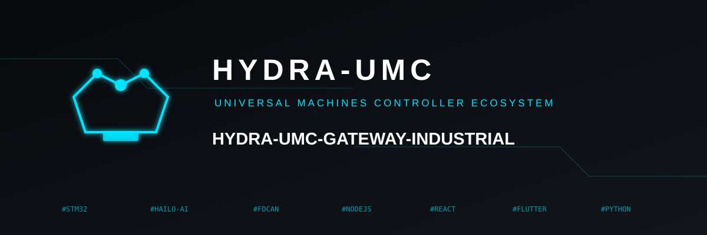
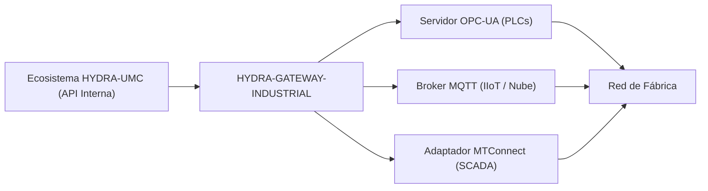

<p align="center">
  
</p>

# 🌐 HYDRA-UMC-GATEWAY-INDUSTRIAL

<p align="center"><a href="README.md">🇺🇸 English</a> | 🇪🇸 <b>Español</b> | <a href="README_fra.md">🇫🇷 Français</a> | <a href="README_ita.md">🇮🇹 Italiano</a> | <a href="README_deu.md">🇩🇪 Deutsch</a> | <a href="README_zho.md">🇨🇳 简体中文</a> | <a href="README_jpn.md">🇯🇵 日本語</a></p>

### 🏭 Puente de Interoperabilidad Industria 4.0 para Estándares de Fábrica

<p align="left">
  
  
  
  
</p>

---

## 1. 🛠️ VISIÓN GENERAL TÉCNICA

**HYDRA-UMC-GATEWAY-INDUSTRIAL** es el puente de comunicación seguro entre el ecosistema HYDRA-UMC y los estándares industriales externos. Permite que la micro-fábrica interactúe con PLCs de terceros, sistemas SCADA y plataformas IIoT basadas en la nube.

Actúa como un traductor multi-protocolo, exponiendo los estados robóticos internos y las telemetrías de herramientas como nodos estandarizados en OPC-UA, tópicos MQTT o flujos XML MTConnect, asegurando que el enjambre Hydra nunca sea una isla aislada en la planta de producción.

### Características Clave:
* 🌐 **Soporte Multi-Estándar:** Interfaces integradas de OPC-UA, MQTT y MTConnect.
* 🛡️ **Seguridad Industrial:** TLS mutuo (mTLS) y autenticación basada en certificados para todas las conexiones de fábrica.
* 🔄 **Mapeo de Estado:** Traducción en tiempo real del estado JSON interno de Hydra en espacios de direcciones industriales estandarizados.
* ⚡ **Alta Fiabilidad:** Puente ligero dedicado optimizado para un tiempo de actividad industrial 24/7.

---

## 2. 🔄 ARQUITECTURA DEL GATEWAY



---

## 3. 🧱 ARQUITECTURA Y DECISIONES DE DISEÑO

* **Por qué es el padre de integración, no un par, de sus 3 hijos.** HYDRA-UMC-OPCUA-SERVER, HYDRA-UMC-MQTT-BROKER y HYDRA-UMC-MTCONNECT-ADAPTER traducen todos el MISMO estado subyacente de HYDRA-UMC-SERVER a 3 protocolos industriales distintos - poseer el enrutamiento/autenticación compartidos en un solo sitio evita 3 traducciones independientes y potencialmente inconsistentes del mismo estado.
* **Por qué 3 adaptadores de protocolo separados, no una pasarela que lo haga todo.** OPC-UA, MQTT y MTConnect son estructuralmente distintos (espacio de direcciones frente a temas pub/sub frente a flujos XML de dispositivo/agente) - un proceso por protocolo significa que un cliente MQTT lento o roto nunca afecta al de OPC-UA, y cada uno puede activarse/desactivarse de forma independiente según el despliegue.
* **Por qué el punto de entrada solo imprime identidad/versión, y termina tras levantar un listener de health-check.** Etapa de andamiaje: probar que el proceso arranca y se mantiene en pie (no solo se ejecuta y termina, a diferencia de la mayoría de los otros esqueletos Node de este ecosistema) precede a la lógica real de traducción de protocolo, ya que una pasarela real es por naturaleza un servicio de larga duración.
* **Cómo encaja en el resto del ecosistema.** El padre de integración de la familia Industrial Gateway - expone el propio estado de HYDRA-UMC-SERVER a sistemas de planta (MES/SCADA/históricos) que hablan OPC-UA, MQTT o MTConnect en vez de la API REST/WebSocket propia de este ecosistema.
* **`GET /status` hace una comprobación real y en vivo en cada petición.** `src/probes.ts` realiza una conexión TCP real para OPC-UA/MQTT y una petición HTTP `GET` real para MTConnect contra cada hijo - `reachable`/`latencyMs`/`error` por hijo y un `allReachable` agregado se calculan en el momento de la petición, no se devuelven de una lista estática o en caché. Verificado de extremo a extremo: se arrancaron los 3 hijos reales, `/status` los reportó a todos alcanzables, se mató de verdad uno de ellos, y la siguiente llamada a `/status` marcó correctamente solo a ese hijo como no alcanzable con un `ECONNREFUSED` real. El host/puerto/URL de cada hijo es configurable por variables de entorno, con el mismo nombre de servicio que ya usa `docker-compose.yml` como valor por defecto.

---

## 📂 ESTRUCTURA DE DIRECTORIOS

```text
HYDRA-UMC-GATEWAY-INDUSTRIAL/
├── src/                # Código fuente (Node/TypeScript - superficie de agregación)
├── docs/               # Documentación y referencia de mapeo
├── build/               # Salida compilada (npm run build)
├── images/             # Medios y diagramas
├── scripts/            # Scripts de utilidad (bump-version.mjs)
├── Dockerfile           # Imagen de contenedor propia de este servicio
├── docker-compose.yml   # Levanta este Gateway + sus 3 hijos juntos
└── README.md
```

Servicio de red puro, sin hardware propio - `hardware/`, `firmware/` y
`os/` se omiten según la política de estructura del repositorio.

---

## 🐳 INTEGRACIÓN DE LOS 3 PUENTES HIJOS

Este es un repo de integración real, no solo documentación -
`docker-compose.yml` levanta este Gateway junto a sus tres hijos
(**HYDRA-UMC-OPCUA-SERVER**, **HYDRA-UMC-MQTT-BROKER**,
**HYDRA-UMC-MTCONNECT-ADAPTER**) como una única red Docker, asumiendo que
los cuatro repos están clonados como carpetas hermanas (la disposición
que ya usa el GitHub org de este ecosistema):

```bash
docker compose up --build
```

Esto arranca los 4 servicios en los mismos puertos que cada uno ya usa de
forma independiente: este Gateway en `8000`, OPC-UA en `4840`, MQTT en
`1883`, MTConnect en `5000`. `GET http://localhost:8000/status` reporta
la versión propia del Gateway y qué hijos espera poder alcanzar.

---

## 🛠️ ENTORNO DE DESARROLLO

### Requisitos
- [Node.js](https://nodejs.org/) (v18 o superior recomendado)
- npm

### Instalación
```bash
npm install
```

### Modo Desarrollo
Ejecuta el servidor de agregación directamente con `tsx` (sin bundler):
- **Windows:** doble clic en `dev.bat` o ejecutar `npm run dev`
- **Linux/Mac:** ejecutar `./dev.sh` o `npm run dev`

### Build de Producción
Empaqueta el servidor en un único archivo desplegable con esbuild:
- **Windows:** doble clic en `build.bat` o ejecutar `npm run build`
- **Linux/Mac:** ejecutar `./build.sh` o `npm run build`

Luego arráncalo con:
```bash
npm start
```

El servidor escucha en `0.0.0.0:8000` - `GET /status` reporta la versión
propia del Gateway más el nombre/protocolo/endpoint de cada puente hijo
al que da la cara.

### Versionado
Cada `npm run build` real incrementa automáticamente el `version` de
`package.json` (`scripts/bump-version.mjs`, primer paso del script
`build`) - un "cuentakilómetros" en base 10: patch +1 por build, con
acarreo a minor (y de minor a major) al pasar de 9 en vez de llegar nunca
a un segmento de dos dígitos (`0.0.9` -> `0.1.0`, no `0.0.10`).

---

## 🚀 HOJA DE RUTA
* **Fase 1:** Implementación de OPC-UA Pub/Sub para intercambio de datos de alta velocidad y puente de protocolos heredados.
* **Fase 2:** Clúster de Broker MQTT para gestión masiva de dispositivos IoT y alta concurrencia.
* **Fase 3:** Soporte del adaptador MTConnect para integración de maquinaria CNC y PLC multi-vendedor.
* **Fase 4:** Cumplimiento total de ciberseguridad ISO-27001 para el Industrial Gateway y soporte de adaptador de software Profinet.

---

## 🔗 Proyectos Relacionados

Este proyecto forma parte de un ecosistema de robótica más amplio del mismo autor (JuanenRac / Electro Hobby 3D), que abarca firmware, software de control, nodos de IA y herramientas de flota. Vale la pena conocerlo, ya que una petición podría en realidad ser sobre uno de estos proyectos en vez de sobre este repositorio.

### Familia

**Padre:** ninguno — este proyecto es en sí mismo el padre de integración de la familia Industrial Gateway.

**Hijos:**
- **[HYDRA-UMC-OPCUA-SERVER](https://github.com/JuanenRac/HYDRA-UMC-OPCUA-SERVER)** — el adaptador de protocolo OPC-UA por el que enruta esta pasarela.
- **[HYDRA-UMC-MQTT-BROKER](https://github.com/JuanenRac/HYDRA-UMC-MQTT-BROKER)** — el adaptador de protocolo MQTT por el que enruta esta pasarela.
- **[HYDRA-UMC-MTCONNECT-ADAPTER](https://github.com/JuanenRac/HYDRA-UMC-MTCONNECT-ADAPTER)** — el adaptador de protocolo MTConnect por el que enruta esta pasarela.

### Relación Directa (fuera de la familia)

- **[HYDRA-UMC-SERVER](https://github.com/JuanenRac/HYDRA-UMC-SERVER)** — la fuente del estado que expone esta pasarela.

### Resto del Ecosistema

**Plataforma HYDRA-UMC** — la célula de micro-fábrica multi-robot
- **[HYDRA-UMC](https://github.com/JuanenRac/HYDRA-UMC)** — la placa base CM5 + STM32H745 que orquesta hasta 8 brazos robóticos.
- **[HYDRA-UMC-SERVER](https://github.com/JuanenRac/HYDRA-UMC-SERVER)** — el backend Express/WebSocket con el que habla cada cliente de control.
- **[HYDRA-UMC-STUDIO](https://github.com/JuanenRac/HYDRA-UMC-STUDIO)** — panel de control web, visualización 3D multi-robot.
- **[HYDRA-UMC-ANDROID-CONTROL](https://github.com/JuanenRac/HYDRA-UMC-ANDROID-CONTROL)** — app de control Android por Wi-Fi/Bluetooth.
- **[HYDRA-UMC-IOS-CONTROL](https://github.com/JuanenRac/HYDRA-UMC-IOS-CONTROL)** — app de control iOS/iPadOS construida en Flutter.
- **[HYDRA-UMC-SUITE](https://github.com/JuanenRac/HYDRA-UMC-SUITE)** — centro de mando de enjambre de escritorio (Python/PySide6).
- **[HYDRA-UMC-EDITOR-URDF](https://github.com/JuanenRac/HYDRA-UMC-EDITOR-URDF)** — editor de modelos URDF de escritorio para el catálogo de robots.
- **[HYDRA-UMC-DSI](https://github.com/JuanenRac/HYDRA-UMC-DSI)** — interfaz táctil nativa para la pantalla DSI integrada.

**Plataforma URTC** — el controlador de cabezal de herramienta que lleva cada brazo HYDRA-UMC
- **[URTC](https://github.com/JuanenRac/URTC)** — controlador de cabezal de herramienta CAN, 25 perfiles de herramienta.
- **[URTC-FLASHER](https://github.com/JuanenRac/URTC-FLASHER)** — herramienta de escritorio de flasheo CAN-OTA + SWD/JTAG.
- **[URTC-TESTER](https://github.com/JuanenRac/URTC-TESTER)** — herramienta de escritorio de diagnóstico CAN en vivo.
- **[URTC-WEB-STUDIO](https://github.com/JuanenRac/URTC-WEB-STUDIO)** — alternativa basada en navegador vía Web Serial API.

**🎥 Vision AI Node (Hailo-8)**
- [HYDRA-UMC-VISION-NODE](https://github.com/JuanenRac/HYDRA-UMC-VISION-NODE)
- [HYDRA-UMC-VISION-STREAMER](https://github.com/JuanenRac/HYDRA-UMC-VISION-STREAMER)
- [HYDRA-UMC-DETECTION-HEF](https://github.com/JuanenRac/HYDRA-UMC-DETECTION-HEF)
- [HYDRA-UMC-SAFETY-ZONES](https://github.com/JuanenRac/HYDRA-UMC-SAFETY-ZONES)
- [HYDRA-UMC-VISUAL-SERVOING-API](https://github.com/JuanenRac/HYDRA-UMC-VISUAL-SERVOING-API)

**🧠 Cognitive AI Node (Hailo-10)**
- [HYDRA-UMC-COGNITIVE-NODE](https://github.com/JuanenRac/HYDRA-UMC-COGNITIVE-NODE)
- [HYDRA-UMC-VLA-ENGINE](https://github.com/JuanenRac/HYDRA-UMC-VLA-ENGINE)
- [HYDRA-UMC-VOICE-UI](https://github.com/JuanenRac/HYDRA-UMC-VOICE-UI)
- [HYDRA-UMC-SEMANTIC-PLANNER](https://github.com/JuanenRac/HYDRA-UMC-SEMANTIC-PLANNER)
- [HYDRA-UMC-DOCS-QA](https://github.com/JuanenRac/HYDRA-UMC-DOCS-QA)

**🐝 Orchestration & Swarm**
- [HYDRA-UMC-ORCHESTRATOR](https://github.com/JuanenRac/HYDRA-UMC-ORCHESTRATOR)
- [HYDRA-UMC-SWARM-SYNC](https://github.com/JuanenRac/HYDRA-UMC-SWARM-SYNC)
- [HYDRA-UMC-PATH-PLANNER-3D](https://github.com/JuanenRac/HYDRA-UMC-PATH-PLANNER-3D)
- [HYDRA-UMC-JOB-DISPATCHER](https://github.com/JuanenRac/HYDRA-UMC-JOB-DISPATCHER)
- [HYDRA-UMC-NODE-HEALING](https://github.com/JuanenRac/HYDRA-UMC-NODE-HEALING)

**🎮 Digital Twin & Simulation**
- [HYDRA-UMC-TWIN](https://github.com/JuanenRac/HYDRA-UMC-TWIN)
- [HYDRA-UMC-PHYSICS-REPLICA](https://github.com/JuanenRac/HYDRA-UMC-PHYSICS-REPLICA)
- [HYDRA-UMC-HIL-BRIDGE](https://github.com/JuanenRac/HYDRA-UMC-HIL-BRIDGE)
- [HYDRA-UMC-SYNTHETIC-DATA-GEN](https://github.com/JuanenRac/HYDRA-UMC-SYNTHETIC-DATA-GEN)

**📊 Data & Analytics**
- [HYDRA-UMC-DATALAKE](https://github.com/JuanenRac/HYDRA-UMC-DATALAKE)
- [HYDRA-UMC-TELEMETRY-COLLECTOR](https://github.com/JuanenRac/HYDRA-UMC-TELEMETRY-COLLECTOR)
- [HYDRA-UMC-ANOMALY-DETECTOR](https://github.com/JuanenRac/HYDRA-UMC-ANOMALY-DETECTOR)
- [HYDRA-UMC-PRODUCTION-REPORTS](https://github.com/JuanenRac/HYDRA-UMC-PRODUCTION-REPORTS)

**🛠️ Complementary Tools**
- [URTC-SMART-RACK](https://github.com/JuanenRac/URTC-SMART-RACK)
- [URTC-VISION-TOOL](https://github.com/JuanenRac/URTC-VISION-TOOL)
- [HYDRA-UMC-WATCH](https://github.com/JuanenRac/HYDRA-UMC-WATCH)
- [HYDRA-UMC-TOOL-CLI](https://github.com/JuanenRac/HYDRA-UMC-TOOL-CLI)
- [HYDRA-UMC-DASHBOARD-AI](https://github.com/JuanenRac/HYDRA-UMC-DASHBOARD-AI)


## 👤 AUTOR
**JuanenRac** (Electro Hobby 3D)
📧 electrohobby3d@gmail.com

## 📜 LICENCIA
GPL-3.0 - Ver archivo LICENSE para más detalles.

## 🛠️ BUILD & RUN

Usa la comprobación de compilación sin versionado antes de una compilación de publicación:

| Acción | Windows | Linux / macOS |
|---|---|---|
| Comprobación de compilación (sin cambiar versión ni CHANGELOG) | `build-test.bat` | `./build-test.sh` |
| Ejecución / desarrollo (cuando exista) | `run*.bat` o `dev*.bat` | `./run*.sh` o `./dev*.sh` |

`build-test.bat` y `build-test.sh` compilan o validan el stack del proyecto sin incrementar `hydra-umc.project.json` ni modificar `CHANGELOG.md`. Solo pueden crear salidas normales del compilador. Los scripts existentes `build*.bat`, `build*.sh`, `run*` y `dev*` conservan su comportamiento específico de versión o ejecución; úsalos cuando necesites ese comportamiento.