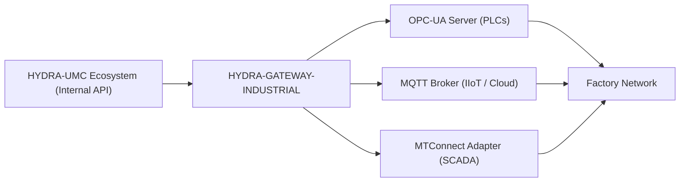

<p align="center">
  
</p>

# 🌐 HYDRA-UMC-GATEWAY-INDUSTRIAL

<p align="center"><a href="README.md">🇺🇸 English</a> | <a href="README_spa.md">🇪🇸 Español</a> | <a href="README_fra.md">🇫🇷 Français</a> | <a href="README_ita.md">🇮🇹 Italiano</a> | <a href="README_deu.md">🇩🇪 Deutsch</a> | 🇨🇳 <b>简体中文</b> | <a href="README_jpn.md">🇯🇵 日本語</a></p>

### 🏭 面向工厂标准的工业 4.0 互操作性桥梁

<p align="left">
  
  
  
  
</p>

---

## 1. 🛠️ 技术概述

**HYDRA-UMC-GATEWAY-INDUSTRIAL** 是 HYDRA-UMC 生态系统与外部工业标准
之间的安全通信桥梁。它使微工厂能够与第三方 PLC、SCADA 系统和基于云的
IIoT 平台进行交互。

它充当多协议转换器，将内部机器人状态和工具遥测数据以标准化节点的形式
暴露为 OPC-UA、MQTT 主题或 MTConnect XML 流，确保 Hydra 集群在生产
车间中永远不会成为一座孤岛。

### 关键特性：
* 🌐 **多标准支持：** 集成的 OPC-UA、MQTT 和 MTConnect 接口。
* 🛡️ **工业级安全：** 所有工厂连接均采用双向 TLS（mTLS）和基于证书的身份验证。
* 🔄 **状态映射：** 将 Hydra 内部的 JSON 状态实时转换为标准化的工业地址空间。
* ⚡ **高可靠性：** 专为 24/7 工业级正常运行时间优化的轻量级专用桥接。
* 🚦 **真实 v0 —— 命令白名单 + 背压：** `POST /command` 受到按协议默认拒绝的白名单、有上限的并发限制以及真实超时的保护——具体今天实际强制执行的内容见下方「诚实说明」。

**诚实说明——今天实际运行的内容：** `POST /command { protocol, operation, target }` 是真实的：该操作必须已明确列入其协议的白名单（否则返回 `403`——v0 只允许读取/发布类操作，不允许任何会写入正在运行的 PLC 的操作），同时运行的命令数量不超过一个上限（超出则返回 `429`），未在规定时间内完成的命令会被报告为超时（`504`）而不是被无限期挂起。默认的执行路径复用了本项目自身真实的可达性探测——诚实地说明它还没有执行真正的 OPC-UA/MQTT/MTConnect 协议层写操作，因为这三个子服务目前也都还没有暴露真正的命令 API。具体已交付内容请参见 `CHANGELOG.md`。

---

## 2. 🔄 网关架构



---

## 3. 🧱 架构与设计决策

* **为何本项目是其 3 个子项目的集成父项目，而非平级项目。** HYDRA-UMC-OPCUA-SERVER、HYDRA-UMC-MQTT-BROKER 和 HYDRA-UMC-MTCONNECT-ADAPTER 都将*同一个*底层的 HYDRA-UMC-SERVER 状态转换为 3 种不同的工业协议——将共享的路由/认证逻辑集中于一处，可避免出现 3 个独立的、可能互不一致的同一状态转换实现。
* **为何是 3 个独立的协议适配器，而非一个大而全的网关。** OPC-UA、MQTT 和 MTConnect 在结构上截然不同（地址空间 vs. 发布/订阅主题 vs. XML 设备/代理流）——每个协议对应一个进程，意味着一个缓慢或损坏的 MQTT 客户端永远不会影响 OPC-UA 客户端，并且每个协议都可以按部署独立启用/禁用。
* **为何入口点今天只打印身份/版本，在健康检查监听器启动后才退出。** 处于脚手架（scaffolding）阶段：证明该进程能够启动并保持运行（而非像该生态系统中大多数其他 Node 骨架那样只是运行后退出），先于真正的协议转换逻辑，因为一个真正的网关本质上是一项长期运行的服务。
* **这如何融入生态系统的其余部分。** 作为 工业网关 系列的集成父项目——将 HYDRA-UMC-SERVER 自身的状态暴露给使用 OPC-UA、MQTT 或 MTConnect 而非本生态系统自身 REST/WebSocket API 的车间系统（MES/SCADA/历史数据库）。
* **`GET /status` 在每次请求时都会执行真实的实时检查。** `src/probes.ts` 对每个子服务执行真实的 TCP 连接（OPC-UA/MQTT）或真实的 HTTP `GET` 请求（MTConnect）——每个子服务的 `reachable`/`latencyMs`/`error` 以及汇总的 `allReachable` 都是在请求发生时实时计算的，而不是从静态或缓存的列表返回。已完成端到端验证：启动全部 3 个真实子服务后，`/status` 报告全部可达；随后真正终止其中一个，下一次 `/status` 调用正确地仅将该子服务标记为不可达，并返回真实的 `ECONNREFUSED` 错误。每个子服务的主机/端口/URL 均可通过环境变量配置，默认值与 `docker-compose.yml` 已使用的服务名相同。
* **为何 `POST /command` 的白名单是默认拒绝而非默认允许。** 一个会转发任意操作字符串的工业网关，一旦某个子服务暴露出真正的写入路径，就会成为一个隐患——从「除非明确列出，否则一律不允许」出发，意味着添加一个危险操作（一次 OPC-UA 节点写入、一次 MQTT 保留配置发布）永远是日后一个经过深思熟虑、可审查的决定，而不是今天一个意外的默认行为。
* **为何 `CommandDispatcher.dispatch()` 中授权检查先于背压检查。** 无论网关当前有多忙，一个未经授权的命令都必须以同样的方式被拒绝——如果先检查容量，一个不被允许的操作有时可能因为恰好有空闲槽位而「意外通过」（accepted），有时又可能因为槽位已满而被读作「只是太忙」，从而通过一个本应纯粹基于授权的决策泄露出网关负载的时序信息。
* **为何默认命令执行器复用可达性探测，而不是一个永远成功的桩实现。** `src/probes.ts` 已经能真实回答「这个子服务是否真的在那里」——复用它意味着 `POST /command` 面对一个已经下线的子服务时会诚实地失败（`502 downstream_unreachable`），而不是对一个根本不可能送达任何地方的命令报告 `accepted`。

---

## 📂 目录结构

```text
HYDRA-UMC-GATEWAY-INDUSTRIAL/
├── src/
│   ├── probes.ts        # 每个子服务的真实 TCP/HTTP 可达性检查
│   ├── command.ts        # 真实的 CommandDispatcher：白名单 + 背压 + 超时
│   └── server.ts         # Express 应用：GET /status、POST /command
├── tests/               # 真实的 vitest 套件（probes、server、command）
├── docs/               # 文档与映射参考
├── build/               # 编译输出（npm run build）
├── images/             # 媒体与图表
├── scripts/            # 实用脚本（bump-version.mjs）
├── tools/
│   ├── build_test.py    # 不递增版本号的构建检查
│   └── ci_validate.py   # CI 使用的清单/CHANGELOG/文档校验
├── build-test.sh/.bat   # 不递增版本号的构建检查
├── Dockerfile           # 本服务自身的容器镜像
├── docker-compose.yml   # 将本网关及其 3 个子项目一同启动
└── README.md
```

纯网络服务，没有自己专属的硬件——`hardware/`、`firmware/` 和 `os/`
已根据仓库结构策略从项目模板中省略。

---

## 🐳 集成 3 个子桥接服务

这是一个真实的集成仓库，而不仅仅是文档——`docker-compose.yml` 会将本
网关与其 3 个子项目（**HYDRA-UMC-OPCUA-SERVER**、
**HYDRA-UMC-MQTT-BROKER**、**HYDRA-UMC-MTCONNECT-ADAPTER**）作为一个
Docker 网络一同启动，前提是这 4 个仓库作为同级文件夹检出（该生态系统的
GitHub 组织已经使用的布局）：

```bash
docker compose up --build
```

这将在各服务各自独立绑定的相同端口上启动全部 4 个服务：本网关在
`8000`，OPC-UA 在 `4840`，MQTT 在 `1883`，MTConnect 在 `5000`。
`GET http://localhost:8000/status` 会报告本网关自身的版本以及它预期
能够连接到的子项目。

---

## 🛠️ 开发环境

### 前提条件
- [Node.js](https://nodejs.org/)（建议 v18 或更高版本）
- npm

### 安装
```bash
npm install
```

### 开发模式
使用 `tsx` 直接运行聚合服务器（无需打包器）：
- **Windows：** 双击 `dev.bat` 或运行 `npm run dev`
- **Linux/Mac：** 运行 `./dev.sh` 或 `npm run dev`

### 生产构建
使用 esbuild 将服务器打包为单个可部署文件：
- **Windows：** 双击 `build.bat` 或运行 `npm run build`
- **Linux/Mac：** 运行 `./build.sh` 或 `npm run build`

然后启动它：
```bash
npm start
```

服务器监听 `0.0.0.0:8000`——`GET /status` 会报告本网关自身的版本，
以及它所对接的每个子桥接服务的名称/协议/端点。

真实示例——对一个未运行的子服务发出一个白名单内的命令、一个未经
授权的操作，以及一个格式错误的请求：

```bash
curl -X POST http://localhost:8000/command -H "Content-Type: application/json" \
  -d '{"protocol":"OPC-UA","operation":"read","target":"ns=2;s=Line1.Status"}'
# 502 {"status":"downstream_unreachable","reason":"TCP connect to opcua-server:4840 timed out after 2000ms"}

curl -X POST http://localhost:8000/command -H "Content-Type: application/json" \
  -d '{"protocol":"OPC-UA","operation":"write","target":"ns=2;s=Line1.SetPoint"}'
# 403 {"status":"rejected_unauthorized","reason":"operation \"write\" is not allowlisted for OPC-UA"}

curl -X POST http://localhost:8000/command -H "Content-Type: application/json" -d '{"protocol":"OPC-UA"}'
# 400 {"error":"protocol, operation and target are required strings"}
```

### 版本管理
每次真实的 `npm run build` 都会自动递增 `package.json` 自身的
`version`（`scripts/bump-version.mjs`，作为 `build` 脚本的第一步接入）
——一种十进制"里程表"方案：每次构建 patch +1，超过 9 时进位到 minor
（minor 超过 9 时进位到 major），而不会到达两位数段（`0.0.9` ->
`0.1.0`，而非 `0.0.10`）。

---

## 🚀 路线图
* **第一阶段：** OPC-UA 发布/订阅实现，用于高速数据交换和传统协议桥接。
* **第二阶段：** 用于海量 IoT 设备管理和高并发的 MQTT Broker 集群。
* **第三阶段：** MTConnect 适配器支持，用于多厂商 CNC 和 PLC 机械集成。
* **第四阶段：** 工业网关 完整的 ISO-27001 网络安全合规性以及 Profinet 软件适配器支持。

---

## 🔗 相关项目

本项目是同一作者（JuanenRac / Electro Hobby 3D）打造的更大规模机器人生态
系统的一部分，涵盖固件、控制软件、AI 节点和车队工具。值得了解，因为某个
需求实际上可能是关于这些项目之一，而非本仓库。

### 项目族

**父项目：** 无——本项目本身就是 工业网关 系列的集成父项目。

**子项目：**
- **[HYDRA-UMC-OPCUA-SERVER](https://github.com/JuanenRac/HYDRA-UMC-OPCUA-SERVER)** —— 本网关所路由经过的 OPC-UA 协议适配器。
- **[HYDRA-UMC-MQTT-BROKER](https://github.com/JuanenRac/HYDRA-UMC-MQTT-BROKER)** —— 本网关所路由经过的 MQTT 协议适配器。
- **[HYDRA-UMC-MTCONNECT-ADAPTER](https://github.com/JuanenRac/HYDRA-UMC-MTCONNECT-ADAPTER)** —— 本网关所路由经过的 MTConnect 协议适配器。

### 直接相关（项目族之外）

- **[HYDRA-UMC-SERVER](https://github.com/JuanenRac/HYDRA-UMC-SERVER)** —— 本网关所暴露状态的来源。

### 生态系统的其余部分

**HYDRA-UMC 平台** —— 多机器人微工厂单元
- **[HYDRA-UMC](https://github.com/JuanenRac/HYDRA-UMC)** —— 协调最多 8 条机械臂的 CM5 + STM32H745 主板。
- **[HYDRA-UMC-SERVER](https://github.com/JuanenRac/HYDRA-UMC-SERVER)** —— 每个控制客户端所对接的 Express/WebSocket 后端。
- **[HYDRA-UMC-STUDIO](https://github.com/JuanenRac/HYDRA-UMC-STUDIO)** —— 基于 Web 的控制仪表盘，多机器人 3D 可视化。
- **[HYDRA-UMC-ANDROID-CONTROL](https://github.com/JuanenRac/HYDRA-UMC-ANDROID-CONTROL)** —— 通过 Wi-Fi/蓝牙的 Android 控制应用。
- **[HYDRA-UMC-IOS-CONTROL](https://github.com/JuanenRac/HYDRA-UMC-IOS-CONTROL)** —— 基于 Flutter 构建的 iOS/iPadOS 控制应用。
- **[HYDRA-UMC-SUITE](https://github.com/JuanenRac/HYDRA-UMC-SUITE)** —— 桌面端集群指挥中心（Python/PySide6）。
- **[HYDRA-UMC-EDITOR-URDF](https://github.com/JuanenRac/HYDRA-UMC-EDITOR-URDF)** —— 用于机器人目录的桌面端 URDF 模型编辑器。
- **[HYDRA-UMC-DSI](https://github.com/JuanenRac/HYDRA-UMC-DSI)** —— 机载 DSI 触摸屏的原生触控 UI。

**URTC 平台** —— 每台 HYDRA-UMC 机械臂搭载的工具头控制器
- **[URTC](https://github.com/JuanenRac/URTC)** —— CAN 总线工具头控制器，25 种工具配置。
- **[URTC-FLASHER](https://github.com/JuanenRac/URTC-FLASHER)** —— 桌面端 CAN-OTA + SWD/JTAG 刷写工具。
- **[URTC-TESTER](https://github.com/JuanenRac/URTC-TESTER)** —— 桌面端实时 CAN 总线诊断工具。
- **[URTC-WEB-STUDIO](https://github.com/JuanenRac/URTC-WEB-STUDIO)** —— 通过 Web Serial API 的浏览器端替代方案。

**🎥 视觉 AI 节点（Hailo-8）**
- [HYDRA-UMC-VISION-NODE](https://github.com/JuanenRac/HYDRA-UMC-VISION-NODE)
- [HYDRA-UMC-VISION-STREAMER](https://github.com/JuanenRac/HYDRA-UMC-VISION-STREAMER)
- [HYDRA-UMC-DETECTION-HEF](https://github.com/JuanenRac/HYDRA-UMC-DETECTION-HEF)
- [HYDRA-UMC-SAFETY-ZONES](https://github.com/JuanenRac/HYDRA-UMC-SAFETY-ZONES)
- [HYDRA-UMC-VISUAL-SERVOING-API](https://github.com/JuanenRac/HYDRA-UMC-VISUAL-SERVOING-API)

**🧠 认知 AI 节点（Hailo-10）**
- [HYDRA-UMC-COGNITIVE-NODE](https://github.com/JuanenRac/HYDRA-UMC-COGNITIVE-NODE)
- [HYDRA-UMC-VLA-ENGINE](https://github.com/JuanenRac/HYDRA-UMC-VLA-ENGINE)
- [HYDRA-UMC-VOICE-UI](https://github.com/JuanenRac/HYDRA-UMC-VOICE-UI)
- [HYDRA-UMC-SEMANTIC-PLANNER](https://github.com/JuanenRac/HYDRA-UMC-SEMANTIC-PLANNER)
- [HYDRA-UMC-DOCS-QA](https://github.com/JuanenRac/HYDRA-UMC-DOCS-QA)

**🐝 编排与集群**
- [HYDRA-UMC-ORCHESTRATOR](https://github.com/JuanenRac/HYDRA-UMC-ORCHESTRATOR)
- [HYDRA-UMC-SWARM-SYNC](https://github.com/JuanenRac/HYDRA-UMC-SWARM-SYNC)
- [HYDRA-UMC-PATH-PLANNER-3D](https://github.com/JuanenRac/HYDRA-UMC-PATH-PLANNER-3D)
- [HYDRA-UMC-JOB-DISPATCHER](https://github.com/JuanenRac/HYDRA-UMC-JOB-DISPATCHER)
- [HYDRA-UMC-NODE-HEALING](https://github.com/JuanenRac/HYDRA-UMC-NODE-HEALING)

**🎮 数字孪生与仿真**
- [HYDRA-UMC-TWIN](https://github.com/JuanenRac/HYDRA-UMC-TWIN)
- [HYDRA-UMC-PHYSICS-REPLICA](https://github.com/JuanenRac/HYDRA-UMC-PHYSICS-REPLICA)
- [HYDRA-UMC-HIL-BRIDGE](https://github.com/JuanenRac/HYDRA-UMC-HIL-BRIDGE)
- [HYDRA-UMC-SYNTHETIC-DATA-GEN](https://github.com/JuanenRac/HYDRA-UMC-SYNTHETIC-DATA-GEN)

**📊 数据与分析**
- [HYDRA-UMC-DATALAKE](https://github.com/JuanenRac/HYDRA-UMC-DATALAKE)
- [HYDRA-UMC-TELEMETRY-COLLECTOR](https://github.com/JuanenRac/HYDRA-UMC-TELEMETRY-COLLECTOR)
- [HYDRA-UMC-ANOMALY-DETECTOR](https://github.com/JuanenRac/HYDRA-UMC-ANOMALY-DETECTOR)
- [HYDRA-UMC-PRODUCTION-REPORTS](https://github.com/JuanenRac/HYDRA-UMC-PRODUCTION-REPORTS)

**🛠️ 配套工具**
- [URTC-SMART-RACK](https://github.com/JuanenRac/URTC-SMART-RACK)
- [URTC-VISION-TOOL](https://github.com/JuanenRac/URTC-VISION-TOOL)
- [HYDRA-UMC-WATCH](https://github.com/JuanenRac/HYDRA-UMC-WATCH)
- [HYDRA-UMC-TOOL-CLI](https://github.com/JuanenRac/HYDRA-UMC-TOOL-CLI)
- [HYDRA-UMC-DASHBOARD-AI](https://github.com/JuanenRac/HYDRA-UMC-DASHBOARD-AI)


## 👤 作者
**JuanenRac** (Electro Hobby 3D)
📧 electrohobby3d@gmail.com
📺 [youtube.com/@electrohobby3d](https://youtube.com/@electrohobby3d)

## 📜 许可证
GPL-3.0 —— 详见 LICENSE。
